[home](https://github.com/dKosarevsky/iu7/blob/master/2020_2021_3sem.md) | [Типы и структуры данных](https://github.com/dKosarevsky/iu7/tree/master/3sem/data_types_and_structures.md)
____________________________________
hand made by @g1ts0
--------
# Лаба 3
Реализовать полный перебор, реализовать муравьиный алгоритм и провести параметризацию с эталононным решением

Алгоритмы для решения задачи коммивояжёра

ЭВРИСТИЧЕСКИЙ АЛГОРИТМ который призван решить задачу с меньшей трудоемкостью и с приемлемой (но не обязательно 100%) точностью.
Задача к.ж. (странствующего торговца)
Есть набор городов, требуется объехать все города с минимальными затратами-посетить каждый город не более 1 раза, кроме быть может исходного: поиск замкнутого пути (гамильтонова цикла).

Предположим у нас есть некоторая карта. Мы храним затраты (длины) на переезд из города А в город Б в матрице смежности:
См.рис.1 \
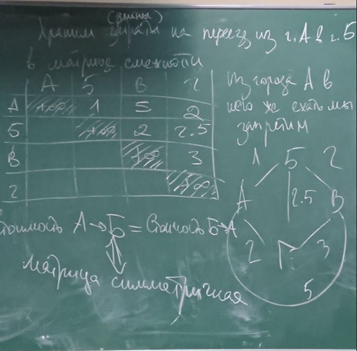 \
 \
Стоимость а->б=б->а и эта матрица симметричная (неор.граф)
Если необходимо учитывать, что в разные стороны затраты разные, например см.рис.2, то матрица может быть несимметрична. (Например из а->б 10; б->а 9 ор-граф)
 \
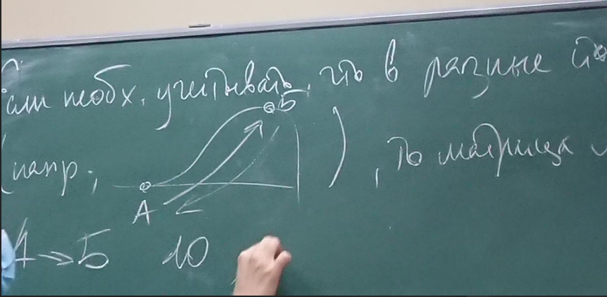 \
Карта-граф. Способы хранения графа:
1)матрица смежности (города к городам)
2)матрица города к дугам
См.рис.3 \
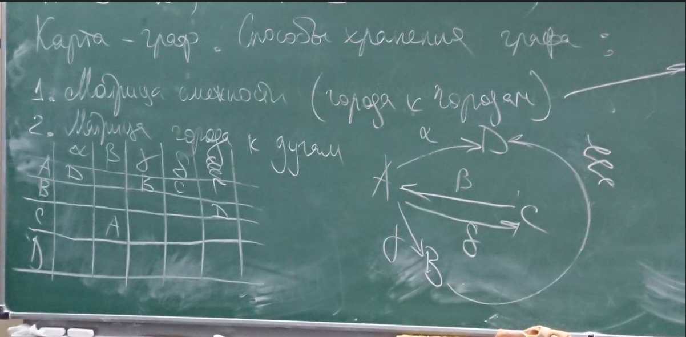 \
3)списки смежности
Это удобно, если граф неполный
См.рис4 \
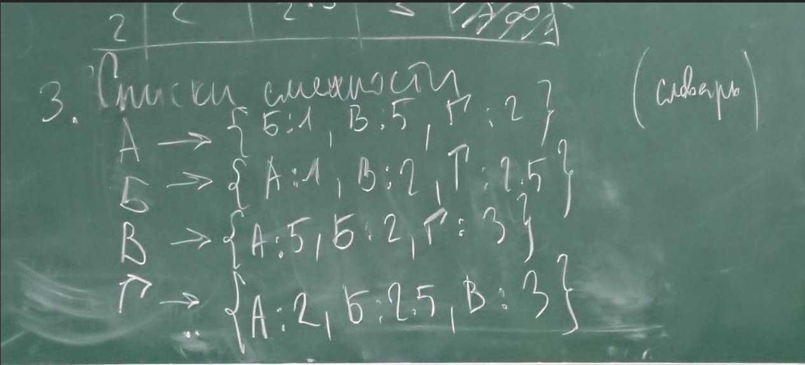

Решение 1: метод полного перебора
Перебрать все возможные пути и выбрать самый дешёвый
//Далее в примерах симметричная матрица смежности
См.рис.5 \
 \
N! : N возможных значений в 1-й позиции матрицы *(N-1) возможных значений во 2-й (из оставшихся N-1)*(N-2)....*1
Можно написать алгоритм, который будет перебирать пути (версии) вариантов маршрута в лексико-графическом порядке. 
Маршрут сформирован, если в нем 4 города (N).
Представим, что у нас аналогия-механические часы: на каждом барабане все буквы (номер городов) и барабаны зацепляются друг за друга.
Нужен массив длиной N с номерами городов маршрута и множество (массив флагов?(свободен-1, занят-0))  непосещённых/свободных городов
Старт:маршрут пуст, массив "список свободных городов" полон {А,Б,В,Г} пока возможны действия: 
Если маршрут ещё не укомплектован, то 
-добавить первый свободный город (по алфавиту нумерации-А)
Если маршрут сформирован, то
-обновить наилучший маршрут (если этот лучше) и его длину
-прокрутить последний валик //снять последний город (while), прокрутить вперёд следующий валик
См.рис.6 \
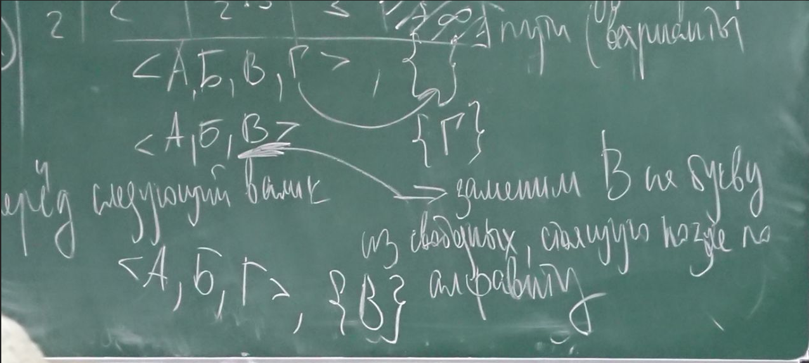 \
В случае успеха, возвращаемся в начало
В случае неудачи смотри рисунок 7 и 8 (и 7 и 8 рисунки читать справа налево поколоночно) \
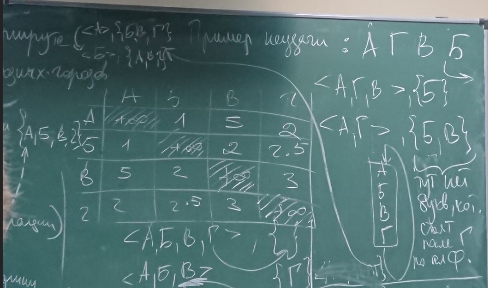 \
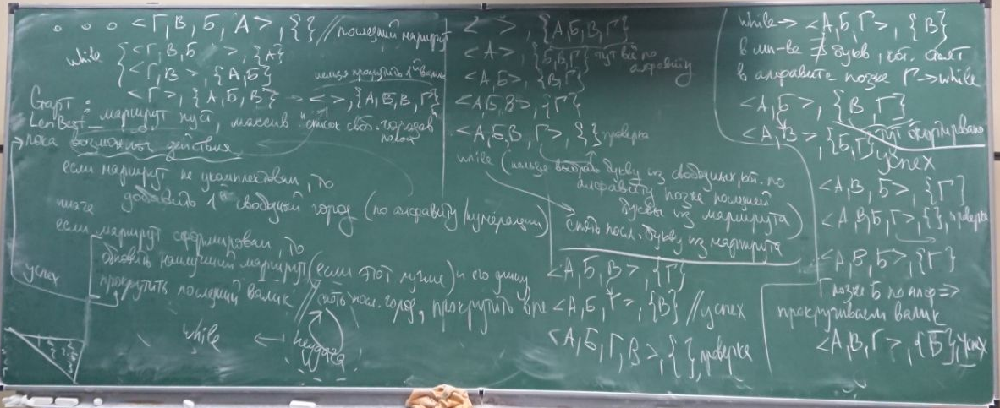 \
(Полный алгоритм можно посмотреть у [Гудмана Хидетнинми-введение в разработку алгоритмов](https://drive.google.com/file/d/1VR67Nfi7LGSJdC2DdO-MIbKkyn80W7p9/view?usp=sharing))

Существует жадный алгоритм (Дейкстры) поиска путей в графе: всегда выбирает ребро минимальной длины. Недостаток:не факт, что за коротким ребром все хорошо и быстро.

МУРАВЬИНЫЙ АЛГОРИТМ
1) Обоняние-способность оценивать феромон на ребре
2) зрение-способность оценивать длину ребра, исход. из текущего города
3) память-список посещённых(в порядке посещения), либо непосещённых городов

Муравей К стартует из k города и должен посетить все города. За день муравей формирует маршрут. Ночью работаем с феромоном. Находясь в городе i, муравей К принимает решение по выбору города j по следующемц вероятностному правилу:
См.рис9 \
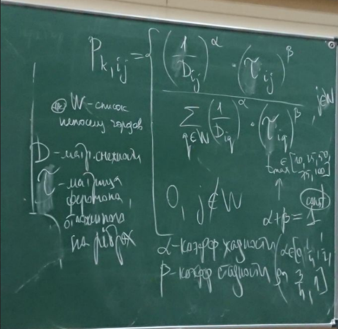 \
У нас могут быть разные классы данных. Для нашей задачи это тип карты. Под типом можно подразумевать разброс значений длин карты.
Параметризация метода решения задачи под конкретный класс входных данных это выбор/подбор таких параметров или настроек метода, которые позволят решать задачу для выбранного класса или классов данных с наилучшим качеством. Мерой качества мб точность, полнота, мера, работа...
Феромон ночью испаряется с коэффициентом ро...
См.рис.10 \
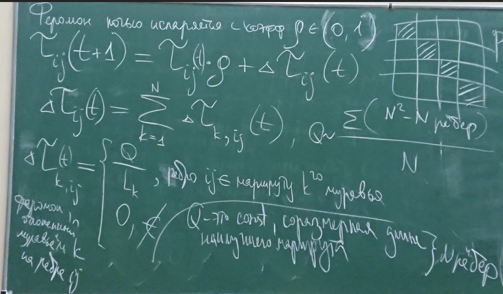 \
На старте муравьи распределяются по 1 в каждый город. 
Феромонов на рёбрах поровну. Чтобы феромон не обновился и вероятность тоже не обнулилась вместе с ним (для непосещённого города), мы ставим правило: феромон не падает ниже некоторой малой константы.
P.S. днём муравьи ходят изолированно, как бы в параллельных плоскостях.

Некоторый алгоритм на псевдокоде
0.распределяем муравьев по городам, задаём изначальную концентрацию феромона на рёбрах. Также говорим, что длина лучшего маршрута это машинная бесконечность
1) Цикл по суткам: t принадлежит от [1, t max]
//День
2) цикл по муравьям
3) муравей формирует маршрут по вероятностному правилу
//While, пока не наберём маршрут из N городов

P.S. муравей не выбирает максимальную вероятность (оставляем простор для маневра/повышаем вариативность выбора)
См.рис11 \
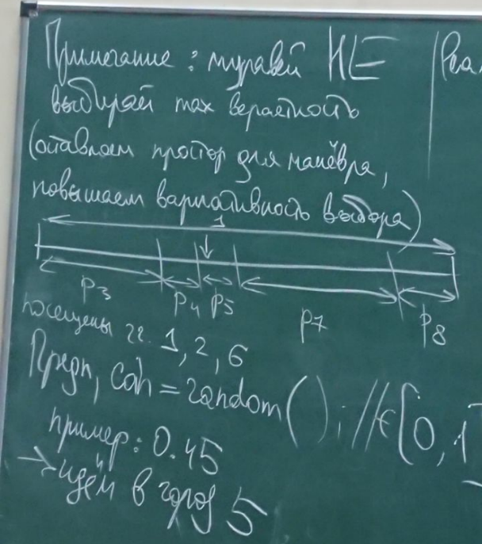 \
Реализация: суммируем вероятности в цикле while, пока сумма не перевалит за значение монетки coin
4) обновить наилучший маршрут и его длину, если найдено наилучшее (на текущий момент) решение
5) конец цикла по муравьям
//ночь
6) цикл по рёбрам
7) изменение феромона на ребре по формуле
8) конец цикла по ребрам
9) конец цикла по суткам
+См.рис.12 \
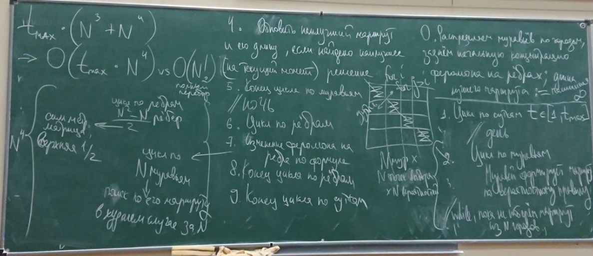

По поводу параметризации...см.рис 13 \
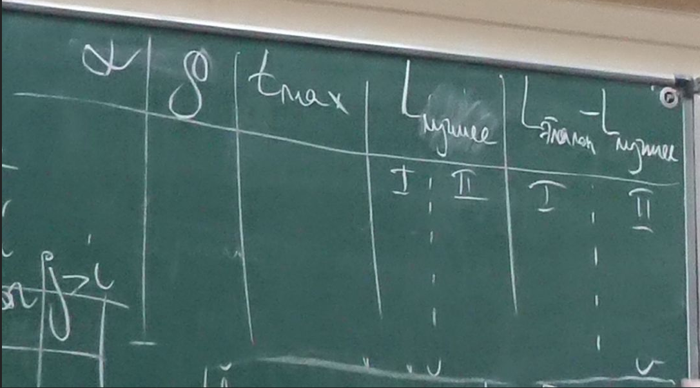
