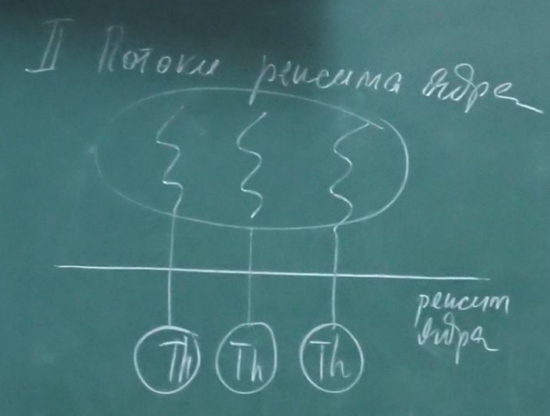
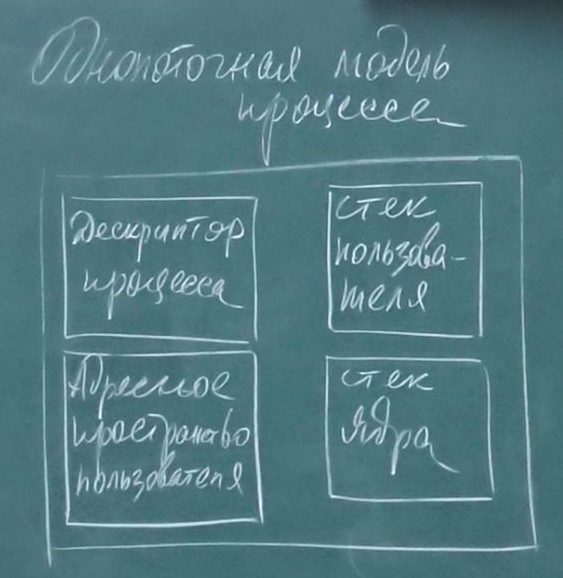
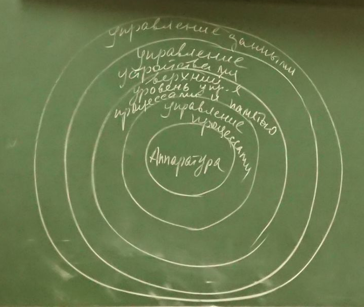

hand made by @g1ts0
--------
Бла бла бла...
Воспроизведение аудио и видео на компе это значит реальное время
В силу этого в винде если процесс был блокирован на звуковой карте, его приоритет сразу повышается на мвше и клаве на 6, а на звуковой карте на 8
Это мы рассмотрели на прошлом занятии
Если подробнее товарищей Соломона и русиновичей винда 2000
Вахалия-юникс изнутри
Если хотим их получить, она пришлет на почту, но надо напомнить

ПЕРЕКЛЮЧЕНИЕ В РЕЖИМ ЯДРА
Когда выполняется код ос, система находится в режиме ядра \
См.рис1
 \
....
Процесс-часть времени выполняется в режиме задача и тогда он выполняет собственный код, а часть времени выполняется в режиме ядра.

Реинтерабельный код-код чистых процедур

Порождение выполняется ядром операционной системы
 Память процессу может выделить ос и он становится в очередь готовых процессов (в ядре). 
 В системе имеется очередь готовых процессов
 Из этой очереди процесс с наибольшим приоритетом получает процессорное время и переходит в выполнение.
 
Диаграмма состояний процесса UNIX \
См рис.2 (это и есть управление процессом) \
 \
Три события переводят процесс в режим ядра
1)Системный вызов
2)Исключение
3)Аппаратное перерывание
В режим ядра процесс может вернуться если он израсходовал квант или он был вытеснен другим более приоритетным процессом.

Переключение контекста
Регистры процессора называются аппаратным контекстом
Int 8 h -периодическое прерывание, аппаратное (18.2 раза в секунду) и процессор переключается на оьраточика прерывания
Чтобы вернуться, дос сохраняет содержимое регистров. Это-созранение аппаратного контекста
Существует push a, pop a-сохранение и восставление содержимого регистров
Полный контекст-информация об аппаратных контекстах+информацию об выделенных процессу ресурсах (выделенная память, открытые файлы и другие ресурсы...). При этом аппаратный контекст выполняется очень часто, поэтому поддерживается аппаратно. 

ТРИ СОБЫТИЯ:
системный вызов выполняется нашей программой, когда при выполнении этой программы требуется обслуживание сервис системойни одна ос не позволяет приложению напрямую обратиться у устройству ввода вывода, иначе такую систему невозможно защитить. Поэтому обращение происходит как системные вызовы.
Системный вызов это инхронное событие, возникает в процессе выполнения программы.
Исключения: возникают при различных исключительных ситуациях (ошибка деления на 0)
Исключения также являются синхронными событиями по отношению к выполняемой программе, т.к. возникает в ходе ее выполнения
Аппаратные прерывания возникают, в зависимости от типа аппаратного прерывания
Если это прерывание от системного таймера, то это периодическое прерывание, на него возлагаются очень серьезные задачи. В многопроцессных системах, это декремент кванта процессорного времени. Если квант истек, обработчик прерывания системного таймера, обработчик прерывания посылает сигнал, что квант истек.
Аппаратные прерывания от устройств ввода вывода.
Все внешние устройства работают по одному и тому же принципу. Инициализация их работы-через системный вызов. Ептвоюмать я не успел записать, как же она быстро диктует. Люди вообще на бумаге успевают что-то записывать..
Аппаратные прерывания являются асинхронными событиями в системе.
Асинхронное событие в системе они не зависят ни от какой деятельности выполняемой процессором.
Когда возникает аппаратное прерывание, обработчик прерывания становится частью кода ядра.
Ядро это единая программа.
С точки зрения быстродействие юя процесса это затратное действие (переключение). У разработчиков возник интерес к потокам, как решению проблемы переключения полного контекста

ПОТОКИ
Thread
С ростом мощности вычислительных систем у разработчиков по возникает стремление писать более объемный код и сложные программа, в юникс это можно решить с помощью запуска доп процессов, т.е. распараллелить процесс. 
Возникла идея делить код программы на части, которые могут выполняться параллельно друг с другом. 
Потоки возникли как стремление сократить расходы при распараллеливании потоков.
Поток это часть кода, которая может выполняться параллельно с другими частями кода программы.
Главная и основная особенность потока-потом не имеет своего адресного пространства, а выполняется в адресном пространстве процесса, но поскольку процесс поделен на потоки, на процессоре будут выполняться поток, т.е. единицей диспетчеризации становится поток. Потоку выделяется процессорное время, отсюда говорят, что поток владеет счётчиком команд. Поток владеет аппаратным контекстом. Выполняется поток, но владельцем ресурсов остаётся процесс. У процесса базовый приоритет, а приоритет потока определяется относительно приоритета процесса. 
2 типа потоков:
1) потоки режима пользователя. Это потоки, о которых ядро ничего не знает. Для того, чтобы из можно было выполнять, должна быть задействована библиотека потоков \

2) потоки режима ядра. Каждому потоку соответствует поток в режиме ядра. То есть сами потоки создаются в результате системного вызова. Эти потоки описываются в системе соответствующими структурами и процессорное время фактически выделяется потоку. Особенно заточены на потоке-уиндоус \
См.рис.3 \
 \
Модели процесса: \
Однопоточная и многопоточная \
Однопоточная модель \
См.рис.4 \
 \
Многопоточная модель \
См.рис.5 \
 \
Мотивация применения потоков
Потоки очень полезны в современном программировании, когда процесс имеет набор задач выполнение которых не зависит друг от друга. Это особенно справедливо, когда например одна задача может блокироваться, при этом другие задачу могут продолжать выполняться. Например, текстовый редактор~в нем низкоприоритетный процесс может проверять грамматику и правописание, в то время, когда другой поток например загружает изображение с диска. При этом обращение к жёсткому диску (внешнее устройство) связано с блокировками. Третий процесс может периодически выполнять резервное копирование
Типы параллелизма
Теоретически имеется два разных пути распараллеливания нагрузки:
-параллелизм данных
-параллелизм задач

Распараллеливание данных это разделение данных между несколькими ядрами, при этом над каждой частью этих данных выполнябтся одни и те же задачи. Например разделение большого изображения на фрагменты и выполнения одинаковой обработки каждого фрагменты юа параллельно. В результате время общей обработки изображения будет сокращено

Распараллеливание задач это разделение приложения на задачи, которые могут выполняться независимо друг от друга, паралельно на разных ядрах

Пробелы многопоточного программирования:
Для разработчиков приложений существует 5 областей, где многоядерночит преподносит новые проблемы
1)определение задач, т.е. анализ приложений для выявления действий, которые могли бы выполняться параллельно
2) сбалансированность,т.е. анализ и поиск задач для паралельного выполнения, которые имеют одинаковую по масштабу функциональность. "Не тратьте потоки на тривиальные задачи"
3) Гонки. Гонками называется обращение параллельных потоков к одним и тем же данным. Это называется разделение данных. Задача-предотвращать возникновение условия гонок.
4) отдельную проблему может составлять зависимость данных. Если одна задача зависит от результата выполнения другое, тогда задачи должны быть синхронизированы. Для обеспечения доступа к данным в правильном порядке.
5) тестирование и отладка. В случае многопоточных приложений становится более сложными поскольку словия гонок становятся намного сложнее и их значительно труднее обнаружить.

Light-weight process \
См.рис.6 \
 \
Облегченный процесс можно рассматривать как отображение между потоками ользовательскими и потоками ядра. Естественно должна существовать определенная библиотека. Каждый поддерживает один или несколько потоков на картоне пользователя и отображает их в один поток ядра.
Структуры данных облегчённого процесса существуют в рамках адресного пространства соответствующего им процесса, но каждый облегченный процесс связан с единственным диспетчеризумым потоком ядра.
Структуры потока ядра поддерживаются в адресном пространстве ядра. 
Мотивация совместное использование потоков и там и там даёт программисту возможность выбрать вариант параллелизма, который будет наиболее эффективным для конкретного приложения.
В результате объединения потоки на пользовательском уровне можно создавать, уничтожать, блокировать, запускать без участия ядра. В то же время в качестве ядреных потоков можно в этой модели определять блокирующиеся потоки

ИЕРАРХИЧЕСКАЯ МАШИНА МЕДНИКА-ДОНАВАНА
См.рис.7
 \
Если определён набор функций, с помощью которого верхний уровень общается с нижним, значит мы определили интерфейс.
Интерфейс: непрозрачный, прозрачный и полупрозрачным.
Непрозрачный: нельзя обратиться к уровню через уровень
Прозрачный:можно обратиться
Полупрозрачный: что-то можно, что-то нельзя
