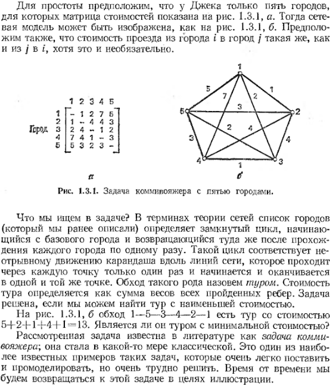

[home](https://github.com/dKosarevsky/iu7/blob/master/2020_2021_3sem.md)
____________________________________
**Типы и структуры данных** \
[Волкова Лилия Леонидовна](https://www.hse.ru/org/persons/69165154) (504л) \
liliya@bmstu.ru \
вторник, 18-30, аудитория 1017 (лекции), 508 или 517 (лабы) \
зачёт по результатам 8-ми лаб
____________________________________
**Литература**

* [Ресурсно-эффективные компьютерные алгоритмы. Разработка и анализ, Ульянов М. В., 2007](https://drive.google.com/file/d/1GDkqsfJDjotvynJQqXr2NnCyt19Jt4bD/view?usp=drivesdk)
* [Дж.Макконел "Основы современных алгоритмов"](https://drive.google.com/file/d/1NXChAct0nCx3uMfQ-Em50TY-T4BWFm5n/view?usp=sharing)
* [Дж.Макконел "Анализ алгоритмов: активный обучающий подход"](http://www.technosphera.ru/files/book_pdf/0/book_8_3.pdf)
* [Томас Х. Кормен, Чарльз И. Лейзерсон "Алгоритмы. Построение и анализ"](https://t.me/progbook/15)
* [С. Писсанецки "Технология разреженных матриц" / 1988](https://drive.google.com/file/d/1QHG9FLWmIM8HSPiU4wcbin8qY6hqXwdQ/view?usp=sharing)
* [С. Гудман, С. Хидетниеми. "Введение в разработку и анализ алгоритмов" / 1981](https://drive.google.com/file/d/1WoM5m2Ls7nP6arYAfLMUZhKRhUvfUEm6/view?usp=sharing)
____________________________________

## ЛР1

Расстояние Левенштейна

1. Реализовать поиск расстояния Левенштейна матрично
2. Реализовать поиск расстояния Левенштейна рекурсивно
3. Реализовать поиск расстояния Дамерау-Левенштейна матрично

+ сделать замеры по времени 100 одинаковых экспериментов (над теми же строками), и, поделив на 100,
получить усреднённое время 1-го эксперимента.
- t по таймеру
- процессорное время (c/c++ библиотека WinAPI? + QueryPerformanceCounter или GetTicks)

[ЛР1](https://www.kaggle.com/dmisky/tads-lab-01)
____________________________________

## ЛР2

Алгоритмы умножения матриц

1. Стандартный
2. Алгоритм Винограда базовый
3. Алгоритм Винограда оптимизированный

 [фотки к ЛР2](https://drive.google.com/drive/folders/19F0r92UZy7WqeTX9bbIl64P4nGbfljqo?usp=sharing) \
 [побитовый сдвиг по-питонячьи](https://wiki.python.org/moin/BitwiseOperators)
 
 [ЛР2](https://www.kaggle.com/dmisky/tads-lab-02) \
 [ЛР2 10 итераций](labs_tads/lab-02-10_it.ipynb) \
 [ЛР2 100 итераций](labs_tads/lab-02-100_it.ipynb)
____________________________________

## ЛР3

**Задача коммивояжёра**

В лабораторной на применение к задаче коммивояжёра метода полного
перебора и метода на основании муравьиного алгоритма нужно будет
провести мини-исследование.
Для этого нужно будет автоматизировать процесс параметризации - нужно
будет запустить муравьиный алгоритм для всех комбинаций параметров ро,
альфа и макисмального количества "суток" жизни колонии tmax (например,
первые два аргумента принимают значения {0, 0.25, 0.5, 0.75, 1}, а
время жизни колонии можно брать как {20, 50, 100, 150, 200}), выписать
в лог (возможно, лог-файл) в каждую строку значения параметров, при
которых проводился эксперимент, и полученный результат для каждого
элемента класса входных данных (используем в
качестве класса 2 матрицы смежности с одинаковым разбросом значений в
них, рекомендуется использовать матрицы с линейным размером между 7 и 15,
чтобы можно было за разумное время получить результат полного
перебора, который будет затем использован как эталонное значение, с
которым будем сравнивать полученные результаты).

[Заметки о муравьином алгоритме](https://drive.google.com/file/d/1BfOQUOUbLmSf7wSCQHgkGAGO0yCeCZRm/view?usp=sharing)

[Ульянов. Муравьиный алгоритм](https://drive.google.com/file/d/12R-2_aoD3Kb-rD9x_aAbbHlnb7BdGrWy/view?usp=sharing)

[Гудман Хидетниеми задача коммивояжёра](https://drive.google.com/drive/folders/1BD-t0Df12GkIE2jHroJNZ4PvtsY5SC2l?usp=sharing)

[hand made speech to text by Oleg](stt/dtas_lab_003.md) \
[литература к ЛР3](https://drive.google.com/folderview?id=1G3qexlRgV9Ap1EZy4xO3ZKXjTTXsd2sg) \
[группа в вк по МА](https://m.vk.com/ant_colony_optimization)

[ЛР3](labs_tads/tads-lab-03-ant.ipynb)
____________________________________

**Задача ЛР4**

Разреженные матрицы (лек.5)

Необходимо ознакомиться с соотв. разделом книги [Серджио Писсанецки - Технология разреженных матриц](https://drive.google.com/file/d/1QHG9FLWmIM8HSPiU4wcbin8qY6hqXwdQ/view?usp=sharing) (классическая советская книга) в части, касающейся рассмотрения схем сжатого хранения Дженнингса, Кнута, Кольцевой Рейнбольдта-Местеньи, Разреженного строчного формата (Чанга и Густавсона). 

По вариантам нужно будет реализовать либо КРМ, либо РСФ: упаковку, распаковку, сложение двух матриц и произведение двух матриц.

В лабораторной не допускается сплошное извлечение элементов матриц (вида "извлечь элемент с координатами [i][j] из упакованной матрицы"), требуется использовать описанные алгоритмы просмотра массива ненулевых элементов. выслана вместе с частью 2.1. Первая половина описания лабораторной

[пример обхода матриц](https://drive.google.com/file/d/12AZfhCfffCJhI3615Q3HRGaWBBGdnZxS/view?usp=sharing) B и C при сложении при помощи курсоров kB и kC, схема КРМ

Описан переход к алгоритму умножения. Рассмотрена схема Чанга и Густавсона, описан переход к алгоритмам сложения и умножения матриц. [раз](https://drive.google.com/file/d/1eGsndYKirhTYQ9Mu2LhN3-Jsl7BEqTyg/view?usp=sharing) и [два](https://drive.google.com/file/d/190eNqyaX5W23vzfgMEL28Jrl6n1xBeK1/view?usp=sharing)

Лабораторная обязательна для зачёта.

____________________________________

Лекция 1 (08.09.2020) | [фото](https://drive.google.com/drive/folders/1OYuu3KKNGjLVhArjl6piAMHTkfpSgHud?usp=sharing) | [аудио](https://drive.google.com/drive/folders/1vkE5v2c4qiqtBCoP984QhED_ukufxqBA?usp=sharing)
____________________________________

Лекция 5 (06.10.2020) | [фото](https://drive.google.com/drive/folders/15vdE5tZmOHO1ceIDNb3n7FrbdIyJqLUy?usp=sharing) | [аудио](https://drive.google.com/drive/folders/1NzuBE9upOsI-NyjGn-Vm5A55skni0Mp3?usp=sharing)
____________________________________

Лекция 6 [remote] (13.10.2020) | [фото](https://drive.google.com/folderview?id=1M0O1djLP-XU2WVQw1BYkN_M_7Ix3jrK4)
____________________________________

