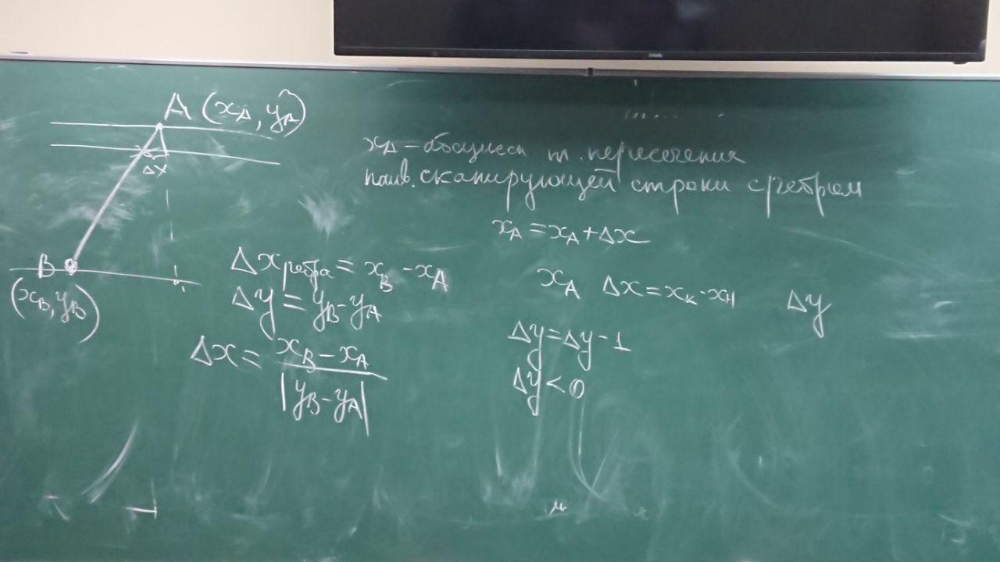
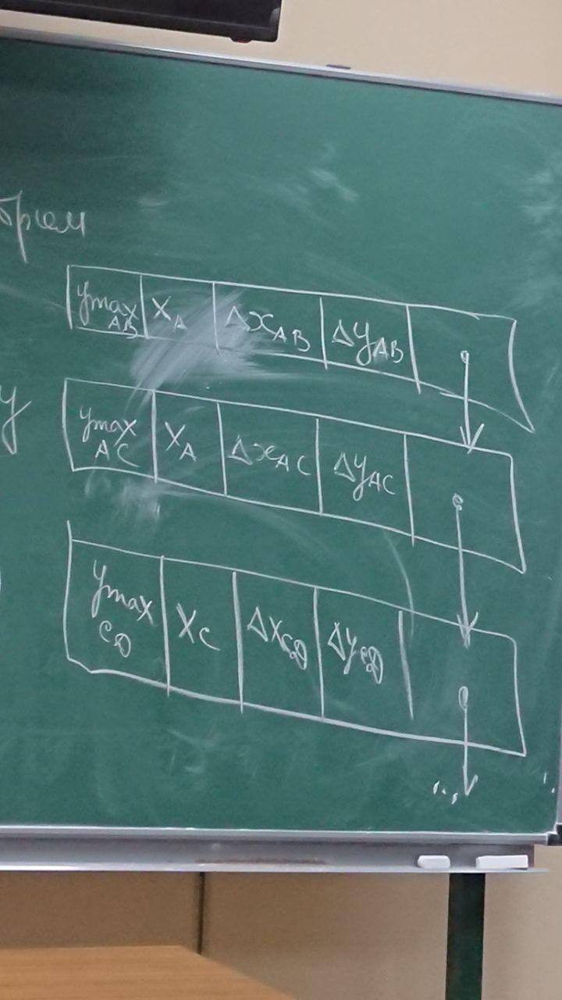
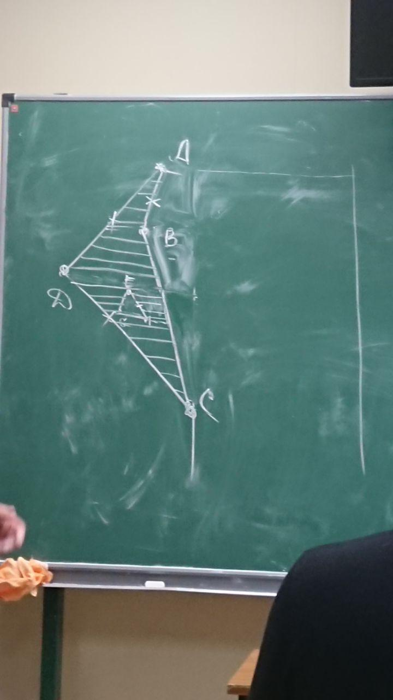
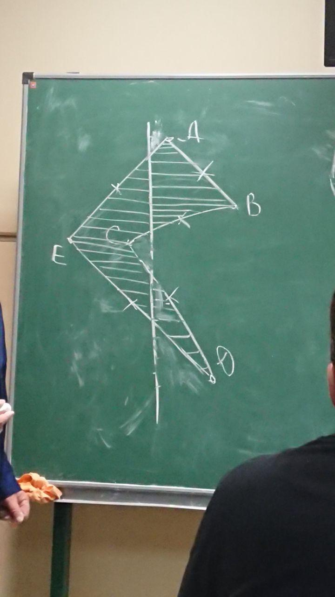
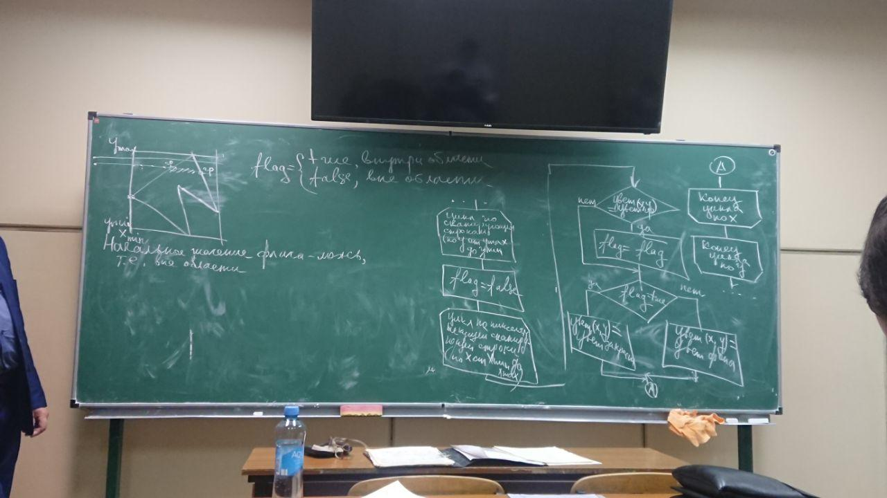
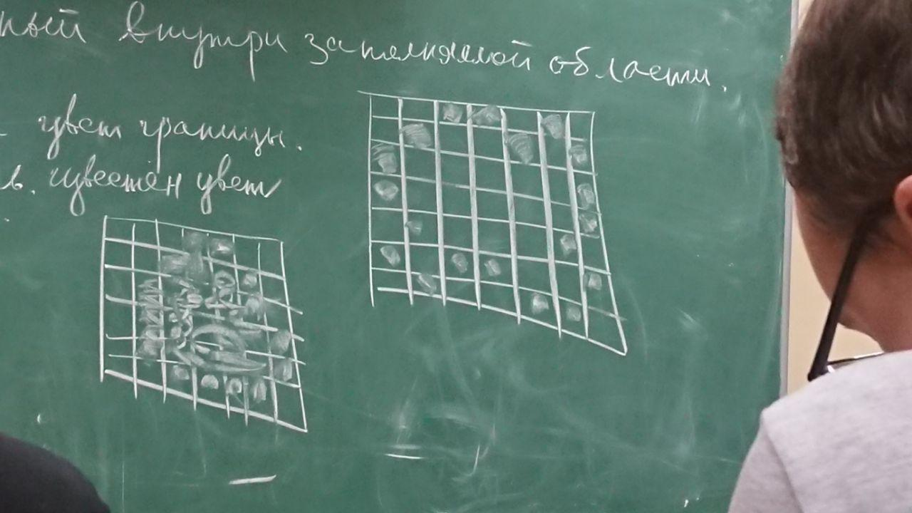
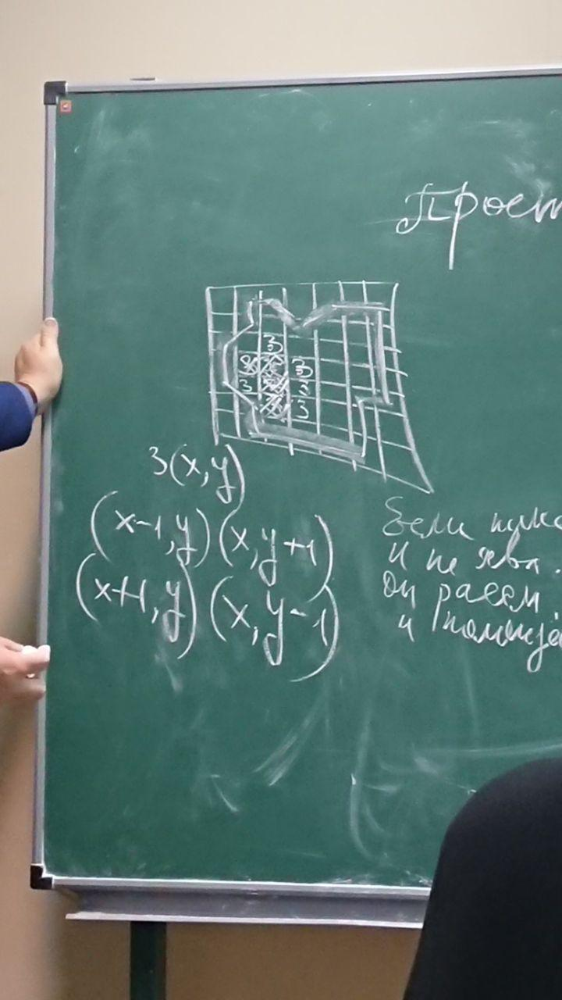

[home](https://github.com/dKosarevsky/iu7/blob/master/2020_2021_5sem.md) | [Компьютерная графика](computer_graphics.md)
____________________________________
hand made by @g1ts0
--------
Алгоритм с упорядоченным списком ребер

Первый вариант алгоритма (наименее эффективный) 
1) найти пересечение всех сканирующих строк со всеми ребрами многоугольника (Xi;Yj) i= 1,Nj; j=Ymin, Ymax, где Ymax-наивысшая сканирующая строка, пересекающая многоугольник. Ymin-наименьшая сканирующая строка, пересекающая многоугольник.
2) Сортировка найденных точек пересечения по убыванию  значения координаты Y.
(X1,Y1)(X2,Y1)...(X3,Y2)....(Xi,Yj)....
Y1>=Y2>=Y3>=Yj....
3) Сортировка по возрастанию абсциссы точек пересечения, расположенных на одной сканирующей строке
(X1,Yj)(X2,Yj)...(Xi,Yj)...(Xk,Yj)....
X1=<X2=<Xi=<Xk
4) Выделить интервалы пикселей, ограниченные двум соседними точками пересечения
5) Закрасить пиксели, расположенные внутри каждого интервала

Простой алгоритм (более эффективный)
Можно использовать распределяющую сортировку
N-количество строк, пересекающих многоугольник
Y-группы
1) Выделить память для хранения точек пересечения сканирующих строк с ребрами многоугольника и рубить память на N участков ( по количеству сканирующиз строк, пересекающих многоугольник)
2) определить точки пересечения сканирующих строк с ребрами многоугольника, занести найденные точки в соответствующие y-группы
3) Упорядочить содержимое каждой Y-группы по возрастанию
4) рубить точки пересечения на пары
5) закрасить пиксели расположенные внутри каждого интервала, ограниченного парой пикселей

См.рис1 \

Активное ребро-ребро, пересекаемое текущей сканирующей строкой

См.рис.2 \

Информация о рёбрах в стеке должна быть упорядочена
Ребра должны располагаться в порядке убывания максимального значения координаты Yребра
Nтек-номер текущей сканирующей строки
Nтек>Ymax, то нет пока активных рёбер
Nтек=Ymax, то появляются активные рёбра
Nтек<=Ymax, значит нет, ребро активно

Если дельта Y стало отрицательным, необходимо исключить элемент стека с информацией об этом ребре.
Время выполнения алгоритма заполнения оценивают:
-операции, связанные с получением информации о цвете пикселя
-операции, связанные с изменением цвета пикселя
-количество обрабатываемых пикселей

Алгоритм заполнения по ребрам
Для краткости формулировки предполагаем, что цвет заполнения является инверсией цвета фона, а цвет фона является инверсией цвета заполнения.
Формулировка: дополнить все пиксели сканирующей строки, расположенные правее точки пересечения сканирующей строки с ребром многоугольника

См.рис3 \

Почему медленнее работает?
-Необходимо получать инфу о цвете пикселей, по многу раз (количество обработок для отдельного пикселя-столько раз, сколько рёбер расположено левее этого пикселя)
-Несколько раз изменять цвет пикселя
-Обработка не только тех пикселей, что принадлежат в области я но и тех, что вне области

Алгоритм заполнения с перегородкой

См.рис4 \

Чтобы уменьшить количество перекрашивания можно ввести перегородку (мысленно проводимая вертикальная прямая)
Использование позволяет сократить количество перекрашивания и количество обрабатываемых пикселей.
Формулировка: дополнить все пиксели, расположенные правее точки пересечения сканирующей строки с ребром многоугольника, но левее перегородки, если пересечение находится левее перегородки. 
Дополнить все пиксели расположенные левее точки пересечения сканирующей строки с ребром многоугольника, но правее перегородки, если пересечение расположено правее перегородки.

Точки пересечения находили геометрическим способом.
Точки пересечения можно находить и графическим путём. 

Алгоритм со списком ребер и флагом
Флаг-признак нахождения пикселя внутри или вне области
Алгоритм является двухшаговым
Первый шаг-очерчивание границ заполняемой области (цвет границы известен)
Второй шаг-заполнение области

Начальное значение флага-ложь, т.е. вне области

См.рис5 \

ВТОРАЯ ГРУППА АЛГОРИТМОВ
Алгоритмы затравояного заполнения
Затравка-пиксель, расположенный внутри заполняемой области.
Способы задания областей:
1) Гранично-определенные области. В этом случае известен цвет границы 
2) Внутренне-определенная область. В этом случае известен цвет пикселей, расположенных внутри области

См.рис6 \

Заполняемые области могут быть 
- 4-связые
- 8-связные

Будем рассматривать 4-связные гранично-определенные области
Удобно использовать стек для хранения затравочных пикселей

Простой алгоритм затравочного заполнения.

См.рис7 \

Если пиксель не закрашен и не является граничным, то она рассматривается как новый затравочный и помещается в стек
1. Задание исходных данных (информация о границе, цвет границы, цвет заполнения, координаты затравки)
2. Занесение затравочного пикселя в стек
3. Выполнение следующих действий до опустошения стека
3.1 Извлечение затравочного пикселя из стека \
3.2 Закраска затравочного пикселя (возможно, с предварительным анализом цвета) \
3.3. Анализ цвета 4 соседних пикселей (х-1,у)(х,у+1)...(х+1,у)(х,у-1). Если цвет пикселя не совпадает с цветом затравки и не совпадает с цветом границы, пиксель помещается в стек.
