[home](https://github.com/dKosarevsky/iu7/blob/master/2020_2021_5sem.md) | [Операционные системы](https://github.com/dKosarevsky/iu7/tree/master/5sem/os.md)
____________________________________
hand made by @g1ts0
--------
Опоздал на 7 минут, надо добавить инфу начала лекции
.... 

Структура долговременного хранения является обычный файл.

Существуют следующие типы отображения памяти
1)абсолютная трансляция, при которой устанавливаются взаимнооднозначные соответствия меток и адресов
2)статическая трансляция коротко говоря это когда программе присваиваются адреса относительно некоторого фиксированного начального адреса в памяти. Подразумевается что эти адреса меняться не могут
3)динамическая трансляция означает что программа может переноситься из одной первоначальной выделенной области памяти в другую область памяти, а результате адреса динамически меняются

Схемы управления памятью
Принято распределение памяти определять следующим образом
1-связанное распределение вся память занимает один непрерывный блок адресов, те программа располагается в памяти (в быту) целиком в последовательных адресах
2-не связанное распределение у памяти это когда программа может быть загружена в разные участки оперативной памяти, это какие-то блоки, линейно увеличивающихся адресов, т.е. кусочк здесь, кусочек там, но кусочек непрерывный

Одиночное непрерывное выделение памяти

См.рис1
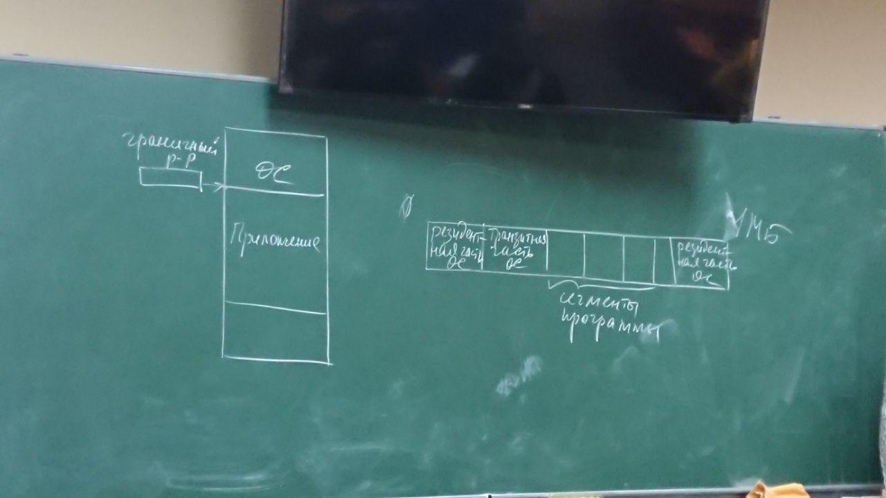

Три сегмента:
- сегмент кода
- сегмент данных
- сегмент стека
После того как загружена ос, в памяти остаётся участок, который называется динамической памятью (куча), в си называется хиппон, а в паскале забыла. По-разному называется.
Почему динамическая?
Потому что её размер меняется.

См.рис.2
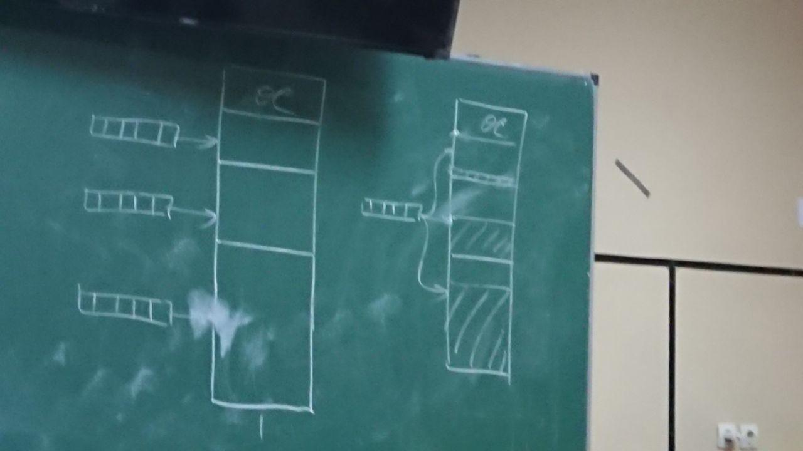

 На рисунке 2:
 рисунок слева:статическое распределение
 рисунок справа:одна очередь ко всем разделам

Это все было неэффективно и было предложено: не определять фиксированно размеры разделов, а загружать программы последовательно одну за другой и тем самый определять размер раздела

См.рис.3
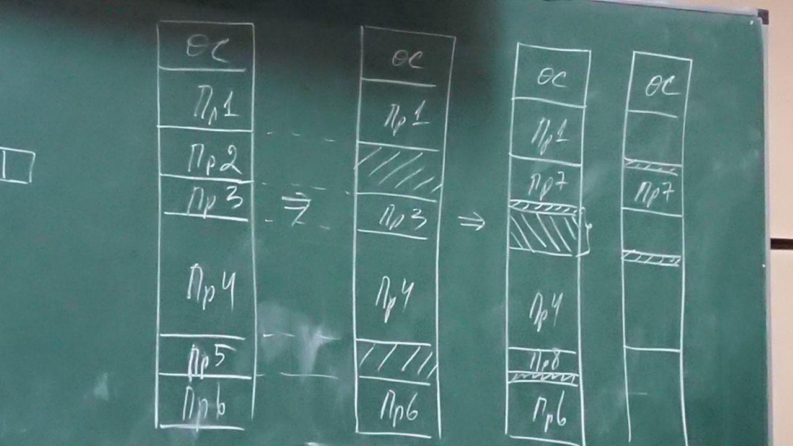

Программы постоянно завершаются и на их место загружаются новые, естественно точно такого же размера программу найти нереально, то есть возникают в результате освобождения участки памяти и их надо объединить. То есть при таком распределении память все хорошо, только в начальный момент. Все это приводит к тому, что возникает большое количество небольших участков я в которые невозможно загрузить ни одну программу.
Фрагментация памяти-появление в памяти небольших свободных участков, в которую не удается загрузить ни одну программу.
Существует три стратегии выбора раздела для загрузки программы
Первая-подходящая (из всех разделов выбирается самый подходящий)
Вторая-самая тесная (из всех разделов для программы выбирается самый близкий по размеру)
Третий-самый широкий (из всех разделов выбирается самый большой размер)
2 и 3 предполагают упорядоченность.

Системные таблицы-таблицы с которыми работает система.
2 таблицы: 

Таблица выделенных разделов (рис.4)
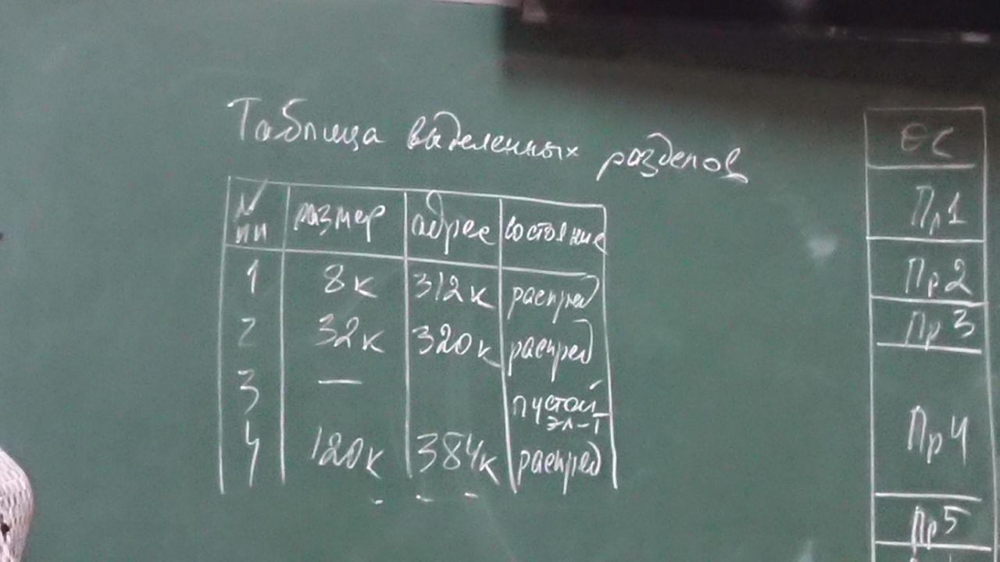

Таблица свободных разделов (рис.5)
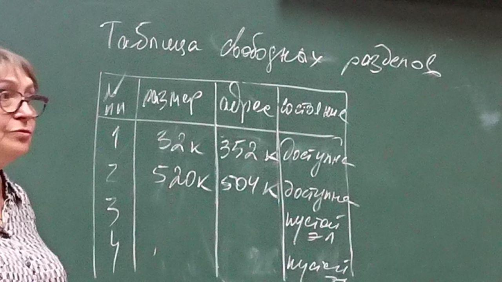

Связанные списки бывают нескольких типов:
- односвязные
- двухсвязные
- кольцевые
- бинарные деревья

См.рис.6
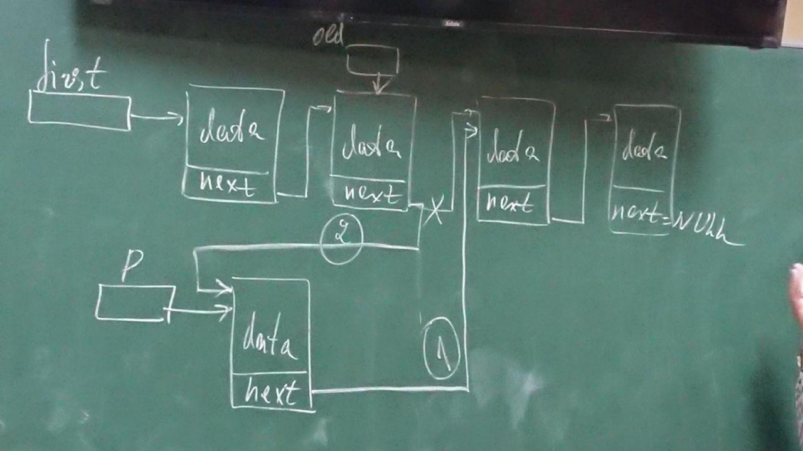

Каждый элемент имеет указатель на следующий элемент списка. Объявляется структура и в этой структуре есть поле "указатель". Одно для односвязного, два для двусвязного и бинарных деревьев.

ПЕРЕМЕЩЕНИЕ РАЗДЕЛОВ
В памяти возникает большое количество маленьких участков, в которые не удается загрузить не одну программу. Выход-перезагрузка системы. Происходит потеря проделанной работы.
Возникает идея перемещения разделов. Опять же речь идёт о статических адресах.

См.рис7
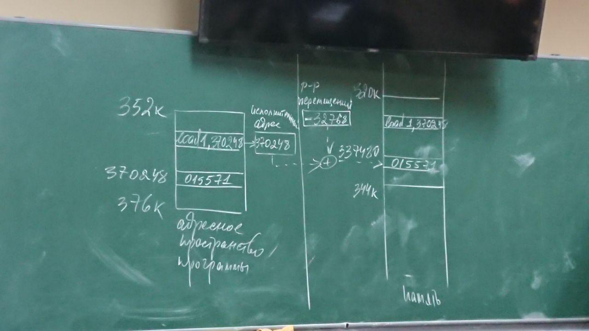

В процессоре должен быть специальный регистр-регистр перемещений.
Мы перемещаем программу к младшим адресам.
В результате такого преобразования адреса мы получаем реальный адрес 337480
Такое решение возможно с помощью преобразования адресов. На каждой команде, кто и несколько раз.

После этого перешли к динамической памяти и было введено понятие логического адреса.
Каждая программа считает, что она начинается с нулевого адреса.

См.рис8
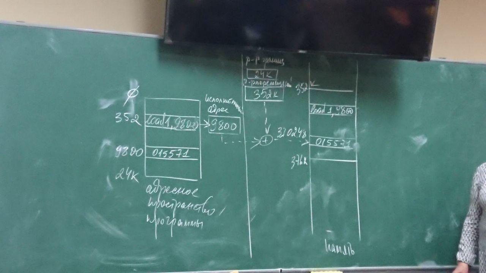

Преобразование присутствует, но в регистре перемещений будет находиться начальный адрес программы. А в программе находится смещение, в результате к начальному адресу прибавляем смещение из программы и получаем линейный физический адрес.
В многопроцессной системе, когда процессор переключается на выполнение следующей программы

в соответствующий регистр (регистр перемещений)  должен быть загружен начальный адрес раздела памяти, в котором находится программа. И для обращения необходимо выполнять преобразование и получается линейный физический адрес.
Это цена за возможность перемещать наши программы.
Когда делать такое перемещение?
-Сразу после освобождения раздела
-В случае если не найден свободный раздел нужного размера

Несвязанное распределение

См.рис9
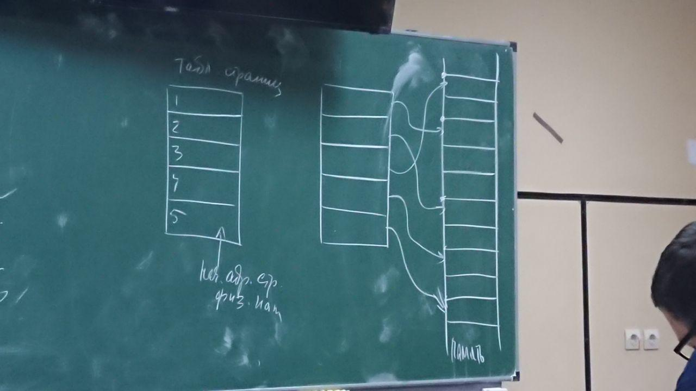

Мы адресное пространство программы поделили на страницы (page). Страницы-мы должны описать адресное пространство программы.
Страница-физическое деление памяти, размер страницы определён в системе, а сегменты является единицей логического деления памяти.
2 способа несвязанного распределения памяти
Страницами и сегментами
А надо ли все страницы программы держать в памяти?
Нет, не нужно. Нужно держать страницы, к которым в текущий момент времени обращается процессор.
И это идея виртуальной памяти

ВИРТУАЛЬНАЯ ПАМЯТЬ
Не существующая память.
Существует три схемы управления виртуальной памятью
-управление памятью страницами позапросу
-управление памятью сегментами по запросу
-управление памятью сегментами поделенными на страницы по запросу

Во всех трёх названиях есть по запросу, то есть необходимая страница или сегмент загружаются в память, когда они нужны то есть когда к ним выполняется обращение. (в современных системах используется только страничное преобразование, выделяется три страницы:страница сегмента кода, страница сегмента данных, страница сегмента стека). 
Если программа не находит нужную страницу происходит страничное прерывание. Его относят к исправимым исключениям, то есть при возникновении такого исключения будет вызван обработчик исключения по отсутствию страницы в памяти, в результате работы этого обработчика, если сказать коротко, будет загружена в память нужная страница и программа продолжит свое выполнение.
А есть неисправимые исключения, например деление на нуль и она завершится.
Страничное преобразование-управление памятью по запросу

См.рис10(присланная фотка)
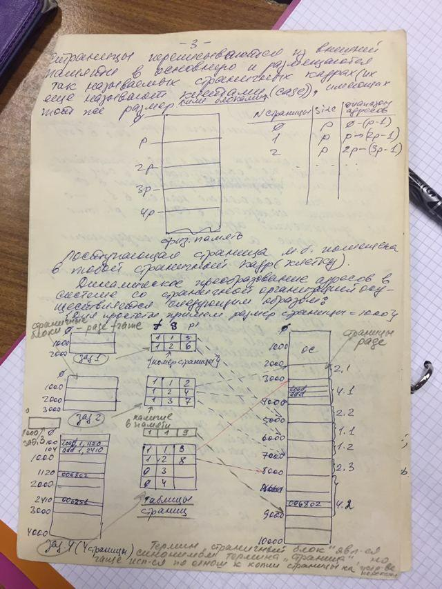

Существует три способа преобразования адресов при управлении памятью страницами по запросу
1)прямое отображение (для выполнения преобразования в процессоре должен быть регистр начального адреса таблицы страниц. Base address)

См.рис11
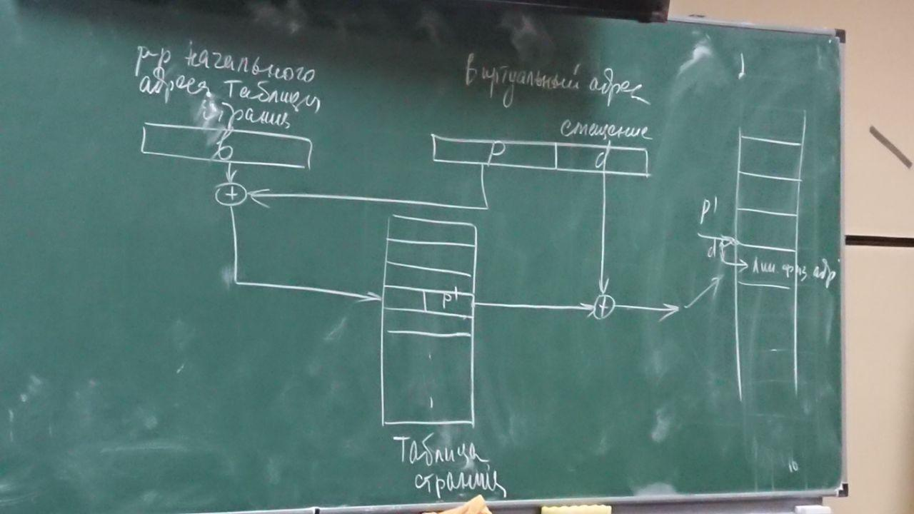

То есть программе выделяется виртуальное адресное пространство. Оно в разных системах реализуется по-разному. Можно сказать, что наша программа располагается в виртуальном адресном пространстве и преобразуется к физическому виртуальный адрес. При простом страничное преобразовании виртуальный адрес делится на две части:номер страницы и смещение страницы. Такое преобразование надо выполнять на каждой странице, кто и несколько раз. Закачка страниц пожирает процессорное время. Это цена. Выигрыш в увеличении мультизадачности, то есть держим в памяти большее количество программ.
2)ассоциативное отображение. Циклы обращения к памяти. Это не один такт, это несколько тактов и это затратное действие. Ассоциативная память-это специальный вид памяти. Это регистровая память с соответствующими схемами управления. Выборка такой памяти осуществляется по ключу за 1 такт. И при совпадении ключа со значением соответствующего поля происходит выборка за 1 такт.

См.рис12
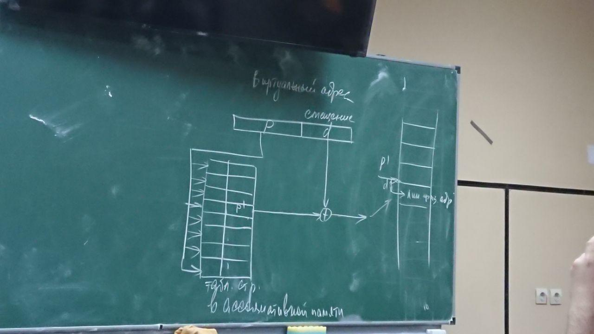

Поэтому стали использовать третий способ
3)Ассоциативно-прямого отображения
В такой схеме исользуется ассоциативная памяти небольшого размера 8/16/24 строки и таблица страниц, которая находится в физической памяти. Сначала ищется в ассоциативной памяти. Ищутся адрес страниц, к которым были последние обращения.

См.рис13
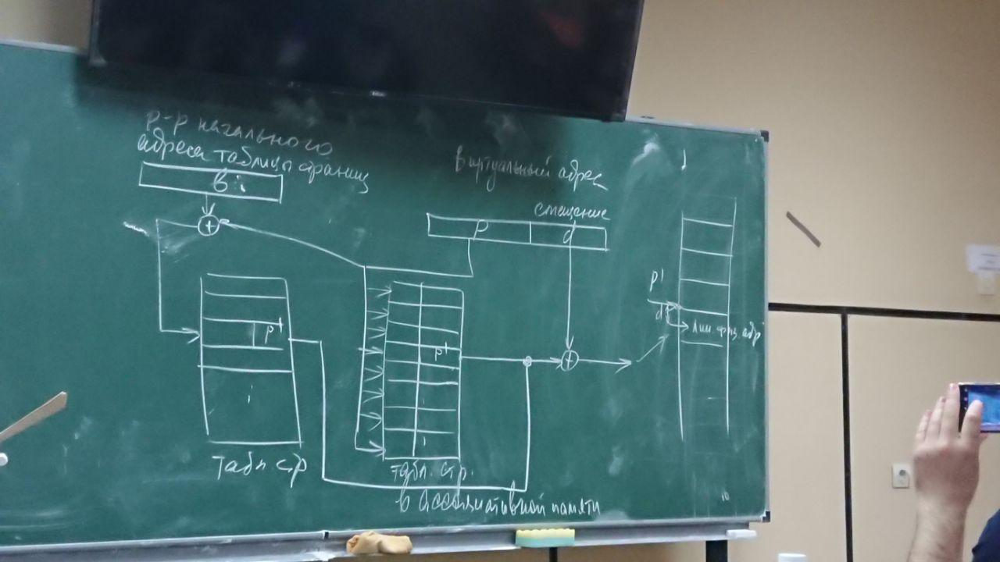
