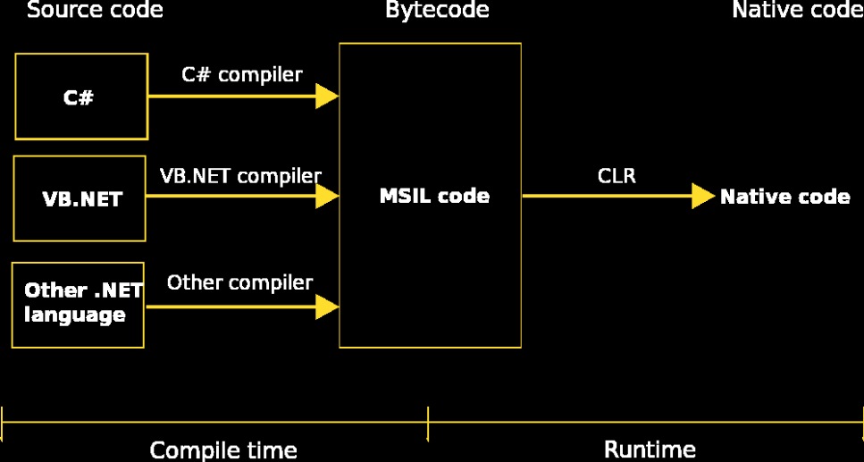

[Вернуться к списку вопросов](../questions.md)

-----------------

# Вопрос № 1

* Common Language Infrastructure (CLI).
* Ключевые аспекты CLI.
* Причины появления CLI.
* Достоинства и недостатки.

**Общая языковая инфраструктура (Common Language Infrastructure - CLI)** - это открытая спецификация (технический
стандарт), разработанная Microsoft и стандартизированная ISO (ISO/IEC 2327:2012) и ECMA (ECMA-335 6th Edition), которая
описывает исполняемый код и среду выполнения и позволяет использовать несколько языков высокого уровня на разных
компьютерных платформах без переписывания для конкретных архитектур, обеспечивая таким образом независимость от выбора
языка и платформы.

### Причины возникновения.

В конце 90х гг. при росте экосистемы Windows и появлении планов развития серверных платформ (
Windows Server) для повышения привлекательности Windows стала необходима разработка инструментария, способного решить
проблемы, которые на тот момент мешали как пользователям, так и разработчикам. CLI возникла в рамках провозглашенной
Microsoft 22 июня 2020 г. .NET Strategy как способ решения следующих проблем:

1. **Утечки памяти** (процесс неконтролируемого роста объема оперативной памяти, занимаемой процессом выполнения
   программы, связанный с ошибками управления памятью). Приводят к тому, что на фоне недостатка ресурсов начинает
   использоваться файл подкачки, доступность системы падает до субъективного нуля и возникает риск потери данных.
2. **Ошибки сегментации.** Возникают при попытке обращения к недоступным для записи участкам памяти. Приводят к
   разрушительному сбою процесса и гарантированной потере данных. При этом нет способа остановить сбой и предотвратить
   подобные ситуации.
3. **Фрагментация памяти** (процесс появления беспорядочно разбросанных незанятых участков в памяти). Нарастает по мере
   работы программы. Приводит к росту памяти процесса и более медленному выделению памяти.
4. **Зависимость от программного окружения** (ОС, версия ОС, набор библиотек, версии библиотек)
5. **Зависимость от аппаратного окружения** (различные оптимизации под разные процессоры)
6. **Программы написаны на разных языках** (одни и те же задачи решаются многократно на разных языках, нужно изучать
   разные языки и сопутствующие технологии, иногда приходится переписывать на другой язык)
7. **Безопасность** (как защитить пользователя от подмены библиотек)
8. **Удобство развертывания**

### Основные аспекты CLI

Спецификация CLI описывает следующие четыре аспекта:

1. Общая система типов – **Common Type System (CTS)**. Набор типов данных, общих для всех CTS-совместимых языков
   программирования (некая общая стандартная библиотека для всех совместимых языков). Характеристики типов данных:
    - Объем занимаемой памяти;
    - Способ представления в памяти;
    - Диапазон значений;
    - Набор операций.
2. **Метаданные** (Metadata). Это часть стандарта CLI, описывающая независимый от языка способ представления информации
   о структуре программы. CLI использует метаданные для описания типов, объявленных согласно CTS. Это делает метаданные
   общим форматом и механизмом обмена информацией между инструментами (компиляторами, отладчиками) и между инструментами
   и VES.
3. Общая спецификация языка – **Common Language Specification (CLS)**. Часть стандарта CLI, описывающая соглашение между
   разработчиками языка и разработчиками библиотек и фреймворков. Содержит указание подмножества CTS и набора конвенций
   использования. Языки позволяют использовать библиотеки и фреймворки, если реализуют по крайней мере те части общей
   системы типов (CTS), которые указаны в CLS. Библиотеки и фреймворки, в свою очередь, будут максимально совместимы,
   если их открытые для взаимодействия типы являются теми, что указаны в CLS или удовлетворяют конвенциям CLS.
4. Виртуальная система исполнения – **Virtual Execution System (VES)**. Часть стандарта CLI, описывающая среду
   исполнения программ на языках, совместимых с CLI.
    * VES использует метаданные сборок (сборка – результат компиляции) для связывания их в единую программу. Машинный
      код генерируется just-in-time компилятором (JIT).
    * VES также выполняет управление памятью процесса. За это отвечает сбощик мусора (garbage collector, GC).
    * При генерации машинного кода VES выполняет платформоспецифичные оптимизации (оптимизации под разные виды
      процессоров).

### Принципы работы CLI:

### Реализации. Достоинства и недостатки.

1. `.NET` FRAMEWORK
    * Первая и официальная реализация от Microsoft
    * Наиболее широкий набор библиотек.
    * Только под Windows (под все семейство ОС Windows, но все равно кроссплатформенность ограничена). Начиная с Windows
      XP зашит в Windows.
    * Большая установка, GAC (global assembly cache – в инфраструктуре .NET подсистема, хранящая сборки CLI (CLI
      assembly) в централизованном репозитории)
    * Open Source с 2014 г. (MIT, 12.11.2014)
2. Mono
    * Open Source реализация
    * Стартовала 30.06.2004
    * Кроссплатформенная: Windows, Linux, macOS, Android, BSD, Solaris, PS 3, Wii, Xbox 360
    * Не такой широкий набор библиотек (в прошлом?)
3. `.NET` CORE
    * Open Source и cross-platform реализация от .NET Foundation
    * Первая версия - 27.06.2016
    * Только Web, Console и Dll (в последних версиях можно использовать и другие технологии, но работать они будут
      только на Windows).
    * Windows, Linux, macOS
    * Лёгкая, модульная установка, частые обновления модулей
4. `.NET` - Первая версия (без «Core») – 10.11.2020, название «.NET 5» , чтобы избежать путаницы с .NET Framework 4

[Вернуться в начало](#begin)