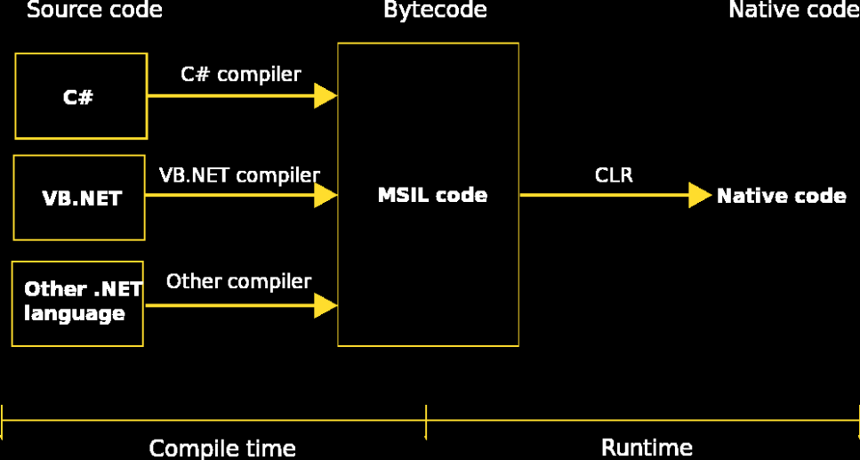

[Вернуться к списку вопросов](../questions.md)

-----------------

# Вопрос № 2

* Компиляция C#.
* Что такое Common Intermediate Language (CIL) и как он связан с Intermediate Language (IL)?
* Как происходит компиляция CIL?
* Что такое Just-in-time компиляция (JIT)?
* Сборки в C# (Assemblies).
* Что такое, из чего состоят сборки C#?
* Что такое Global Assembly Cache (GAC)?
* Механизм защиты от подмены сборок.
* Типы сборок.

### Компиляция C#. Что такое Common Intermediate Language (CIL) и как он связан с Intermediate Language (IL)? Как происходит компиляция CIL? Что такое Just-in-time компиляция (JIT)?

Основные принципы компиляции

**Common Intermediate Language (CIL)**, ранее называвшийся Microsoft Intermediate Language (MSIL) или Intermediate
Language (IL) (т.о. Intermediate Language – это просто предыдущее название (версия?) Common Intermediate Language), это
набор двоичных команд промежуточного языка, определенный в стандарте Common Language Infrastructure (CLI). Инструкции
CIL выполняются CLI-совместимой средой выполнения (например, Common Language Runtime). CIL - это
объектно-ориентированный, стековый байт-код . Среды выполнения обычно вовремя компилируют инструкции CIL в собственный
код.

При компиляции языков программирования CLI исходный код транслируется в код CIL, а не в объектный код, зависящий от
платформы или процессора.

CIL - это не зависящий от процессора и платформы набор инструкций, который может выполняться в любой среде,
поддерживающей инфраструктуру общего языка, например в среде выполнения .NET в Windows или кроссплатформенной среде
выполнения Mono. Теоретически это избавляет от необходимости распространять разные исполняемые файлы для разных платформ
и типов ЦП. Код CIL проверяется на безопасность во время выполнения, обеспечивая лучшую безопасность и надежность, чем
исполняемые файлы, скомпилированные в собственном коде.

Процесс выполнения выглядит следующим образом:

* Исходный код преобразуется в байт-код CIL и создается сборка CLI .
* После выполнения сборки CIL ее код передается через JIT-компилятор среды выполнения для генерации собственного кода.
  Также может использоваться предварительная компиляция, которая исключает этот шаг, но за счет переносимости
  исполняемого файла (но про это в лекциях у нас ничего не было).
* Процессор компьютера выполняет собственный код.

**Компиляция Just-in-time** («на лету») происходит на этапе исполнения, т.е. JIT компилятор начинает работать только при
запуске программы. При этом происходит так называемая «ленивая» компиляция - на основе метаданных JIT компилятор
принимает решение, какую именно часть программы сейчас нужно компилировать, т.е. программа компилируется последовательно
только теми частями, которые необходимы непосредственно для работы в данный момент (может компилировать с расчетом на
несколько шагов вперед, но все равно не все сразу).

**«Ленивая»** компиляция возможна из-за доступности метаданных единиц компиляции. Из-за этого возможна также «горячая»
замена участков кода непосредственно в процессе исполнения программы. Удобно при отладке приложений.

При «ленивой» компиляции не происходит повторной компиляции каких-либо участков кода.

### Сборки в C# (Assemblies). Что такое, из чего состоят сборки C#? Что такое Global Assembly Cache (GAC)? Механизм защиты от подмены сборок. Типы сборок.

**Сборка** – это единица компиляции и единица исполнения в CLI. Набор из одного или нескольких файлов, поставляемых как
единое целое. Обязательно включает в себя манифест.

**Файлы**, входящие в сборку:

* Модули: код на CIL + метаданные
* Ресурсы: строки, изображения и т.д.

**Манифест** сборки включает в себя:

* Версию сборки
* Имя сборки
* Языковую культуру сборки
* Требования безопасности сборки
* Данные о том, какие файлы входят в сборку
* Цифровую подпись и публичный ключ

Сборка А и сборка Б могут иметь общие файлы (но обычно так не делают).

**Версия сборки** – это 4 32-битных целых числа:

* Major - крупные изменения, потеря обратной совместимости
* Minor - важные улучшения, сохранение совместимости
* Build - различные компиляции одного исходного кода
* Revision - полная взаимозаменяемость в пределах ревизии

**Имя сборки** может включать в себя точки (например, System.Configuration.dll)

**Языковая культура** (опциональный параметр). Указывает, что сборка относится к определённой языковой культуре.
Названия культур определяются стандартом IETF RFC1766 и указываются в формате "<язык>-<страна/регион>":

* <язык> - 2-буквенный код в нижнем регистре (ISO 639-1)
* <страна/регион> - 2-буквенный код в верхнем регистре (ISO 3166)
  Например, "en-US" – это английский язык США, а "ru-RU" – это «российский» русский.

**Требования безопасности сборки**:

* Требуемые разрешения (например, права администратора при работе с 80 портом)
* Желательные разрешения
* Запрещаемые разрешения

**Цифровая подпись** (strong name – сильное имя сборки) – защита от подмены сборок

* Гарантирует аутентичность сборки
* Проверяется на уровне VES

Сборка со строгим именем создается с помощью закрытого ключа, который соответствует открытому ключу, распространяемому
со сборкой, и самой сборке. Сборка включает манифест сборки, который содержит имена и хэши всех файлов, из которых
состоит сборка. Сборки с одинаковым строгим именем должны быть идентичны. Строгое имя состоит из удостоверения сборки,
включающего ее простое текстовое имя, номер версии и сведения о языке и региональных параметрах (если они имеются), а
также открытый ключ и цифровую подпись. Оно создается из файла сборки с использованием соответствующего закрытого ключа.

**Global Assembly Cache** (англ. GAC — Глобальный Кэш Сборок) — в инфраструктуре .NET — подсистема, хранящая сборки
CLI (CLI assembly) в централизованном репозитории. Система разработана для борьбы с проблемами разделяемых библиотек,
например таких, как DLL hell.

К сборкам, расположенным в GAC, предъявляется несколько требований. В частности, они должны использовать strong name,
соблюдать строгую схему указания версий и допускать исполнение нескольких версий кода в рамках единого приложения.

GAC необходим, чтобы несколько приложений, использующие одинаковые сборки, могли иметь к ним доступ.

Гарантирует их безопасность от удаления пользователем, так как каталог GAC находится внутри защищенной системной папки
Windows.

GAC может хранить несколько разных версий сборок CLI, приложение при запуске запрашивает необходимую версию сборки.

**Сборки могут быть статическими или динамическими**. Статические сборки хранятся на диске в виде переносимых
исполняемых (PE) файлов. Статические сборки могут включать интерфейсы, классы и ресурсы, такие как точечные рисунки,
файлы JPEG и другие файлы ресурсов. Кроме того, можно создавать динамические сборки, которые запускаются непосредственно
из памяти и не сохраняются на диск перед выполнением. Динамические сборки можно сохранить на диске после выполнения.

[Вернуться в начало](#begin)