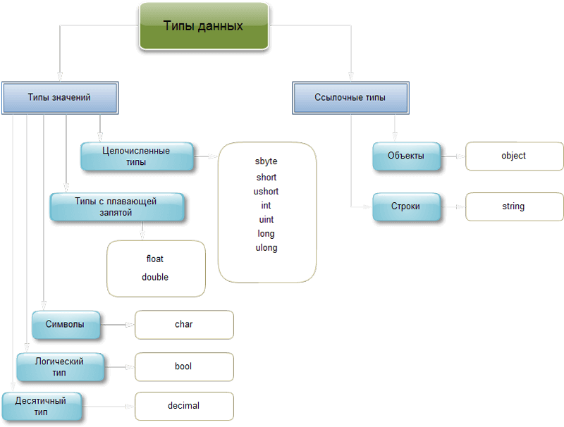
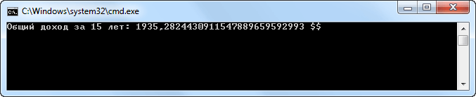

[Вернуться к списку вопросов](../questions.md)

<div id="begin"></div>
-----------------

# Вопрос № 5

* Логический тип данных.
* Логические выражения.
* Логические операторы.
* Тернарный оператор.
* Целочисленные типы данных: byte, sbyte, int, uint, short, ushort, long, ulong.
* Названия типов, объём занимаемой памяти.
* Набор операций.
* Вещественные типы данных: float, double, decimal.
* Названия типов, объём занимаемой памяти.
* Набор операций.
* Тип данных char.
* Название типа, объём занимаемой памяти.
* Набор операций.

Типы данных имеют особенное значение в C#, поскольку это строго типизированный язык. Это означает, что все операции
подвергаются строгому контролю со стороны компилятора на соответствие типов, причем недопустимые операции не
компилируются. Следовательно, строгий контроль типов позволяет исключить ошибки и повысить надежность программ. Для
обеспечения контроля типов все переменные, выражения и значения должны принадлежать к определенному типу. Такого
понятия, как "бестиповая" переменная, в данном языке программирования вообще не существует. Более того, тип значения
определяет те операции, которые разрешается выполнять над ним. Операция, разрешенная для одного типа данных, может
оказаться недопустимой для другого.

В C# имеются две общие категории встроенных типов данных: типы значений и ссылочные типы. Они отличаются по содержимому
переменной. Концептуально разница между ними состоит в том, что тип значения (value type) хранит данные непосредственно,
в то время как ссылочный тип (reference type) хранит ссылку на значение.

Эти типы сохраняются в разных местах памяти: типы значений сохраняются в области, известной как стек, а ссылочные типы —
в области, называемой управляемой кучей.



Разберем типы значений.

### Целочисленные типы

В C# определены девять целочисленных типов: `char`, `byte`, `sbyte`, `short`, `ushort`, `int`, `uint`, `long` и `ulong`.
Но тип `char` применяется, главным образом, для представления символов и поэтому рассматривается отдельно. Остальные
восемь целочисленных типов предназначены для числовых расчетов. Ниже представлены их диапазон представления чисел и
разрядность в битах:

Целочисленные типы C#

| **Тип** | **Тип CTS**   | **Разрядность в битах** | **Диапазон**                                |
| ------- | ------------- | ----------------------- | ------------------------------------------- |
| byte    | System.Byte   | 8                       | 0:255                                       |
| sbyte   | System.SByte  | 8                       | \-128:127                                   |
| short   | System.Int16  | 16                      | \-32768 : 32767                             |
| ushort  | System.UInt16 | 16                      | 0 : 65535                                   |
| int     | System.Int32  | 32                      | \-2147483648 : 2147483647                   |
| uint    | System.UInt32 | 32                      | 0 : 4294967295                              |
| long    | System.Int64  | 64                      | \-9223372036854775808 : 9223372036854775807 |
| ulong   | System.UInt64 | 64                      | 0 : 18446744073709551615                    |

Как следует из приведенной выше таблицы, в C# определены оба варианта различных целочисленных типов: со знаком и без
знака. Целочисленные типы со знаком отличаются от аналогичных типов без знака способом интерпретации старшего разряда
целого числа. Так, если в программе указано целочисленное значение со знаком, то компилятор C# сгенерирует код, в
котором старший разряд целого числа используется в качестве флага знака. Число считается положительным, если флаг знака
равен 0, и отрицательным, если он равен 1.

Отрицательные числа практически всегда представляются методом дополнения до двух, в соответствии с которым все двоичные
разряды отрицательного числа сначала инвертируются, а затем к этому числу добавляется 1.

Вероятно, самым распространенным в программировании целочисленным типом является тип int. Переменные типа int нередко
используются для управления циклами, индексирования массивов и математических расчетов общего назначения. Когда же
требуется целочисленное значение с большим диапазоном представления чисел, чем у типа int, то для этой цели имеется
целый ряд других целочисленных типов.

Так, если значение нужно сохранить без знака, то для него можно выбрать тип uint, для больших значений со знаком — тип
long, а для больших значений без знака — тип ulong. В качестве примера ниже приведена программа, вычисляющая расстояние
от Земли до Солнца в сантиметрах. Для хранения столь большого значения в ней используется переменная типа long:

```cs
using System;
using System.Collections.Generic;
using System.Linq;
using System.Text;

namespace ConsoleApplication1
{
    class Program
    {
        static void Main(string[] args)
        {
            long result;
            const long km = 149800000; // расстояние в км.

            result = km * 1000 * 100;
            Console.WriteLine(result);
            Console.ReadLine();
        }
    }
}
```

Всем целочисленным переменным значения могут присваиваться в десятичной или шестнадцатеричной системе обозначений. В
последнем случае требуется префикс 0x:

```cs
long x = 0x12ab;
```

Если возникает какая-то неопределенность относительно того, имеет ли целое значение тип int, uint, long или ulong, то по
умолчанию принимается int. Чтобы явно специфицировать, какой другой целочисленный тип должно иметь значение, к числу
можно добавлять следующие символы:

```cs
uint ui = 1234U;
long l = 1234L;
ulong ul = 1234UL;
```

U и L можно также указывать в нижнем регистре, хотя строчную L легко зрительно спутать с цифрой 1 (единица).

### Типы с плавающей точкой

Типы с плавающей точкой позволяют представлять числа с дробной частью. В C# имеются две разновидности типов данных с
плавающей точкой: float и double. Они представляют числовые значения с одинарной и двойной точностью соответственно.
Так, разрядность типа float составляет 32 бита, что приближенно соответствует диапазону представления чисел от 5E-45 до
3,4E+38. А разрядность типа double составляет 64 бита, что приближенно соответствует диапазону представления чисел от
5E-324 до 1,7Е+308.

Тип данных float предназначен для меньших значений с плавающей точкой, для которых требуется меньшая точность. Тип
данных double больше, чем float, и предлагает более высокую степень точности (15 разрядов).

Если нецелочисленное значение жестко кодируется в исходном тексте (например, 12.3), то обычно компилятор предполагает,
что подразумевается значение типа double. Если значение необходимо специфицировать как float, потребуется добавить к
нему символ F (или f):

```cs
float f = 12.3F;
```

### Десятичный тип данных

Для представления чисел с плавающей точкой высокой точности предусмотрен также десятичный тип decimal, который
предназначен для применения в финансовых расчетах. Этот тип имеет разрядность 128 бит для представления числовых
значений в пределах от 1Е-28 до 7,9Е+28. Вам, вероятно, известно, что для обычных арифметических вычислений с плавающей
точкой характерны ошибки округления десятичных значений. Эти ошибки исключаются при использовании типа decimal, который
позволяет представить числа с точностью до 28 (а иногда и 29) десятичных разрядов. Благодаря тому что этот тип данных
способен представлять десятичные значения без ошибок округления, он особенно удобен для расчетов, связанных с финансами:

```cs
using System;
using System.Collections.Generic;
using System.Linq;
using System.Text;

namespace ConsoleApplication1
{
    class Program
    {
        static void Main(string[] args)
        {
            // *** Расчет стоимости капиталовложения с ***
            // *** фиксированной нормой прибыли***
            decimal money, percent;
            int i;
            const byte years = 15;

            money = 1000.0m;
            percent = 0.045m;

            for (i = 1; i <= years; i++)
            {
                money *= 1 + percent;
            }

            Console.WriteLine("Общий доход за {0} лет: {1} $$",years,money);
            Console.ReadLine();
        }
    }
}
```

Результатом работы данной программы будет:



### Символы

В C# символы представлены не 8-разрядным кодом, как во многих других языках программирования, например С++, а
16-разрядным кодом, который называется юникодом (Unicode). В юникоде набор символов представлен настолько широко, что он
охватывает символы практически из всех естественных языков на свете. Если для многих естественных языков, в том числе
английского, французского и немецкого, характерны относительно небольшие алфавиты, то в ряде других языков, например
китайском, употребляются довольно обширные наборы символов, которые нельзя представить 8-разрядным кодом. Для
преодоления этого ограничения в C# определен тип char, представляющий 16-разрядные значения без знака в пределах от 0 до
65 535. При этом стандартный набор символов в 8-разрядном коде ASCII является подмножеством юникода в пределах от 0 до

127. Следовательно, символы в коде ASCII по-прежнему остаются действительными в C#.

Для того чтобы присвоить значение символьной переменной, достаточно заключить это значение (т.е. символ) в одинарные
кавычки:

```cs
char ch;
ch = 'Z';
```

Несмотря на то что тип char определен в C# как целочисленный, его не следует путать со всеми остальными целочисленными
типами. Дело в том, что в C# отсутствует автоматическое преобразование символьных значений в целочисленные и обратно.
Например, следующий фрагмент кода содержит ошибку:

```cs
char ch;
ch = 8; // ошибка, не выйдет
```

Наравне с представлением char как символьных литералов, их можно представлять как 4-разрядные шестнадцатеричные значения
Unicode (например, '\u0041'), целочисленные значения с приведением (например, (char) 65) или же шестнадцатеричные
значения (например, '\x0041'). Кроме того, они могут быть представлены в виде управляющих последовательностей.

### Логический тип данных

Тип **bool** представляет два логических значения: "истина" и "ложь". Эти логические значения обозначаются в C#
зарезервированными словами true и false соответственно. Следовательно, переменная или выражение типа bool будет
принимать одно из этих логических значений. Кроме того, в C# не определено взаимное преобразование логических и целых
значений. Например, 1 не преобразуется в значение true, а 0 — в значение false.

[Вернуться в начало](#begin)