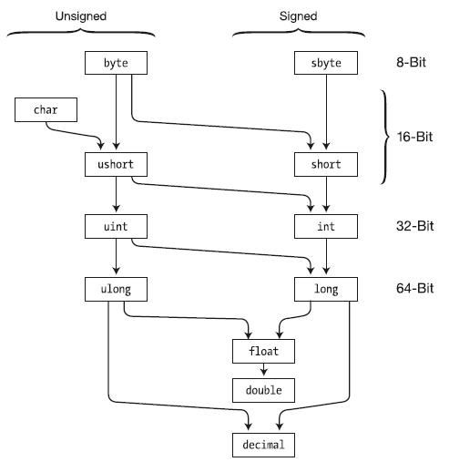
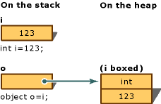
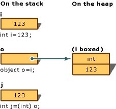

[Вернуться к списку вопросов](../questions.md)

<div id="begin"></div>
-----------------

# Вопрос № 6

* Приведение типов.
* Явное и неявное приведение типов.
* Операторы is, as.
* Упаковка и распаковка (boxing и unboxing).

При рассмотрении типов данных указывалось, какие значения может иметь тот или иной тип и сколько байт памяти он может
занимать. В прошлой теме были расмотрены арифметические операции. Теперь применим операцию сложения к данным разных
типов:

```cs
byte a = 4;
int b = a + 70;
```

Результатом операции вполне справедливо является число 74, как и ожидается. Но теперь попробуем применить сложение к
двум объектам типа byte:

```cs
byte a = 4;
byte b = a + 70;  // ошибка
```

Здесь поменялся только тип переменной, которая получает результат сложения - с int на byte. Однако при попытке
скомпилировать программу мы получим ошибку на этапе компиляции. И если мы работаем в Visual Studio, среда подчеркнет
вторую строку красной волнистой линией, указывая, что в ней ошибка.

При операциях мы должны учитывать диапазон значений, которые может хранить тот или иной тип. Но в данном случае число
74, которое мы ожидаем получить, вполне укладывается в диапазон значений типа byte, тем не менее мы получаем ошибку.

Дело в том, что операция сложения (да и вычитания) возвращает значение типа int, если в операции участвуют целочисленные
типы данных с разрядностью меньше или равно int (то есть типы byte, short, int). Поэтому результатом операции a + 70
будет объект, который имеет длину в памяти 4 байта. Затем этот объект мы пытаемся присвоить переменной b, которая имеет
тип byte и в памяти занимает 1 байт.

И чтобы выйти из этой ситуации, необходимо применить операцию преобразования типов:

```cs
byte a = 4;
byte b = (byte)(a + 70);
```

Операция преобразования типов предполагает указание в скобках того типа, к которому надо преобразовать значение.

### Сужающие и расширяющие преобразования

Преобразования могут сужающие (narrowing) и расширяющие (widening). Расширяющие преобразования расширяют размер объекта
в памяти. Например:

```cs
byte a = 4;             // 0000100
ushort b = a;   // 000000000000100
```

В данном случае переменной типа ushort присваивается значение типа byte. Тип byte занимает 1 байт (8 бит), и значение
переменной a в двоичном виде можно представить как:

```cs
00000100
```

Значение типа ushort занимает 2 байта (16 бит). И при присвоении переменной b значение переменной a расширяется до 2
байт

```cs
0000000000000100
```

То есть значение, которое занимает 8 бит, расширяется до 16 бит.

Сужающие преобразования, наоборот, сужают значение до типа меньшей разядности. Во втором листинге статьи мы как раз
имели дело с сужающими преобразованиями:

```cs
ushort a = 4;
byte b = (byte) a;
```

Здесь переменной b, которая занимает 8 бит, присваивается значение ushort, которое занимает 16 бит. То есть из
0000000000000100 получаем 00000100. Таким образом, значение сужается с 16 бит (2 байт) до 8 бит (1 байт).

### Явные и неявные преобразования

**Неявные преобразования**

В случае с расширяющими преобразованиями компилятор за нас выполнял все преобразования данных, то есть преобразования
были неявными (implicit conversion). Такие преобразования не вызывают каких-то затруднений. Тем не менее стоит сказать
пару слов об общей механике подобных преобразований.

Если производится преобразование от безнакового типа меньшей разрядности к безнаковому типу большой разрядности, то
добавляются дополнительные биты, которые имеют значени 0. Это называется дополнение нулями или zero extension.

```cs
byte a = 4;             // 0000100
ushort b = a;   // 000000000000100
```

Если производится преобразование к знаковому типу, то битовое представление дополняется нулями, если число
положительное, и единицами, если число отрицательное. Последний разряд числа содержит знаковый бит - 0 для положительных
и 1 для отрицательных чисел. При расширении в добавленные разряды компируется знаковый бит. Рассмотрим преобразование
положительного числа:

```cs
sbyte a = 4;            // 0000100
short b = a;    // 000000000000100
```

Преобразование отрицательного числа:

```cs
sbyte a = -4;           // 1111100
short b = a;    // 111111111111100
```

**Явные преобразования**

При явных преобразованиях (explicit conversion) мы сами должны применить операцию преобразования (операция ()). Суть
операции преобразования типов состоит в том, что перед значением указывается в скобках тип, к которому надо привести
данное значение:

```cs
int a = 4;
int b = 6;
byte c = (byte)(a+b);
```

Расширяющие преобразования от типа с меньшей разрядностью к типу с большей разрядностью компилятор поводит неявно. Это
могут быть следующие цепочки преобразований:

`byte -> short -> int -> long -> decimal`

`int -> double`

`short -> float -> double`

`char -> int`

Все безопасные преобразования автоматические преобразования можно описать следующей таблицей:

| **Тип** | **В какие типы безопасно преобразуется**                      |
| ------- | ------------------------------------------------------------- |
| byte    | short, ushort, int, uint, long, ulong, float, double, decimal |
| sbyte   | short, int, long, float, double, decimal                      |
| short   | int, long, float, double, decimal                             |
| ushort  | int, uint, long, ulong, float, double, decimal                |
| int     | long, float, double, decimal                                  |
| uint    | long, ulong, float, double, decimal                           |
| long    | float, double, decimal                                        |
| ulong   | float, double, decimal                                        |
| float   | double                                                        |
| char    | ushort, int, uint, long, ulong, float, double, decimal        |



В остальных случаях следует использовать явные преобразования типов.

Также следует отметить, что несмотря на то, что и double, и decimal могут хранить дробные данные, а decimal имеет
большую разрядность, чем double, но все равно значение double нужно явно приводить к типу decimal:

```cs
double a = 4.0;
decimal b = (decimal)a;
```

### Потеря данных и ключевое слово checked

Рассмотрим другую ситуацию, что будет, например, в следующем случае:

```cs
int a = 33;
int b = 600;
byte c = (byte)(a+b);
```

Результатом будет число 121, так число 633 не попадает в допустимый диапазон для типа byte, и старшие биты будут
усекаться. В итоге получится число 121. Поэтому при преобразованиях надо это учитывать. И мы в данном случае можем либо
взять такие числа a и b, которые в сумме дадут число не больше 255, либо мы можем выбрать вместо byte другой тип данных,
например, int.

Однако ситуации разные могут быть. Мы можем точно не знать, какие значения будут иметь числа a и b. И чтобы избежать
подобных ситуаций, в c# имеется ключевое слово checked:

```cs
try
{
    int a = 33;
    int b = 600;
    byte c = checked((byte)(a + b));
    Console.WriteLine(c);
}
catch (OverflowException ex)
{
    Console.WriteLine(ex.Message);
}
```

При использовании ключевого слова checked приложение выбрасывает исключение о переполнении. Поэтому для его обработки в
данном случае используется конструкция try...catch. Подробнее данную конструкцию и обработку исключений мы рассмотрим
позже, а пока надо знать, что в блок try мы включаем действия, в которых может потенциально возникнуть ошибка, а в блоке
catch обрабатываем ошибку.

Упаковка представляет собой процесс преобразования типа значения в тип object или в любой другой тип интерфейса,
реализуемый этим типом значения. Когда тип значения упаковывается общеязыковой средой выполнения (CLR), он инкапсулирует
значение внутри экземпляра System.Object и сохраняет его в управляемой куче. Операция распаковки извлекает тип значения
из объекта. Упаковка является неявной; распаковка является явной. Понятия упаковки и распаковки лежат в основе единой
системы типов C#, в которой значение любого типа можно рассматривать как объект.

В следующем примере выполнена операция iупаковки целочисленной переменной, которая присвоена объекту o.

```cs
int i = 123;
// The following line boxes i.
object o = i;
```

Затем можно выполнить операцию распаковки объекта oи присвоить его целочисленной переменной i:

```cs
o = 123;
i = (int)o;  // unboxing
```

Следующий пример иллюстрирует использование упаковки в C#.

```cs
byte[] array = { 0x64, 0x6f, 0x74, 0x63, 0x65, 0x74 };

string hexValue = Convert.ToHexString(array);
Console.WriteLine(hexValue);

/*Output:
  646F74636574
 */
```

### Производительность

По сравнению с простыми операциями присваивания операции упаковки и распаковки являются весьма затратными процессами с
точки зрения вычислений. При выполнении упаковки типа значения необходимо создать и разместить новый объект. Объем
вычислений при выполнении операции распаковки, хотя и в меньшей степени, но тоже весьма значителен. Дополнительные
сведения см. в разделе Производительность.

### Упаковка

Упаковка используется для хранения типов значений в куче со сбором мусора. Упаковка представляет собой неявное
преобразование типа значения в тип object или в любой другой тип интерфейса, реализуемый этим типом значения. При
упаковке типа значения в куче выделяется экземпляр объекта и выполняется копирование значения в этот новый объект.

Рассмотрим следующее объявление переменной типа значения.

```cs
int i = 123;
```

Следующий оператор неявно применяет операцию упаковки к переменной i.

```cs
// Boxing copies the value of i into object o.
object o = i;
```

Результат этого оператора создает ссылку на объект o в стеке, которая ссылается на значение типа int в куче. Это
значение является копией значения типа значения, присвоенного переменной i. Разница между этими двумя переменными, i и
o, показана на рисунке упаковки-преобразования ниже:



Можно также выполнять упаковку явным образом, как в следующем примере, однако явная упаковка не является обязательной.

```cs
int i = 123;
object o = (object)i;  // explicit boxing
```

Описание

В этом примере целочисленная переменная i преобразуется в объект o при помощи упаковки. Затем значение, хранимое
переменной i, меняется с 123 на 456. В примере показано, что исходный тип значения и упакованный объект используют
отдельные ячейки памяти, а значит могут хранить разные значения.

Пример

```cs
class TestBoxing
{
    static void Main()
    {
        int i = 123;

        // Boxing copies the value of i into object o.
        object o = i;

        // Change the value of i.
        i = 456;

        // The change in i doesn't affect the value stored in o.
        System.Console.WriteLine("The value-type value = {0}", i);
        System.Console.WriteLine("The object-type value = {0}", o);
    }
}
/* Output:
    The value-type value = 456
    The object-type value = 123
*/
```

### Распаковка

Распаковка является явным преобразованием из типа object в тип значения или из типа интерфейса в тип значения,
реализующего этот интерфейс. Операция распаковки состоит из следующих действий:

* проверка экземпляра объекта на то, что он является упакованным значением заданного типа значения;
* копирование значения из экземпляра в переменную типа значения.

В следующем коде показаны операции по упаковке и распаковке.

```cs
int i = 123;      // a value type
object o = i;     // boxing
int j = (int)o;   // unboxing
```

На рисунке ниже представлен результат выполнения этого кода.



Для успешной распаковки типов значений во время выполнения необходимо, чтобы экземпляр, который распаковывается, был
ссылкой на объект, предварительно созданный с помощью упаковки экземпляра этого типа значения. Попытка распаковать null
создает исключение NullReferenceException. Попытка распаковать ссылку на несовместимый тип значения создает исключение
InvalidCastException.

Пример

В следующем примере показан случай недопустимой распаковки, в результате чего создается исключение InvalidCastException.
В случае использования try и catch при возникновении ошибки выводится сообщение.

```cs
class TestUnboxing
{
    static void Main()
    {
        int i = 123;
        object o = i;  // implicit boxing

        try
        {
            int j = (short)o;  // attempt to unbox

            System.Console.WriteLine("Unboxing OK.");
        }
        catch (System.InvalidCastException e)
        {
            System.Console.WriteLine("{0} Error: Incorrect unboxing.", e.Message);
        }
    }
}
```

При выполнении этой программы выводится следующий результат:

`Specified cast is not valid. Error: Incorrect unboxing.`

При изменении оператора:

```cs
int j = (short) o;
```

на:

```cs
int j = (int) o;
```

будет выполнено преобразование со следующим результатом:

`Unboxing OK.`

[Вернуться в начало](#begin)