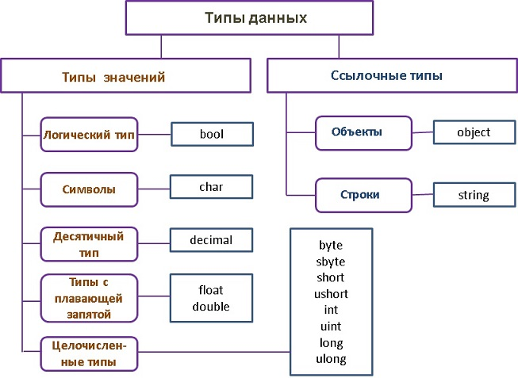
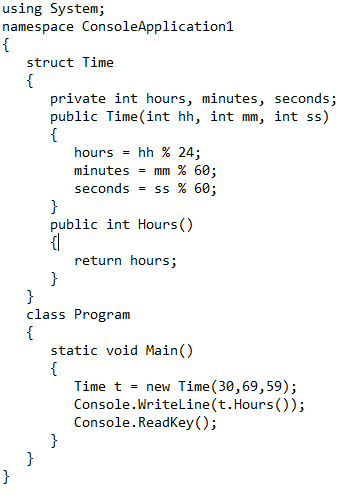
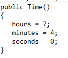
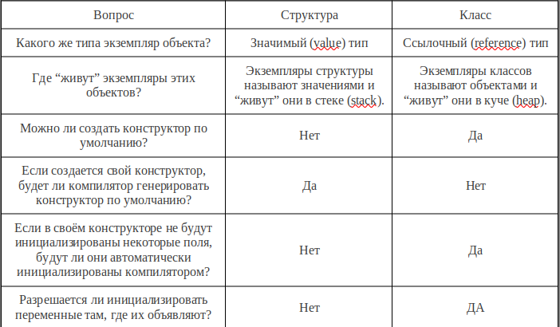

[Вернуться к списку вопросов](../questions.md)

<div id="begin"></div>
-----------------

# Вопрос № 7

* Типы данных.
* Разница между классами и структурами.

В `C#` имеются две общие категории встроенных типов данных: типы значений (value type) и ссылочные типы (reference type)
. Их классификация приведена на рисунке.



Понятие «встроенные типы данных» означает, что для определения переменной выбранного типа вам достаточно указать одно из
ключевых слов, указанных в прямоугольниках, и через пробел идентификатор переменной, завершив запись «;», например:

```cs
double d;
string s;
```

Первый оператор объявления переменной `d` обеспечит ее размещение в стеке, зарезервировав для ее значения ровно 8 байт.
Второй оператор зарезервирует место в стеке для ссылки на строку s, содержимое которой после ее инициализации
разместится в куче.

Структуры синтаксически очень похожи на классы, но существует принципиальное отличие, которое заключается в том, что
класс – является ссылочным типом (reference type), а структуры – значимым типом (value type). Следовательно, классы
всегда создаются в так называемой “куче” (heap), а структуры создаются в стеке (stack).

Но это справедливо в очень простых случаях, главное отличие структур и классов: структуры, указываемые в списке
параметров метода, передаются по значению (то есть копируются), объекты классов — по ссылке. Именно это является главным
различием в их поведении, а не то, где они хранятся. Примечание: структуру тоже можно передать по ссылке, используя
модификаторы `out` и `ref`.

Чем больше вы будете использовать структуры вместо маленьких классов, тем менее затратным по ресурсам будет
использование памяти. Так же как и классы, структуры могут иметь поля, методы и конструкторы. О конструкторах структур
уже говорилось, ибо это важный критерий при сравнивании классов и структур.

Мы выяснили, что все встроенные типы значений задаются структурами, например, числовые типы `int`, `long`, `float`
определены структурами `System.Int32`, `System.Int64` и `System.Single` соответственно. Эти структуры имеют поля и
методы. Мы уже вызывали методы у переменных этих типов. Например, каждая из перечисленных структур имеет
метод `ToString()`. Также у перечисленных структур есть статичные поля, например, `Int32.MaxValue` или `Int32.MinValue`.

В отличие от классов, использование публичных полей в структурах в большинстве случаев не рекомендуется, потому что не
существует способа контролирования значений в них. Например, кто-либо может установить значение минут или секунд более

60. Более правильный вариант в данном случае использовать свойства, а в конструкторе осуществить проверку:



В результате будет напечатано число часов: 6 (остаток от деления 30 на 24). Заменим конструктор Time(…) конструктором
без параметров:



Получим сообщение об ошибке.

«Структуры не могут содержать явных конструкторов без параметров» Причина возникновения ошибки в том, что вы не можете
использовать конструктор по умолчанию (без параметров) для структуры, потому что компилятор всегда генерирует его сам.
Что же касается класса, то компилятор создает конструктор по умолчанию только в том случае, если Вы его не создали. При
объявлении класса нет проблем создать собственный конструктор без параметров (замените в программе ключевое
слово `struct` на `class`, вы получите результат — 7).

Два правила структур Первое правило структуры: Всегда все переменные должны быть инициализированы. В классах Вы можете
инициализировать значение полей непосредственно при их объявлении. В структурах такого сделать нельзя, и поэтому данный
код вызовет ошибку при компиляции. Поэтому:
Второе правило структуры: Нельзя инициализировать переменные в том месте, где они объявляются.

**Сравнение классов и структур в сжатом виде:**



Поля структуры могут быть инициализированы, при использовании конструктора (если объект объявляется с помощью оператора
new), причем не важно, какого «собственного» или «по умолчанию».

К особенностям структур можно отнести еще и тот факт, что вследствие того, что структуры являются значимым типом, то
можно создать структуру без использования конструктора


[Вернуться в начало](#begin)