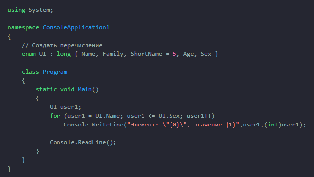

[Вернуться к списку вопросов](../questions.md)

<div id="begin"></div>
-----------------

# Вопрос № 8

* Перечисления.
* Инициализаторы членов перечислений.
* Базовый тип перечислений.
* Набор операций над перечислениями.

**Перечисление** (enumeration) — это определяемый пользователем целочисленный тип. Когда вы объявляете перечисление, то
специфицируете набор допустимых значений, которые могут принимать экземпляры перечислений. Но мало того — этим значениям
еще должны быть присвоены имена, понятные для пользователей. Если где-то в коде попытаться присвоить экземпляру
перечисления значение, не входящее в список допустимых, компилятор выдаст ошибку.

Определение перечисления может в долговременной перспективе сэкономить массу времени и избавить от головной боли.
Существует, по крайней мере, три явных выгоды от применения перечислений вместо простых целых:

Перечисления облегчают сопровождение кода, гарантируя, что переменным будут присваиваться только легитимные, ожидаемые
значения.

Перечисления делают код яснее, позволяя обращаться к целым значениям, называя их осмысленными именами вместо
малопонятных "магических" чисел.

Перечисления облегчают ввод исходного кода. Когда вы собираетесь присвоить значение экземпляру перечислимого типа, то
интегрированная среда Visual Studio с помощью средства IntelliSense отображает всплывающий список с допустимыми
значениями, что позволяет сэкономить несколько нажатий клавиш и напомнить о возможном выборе значений.

Перечислимый тип данных объявляется с помощью ключевого слова enum. Ниже приведена общая форма объявления перечисления:

```cs
enum имя {список_перечисления};
```

где имя — это имя типа перечисления, а список_перечисления — список идентификаторов, разделяемый запятыми.

Следует особо подчеркнуть, что каждая символически обозначаемая константа в перечислении имеет целое значение. Тем не
менее неявные преобразования перечислимого типа во встроенные целочисленные типы и обратно в C# не определены, а значит,
в подобных случаях требуется явное приведение типов. Кроме того, приведение типов требуется при преобразовании двух
перечислимых типов. Но поскольку перечисления обозначают целые значения, то их можно, например, использовать для
управления оператором выбора switch или же оператором цикла for. Для каждой последующей символически обозначаемой
константы в перечислении задается целое значение, которое на единицу больше, чем у предыдущей константы.



По умолчанию значение первой символически обозначаемой константы в перечислении равно нулю.

Значение одной или нескольких символически обозначаемых констант в перечислении можно задать с помощью инициализатора.
Для этого достаточно указать после символического обозначения отдельной константы знак равенства и целое значение.
Каждой последующей константе присваивается значение, которое на единицу больше значения предыдущей инициализированной
константы. В приведенном выше примере инициализируется константа `ShortName`.

По умолчанию в качестве базового для перечислений выбирается тип `int`, тем не менее перечисление может быть создано
любого целочисленного типа, за исключением char. Для того чтобы указать другой тип, кроме int, достаточно поместить этот
тип после имени перечисления, отделив его двоеточием.

Изменять базовый тип перечислений удобно в случае создания таких приложений `.NET`, которые будут развертываться на
устройствах с небольшим объемом памяти (таких как поддерживающие `.NET` сотовые телефоны или устройства `PDA`), чтобы
экономить память везде, где только возможно. Естественно, если для перечисления в качестве базового типа указан `byte`,
каждое значение в этом перечислении ни в коем случае не должно выходить за рамки диапазона его допустимых значений.

Перечисления очень широко применяются во всех библиотеках базовых классов `.NET`. Например, в `ADO.NET` множество
перечислений используется для обозначения состояния соединения с базой данных (например, открыто оно или закрыто) и
состояния строки в `DataTable` (например, является она измененной, новой или отсоединенной). Поэтому в случае применения
любых перечислений следует всегда помнить о наличии возможности взаимодействовать с парами "имя/значение" в них с
помощью членов `System.Enum`.

С переменными перечисляемого типа можно выполнять:

* арифметические операции (`+`, `–`, `++`, `––`)
* логические поразрядные операции (`^`, `&`, `|`, `~`)
* сравнить их с помощью операции отношения (`<`, `<=`, `>`, `>=`, `==`, `!=`)
* получать размер в байтах (`sizeof`).

При использовании переменных перечисляемого типа в целочисленных выражениях и операциях присваивания требуется явное
преобразование типа. Переменной перечисляемого типа можно присвоить любое значение, представимое с помощью базового
типа, то есть не только одно из значений, входящих в тело перечисления. Присваиваемое значение становиться новым
элементом перечисления.


[Вернуться в начало](#begin)