[Вернуться к списку вопросов](../questions.md)

<div id="begin"></div>
-----------------

# Вопрос № 9

* Поля в структурах.
* Конструкторы в структурах.
* Инициализация полей структур.
* Методы и свойства в структурах.
* Финализаторы в структурах.
* Наследование структур.

Тип структуры представляет собой тип значения, который может инкапсулировать данные и связанные функции. Для определения
типа структуры используется ключевое слово struct:

```cs
struct имя : интерфейсы {
// объявления членов
}
```

Типы структуры имеют семантики значений. То есть переменная типа структуры содержит экземпляр этого типа. По умолчанию
значения переменных копируются при назначении, передаче аргумента в метод и возврате результата метода. В случае
переменной типа структуры копируется экземпляр типа

Как правило, типы структуры используются для проектирования небольших ориентированных на данные типов, которые
предоставляют минимум поведения или не предоставляют его вовсе. Например, платформа .NET использует типы структуры для
представления числа (как целого, так и вещественного), логического значения, символа Юникода, экземпляра времени. Если
вы сконцентрированы на поведении типа, рекомендуется определить класс. Типы классов имеют семантики ссылок. То есть
переменная типа класса содержит ссылку на экземпляр этого типа, а не сам экземпляр.

Поскольку типы структуры имеют семантику значений, рекомендуется определять неизменяемые типы структуры.

Коротко о различии структуры и класса:

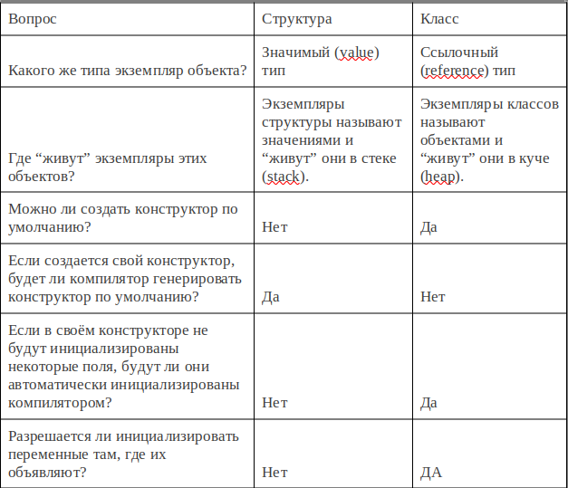

1. структуры не могут быть абстрактными, структуры не имеют деструкторов, структуры не поддерживают наследование.
2. Главное отличие структур и классов: структуры передаются по значению (то есть копируются), объекты классов — по
   ссылке. Именно это является существенным различием в их поведении, а не то, где они хранятся.
3. Структуру тоже можно передать по ссылке, используя модификаторы `out` и `ref`.

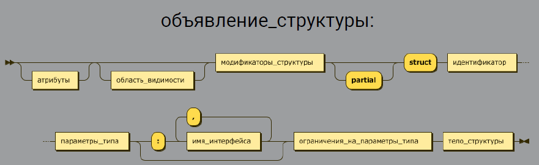

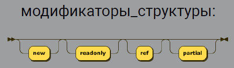

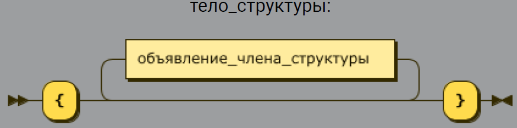

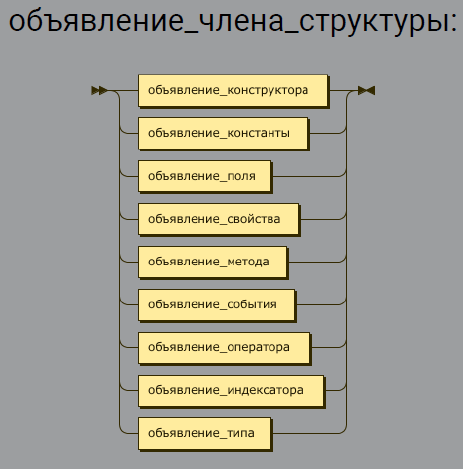

#### Поля в структурах.

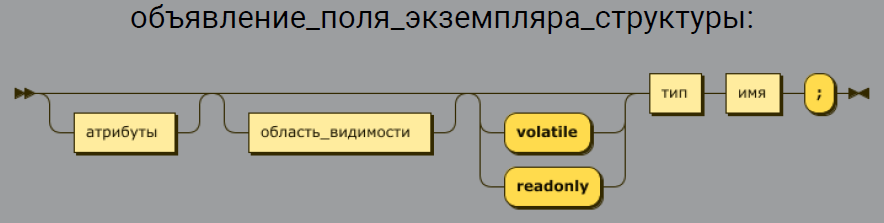

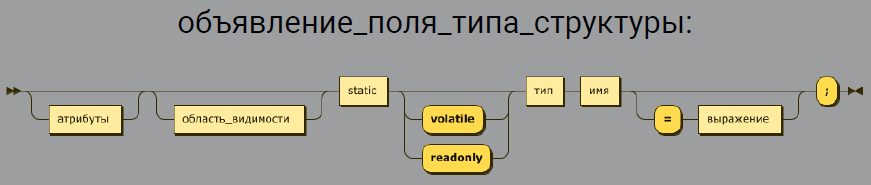

```cs
struct S
{
   int field1;
   readonly int field2;
   static int field4;
   static readonly int field5 = 7;
   static int b = a + 1;
}
```

```cs
struct Node
{
   double value;
   // Ошибка компиляции
   Node next;
}
```

```cs
struct S
{
   // Ошибки нет
   static int a = b + 1;
   static int b = a + 1;
}
```

### Конструкторы в структурах

* Конструктор типа (статический)
* Конструкторы экземпляров

#### СТАТИЧЕСКИЙ КОНСТРУКТОР

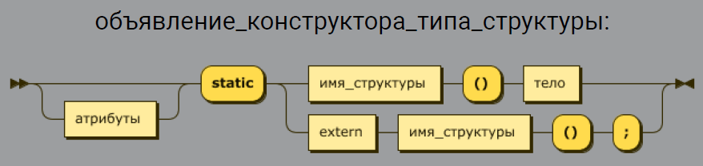

```cs
struct S
{
   static S()
   {
   }
}
```

Статический конструктор

* Вызывается автоматически
* Вызов гарантирован строго до первого обращения к типу
* Вызывается ровно 1 раз
* Если генерирует ошибку, то тип недоступен

Применение статического конструктора

* При работе с неуправляемым кодом – для загрузки функций из внешней библиотеки
* Проверки во время исполнения: конфигурация, лицензия и т.д.
* Настройка логирования

#### КОНСТРУКТОРЫ ЭКЗЕМПЛЯРОВ СТРУКТУР

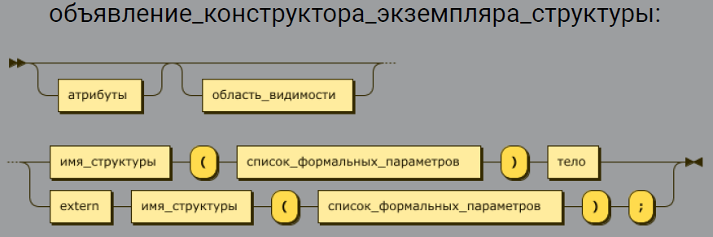

#### КОНСТРУКТОР ЭКЗЕМПЛЯРОВ СТРУКТУР

* Не может быть без параметров
* Обязан инициализировать все поля структуры

```cs
struct Point
{
   public int X;
   public int Y;
   public Point(int x, int y)
   {
      X = x;
      Y = y;
   }
}
```

```cs
struct Point
{
   public int X;
   public int Y;
   public int Z;
   // ошибка: поле Z не инициализировано в     
   конструкторе
   public Point(int x, int y)
   {
      X = x;
      Y = y;
   }
}
```

### Инициализация полей структур

Важно учитывать, что если мы определяем конструктор в структуре, то он должен инициализировать все поля структуры.

Также, как и для класса, можно использовать инициализатор для создания структуры:

```cs
User person = new User { name = "Sam", age = 31 };
```

Но в отличие от класса нельзя инициализировать поля структуры напрямую при их объявлении, например, следующим образом:

```cs
struct User
{
    public string name = "Sam";     // ! Ошибка
    public int age = 23;            // ! Ошибка
    public void DisplayInfo()
    {
        Console.WriteLine($"Name: {name}  Age: {age}");
    }
}
```

### КОНСТАНТЫ

* Значение известно на этапе компиляции
* Всегда статические, но модификатор static не указывается

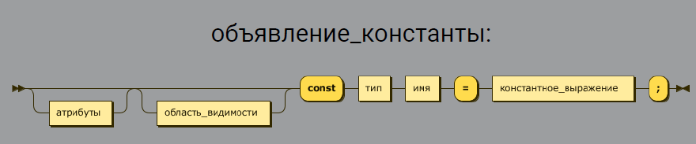

```cs
struct HumanAge
{
   public const int MaxAge = 117;
   // ...
}
```

```cs
struct A
{
   public const double TwoPi = Math.PI * 2;
}
```

### МЕТОДЫ СТРУКТУР

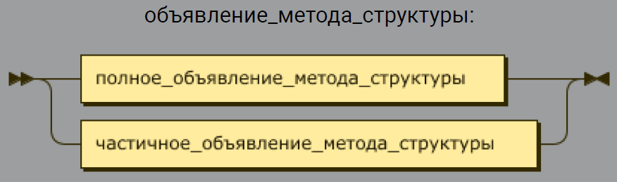

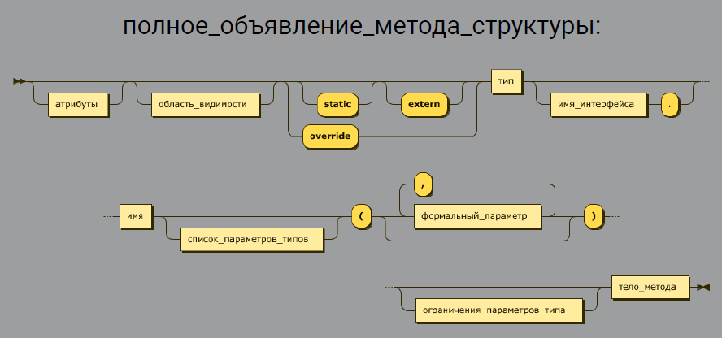

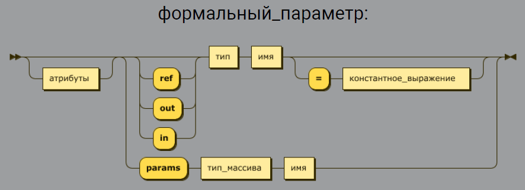

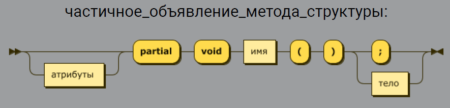

```cs
struct Complex
{
   public double real;
   public double imaginary;
   public void Add(Complex value)
   {
       real += value.real;
       imaginary += value.imaginary;
   }
}
```

```cs
struct Complex
{
   public double real;
   public double imaginary;
   public double GetModulus()
   {
       return Math.Sqrt(real * real + imaginary * imaginary);
   }
}
```

```cs
struct Complex
{
   public double real;
   public double imaginary;
   public static Complex Sum(Complex a, Complex b)
   {
       return new Complex
       {
           real = a.real + b.real,
           imaginary = a.imaginary + b.imaginary
       };
   }
}
```

#### Модификатор extern

* Указывает, что метод имеет внешнюю реализацию
* Обычно локация реализации указывается атрибутом DllImport

```cs
struct S
{
   [DllImport("User32.dll", CharSet=CharSet.Unicode)]
   public static extern int MessageBox(IntPtr h, string m, string c, int t
}
```

#### Модификатор override

* Указывает, что метод переопределяет базовую реализацию
* Применим только к виртуальным методам - помеченным модификатором virtual

```cs
struct Complex
{
   public double real;
   public double imaginary;
   public override string ToString()
   {
       return $"{real} + {imaginary}i";
   }
}
```

#### Модификатор partial

* Указывает, что метод определён в другой части определения типа
* Может только иметь сигнатуру вида partial void имя()

```cs
partial struct B {
   partial void DoWork();
}
partial struct B
{
   partial void DoWork()
   {
       Console.WriteLine("Working...");
   }
}
```

Имя интерфейса перед именем метода

* Это явная реализация интерфейса
* Рассмотрим в разделе "интерфейсы" одной из следующих лекций

Список параметров типов и ограничения параметров типов

* Это шаблонные методы
* Рассмотрим в разделе "универсальные шаблоны" одной из следующих лекций

`ref`, `out` и `in` параметры

* Параметры передаются по ссылке
* ref параметр может быть изменён в теле метода
* out параметр обязан быть изменён в теле метода
* in параметр не может быть изменён в теле метода

```cs
private static void ChangeByReference(ref Product itemRef)
{
   itemRef = new Product("Stapler", 99999);
   itemRef.ItemID = 12345;
}
```

```cs
double d;
if (double.TryParse(Console.ReadLine(), out d));
...
```

```cs
private static double CalculateDistance3(in Point3D point1, in Point3D point2
{
   double xDifference = point1.X - point2.X;
   double yDifference = point1.Y - point2.Y;
   double zDifference = point1.Z - point2.Z;
   return Math.Sqrt(xDifference * xDifference +
        yDifference * yDifference + zDifference * zDifference);
}
```

модификатор params у параметра

* Указывает, что он принимает переменное количество значений: 0...*
* типом параметра должен быть массив
* при вызове можно передать значения через запятую
* при вызове можно передать массив

```cs
static int Sum(params int[] numbers)
{
   int result = 0;
   foreach (var item in numbers)
   {
      result += item;
   }
   return result;
}
```

```cs
static void Main(string[] args)
{
   int r1 = Sum(1, 2, 3, 4, 5);
   int r2 = Sum(new[] { 1, 2, 3, 4, 5 });
}
```

## СВОЙСТВА

* Синтаксически аналогичны полям для пользователя
* Позволяют определить произвольную реализацию для чтения и записи
* Позволяют ограничить или запретить чтение или запись

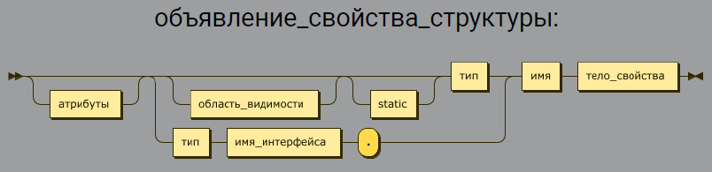

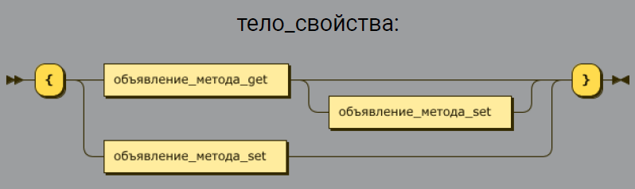

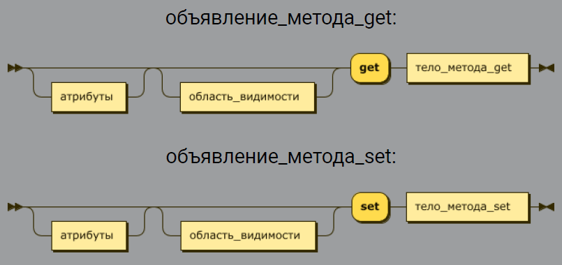

тело_метода_get

* Соответствует телу метода, не принимающего параметров и возвращающего значение типа данного свойства
* Область видимости может только сужать область видимости свойства тело_метода_set
* Соответствует телу метода, принимающего параметр с именем value и типом данного свойства и не возвращающего значение
* Область видимости может только сужать область видимости свойства

```cs
struct Meter
{
   private double value;
   public double Value
   {
      get { return value; }
      set { this.value = value; }
   }
}
```

```cs
struct Meter
{
   private double value;
   public double Value
   {
      get { return value; }
   }
}
```

```cs
struct Meter
{
   private double value;
   public double Value
   {
      set { this.value = value; }
   }
}
```

```cs
struct Meter
{
   private double value;
   public double Value
   {
       get { return value; }
       internal set { this.value = value; }
   }
}
```

Автоматически-реализуемые свойства

* Это синтаксический сахар
* При компиляции преобразуются в свойство, читающее и записывающее значение поля

```cs
struct Point
{
   private int x;
   public int X
   {
      get { return x; }
      set { x = value; }
   }
   public int Y { get; set; }
}
```

Автоматически-реализуемые readonly свойства

* Это синтаксический сахар
* При компиляции преобразуются в свойство, читающее значение readonly поля

```cs
struct Point
{
   public int X { get; }
   public int Y { get; }
   public Point(int x, int y)
   {
      X = x;
      Y = y;
   }
}
```

readonly struct - Запрещает менять состояние экземпляра после его создания

ref struct - Запрещает экземпляру структуры попасть из стека в кучу =>

* Нельзя использовать в качестве элементов массивов
* Нельзя использовать в качестве типа члена экземпляра класса и не-ref структуры
* Нельзя реализовывать интерфейсы
* Нельзя упаковывать в виде Object или
* ValueType
* Есть ограничения при использовании в асинхронных методах
* Нельзя использовать в итераторах

Выбирайте структуру, если

* Экземпляры небольшие
* Экземпляры обычно короткоживущие
* Экземпляры часто вложены в другие объекты

Не выбирайте структуру, если тип не обладает хотя бы одной из характеристик:

* Логически представляет собой одно значение (как int, double)
* Экземпляр занимает не больше 16 байт
* Значение неизменяемо
* Не понадобится частая упаковка/распаковка

#### СОВЕТЫ ПО ПРОЕКТИРОВАНИЮ СТРУКТУР

* Не создавайте изменяемые структуры

```cs
Point p1 = new Point(13, 17);
Point p2 = p1;
p1.X = 10;
```

* Убедитесь, что значение по умолчанию является корректным
* Реализуйте IEquatable`t

```cs
struct Point : IEquatable<point>
{
   public int X { get; }
   public int Y { get; }
   public Point(int x, int y)
   {
      X = x;
      Y = y;
   }
   public bool Equals(Point other)
   {
      return X == other.X && Y == other.Y;
   }
}
```

* Переопределите Object.Equals и ToString()

```cs
struct Point : IEquatable<Point>
{
   // ...
   public override bool Equals(object obj)
   {
      return obj is Point
          && ((Point)obj).X == X
          && ((Point)obj).Y == Y;
   }
}
```

### Финализаторы в структурах

Переопределять метод Finalize() в типах структур нельзя. Это вполне логичное ограничение, поскольку структуры
представляют собой типы значения, которые изначально никогда не размещаются в управляемой памяти и, следовательно,
никогда не подвергаются процессу сборки мусора. Однако в случае создания структуры, которая содержит ресурсы,
нуждающиеся в очистке, вместо этого метода можно реализовать интерфейс IDisposable.

Разумеется, вызов метода Finalize() будет происходить (в конечном итоге) либо во время естественной активизации процесса
сборки мусора, либо во время его принудительной активизации программным образом с помощью GC.Collect(). Помимо этого,
финализатор типа будет автоматически вызываться и при выгрузке из памяти домена, который отвечает за обслуживание
приложения.

### Наследование структур

Тип структуры не может наследовать от другого типа класса или структуры и не может быть базовым для класса. Однако тип
структуры может реализовывать интерфейсы.

[Вернуться в начало](#begin)