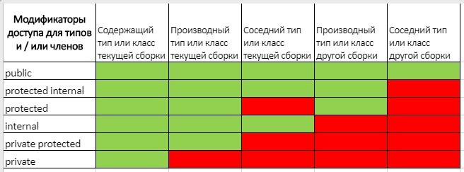

[Вернуться к списку вопросов](../questions.md)

<div id="begin"></div>
-----------------

# Вопрос № 10

* Поля классов.
* Области видимости полей классов.
* Статические поля.
* Поля только для чтения (readonly).
* Константные поля.
* Инициализация значений полей.

Полями класса называются обычные переменные уровня класса. Поля экземпляров могут иметь инициализаторы (т.е. когда мы
сразу присваиваем какое-то значение). При этом выражение в инициализаторе не может обращаться к this (т.е. ни к каким
члена экземпляра). Инициализатор срабатывает при создании экземпляра. Инициализаторы полей экземпляра срабатывают при
создании экземпляра. Статические инициализаторы полей срабатывают при инициализации типа, что случается один раз в жизни
программы, когда тип входит в какую-то область действия кода. Обращаться к другому полю экземпляра нельзя.

В отличии от структур еще добавляются области видимости. В структурах нет наследования, поэтому нет и областей
видимости, которые с ним связаны. В классах поля могут быть private, protected

Все члены класса - поля, методы, свойства - все они имеют модификаторы доступа. Модификаторы доступа позволяют задать
допустимую область видимости для членов класса.

В C# применяются следующие модификаторы доступа:

- public: публичный, общедоступный класс или член класса. Такой член класса доступен из любого места в коде, а также из
  других программ и сборок.
- private: закрытый класс или член класса. Представляет полную противоположность модификатору public. Такой закрытый
  класс или член класса доступен только из кода в том же классе или контексте.
- protected: такой член класса доступен из любого места в текущем классе или в производных классах. При этом производные
  классы могут располагаться в других сборках.
- internal: класс и члены класса с подобным модификатором доступны из любого места кода в той же сборке, однако он
  недоступен для других программ и сборок (как в случае с модификатором public).
- protected internal: совмещает функционал двух модификаторов. Классы и члены класса с таким модификатором доступны из
  текущей сборки и из производных классов.
- private protected: такой член класса доступен из любого места в текущем классе или в производных классах, которые
  определены в той же сборке.



### Константы

Константы характеризуются следующими признаками:

- Константа должна быть проинициализирована при определении
- После определения значение константы не может быть изменено

Константы предназначены для описания таких значений, которые не должны изменяться в программе. Для определения констант
используется ключевое слово const:

```cs
const double PI = 3.14;
const double E = 2.71;
```

При использовании констант надо помнить, что объявить мы их можем только один раз и что к моменту компиляции они должны
быть определены.

```cs
class MathLib
{
    public const double PI=3.141;
    public const double E = 2.81;
    public const double K;      // Ошибка, константа не инициализирована
}
 
class Program
{
    static void Main(string[] args)
    {
        MathLib.E=3.8; // Ошибка, значение константы нельзя изменить
    }
}
```

Также обратите внимание на синтаксис обращения к константе. Так как неявно это статическое поле, для обращения к ней
необходимо использовать имя класса.

```cs
class MathLib
{
    public const double PI=3.141;
}
 
class Program
{
    static void Main(string[] args)
    {
        Console.WriteLine(MathLib.PI);
    }
}
```

Но следует учитывать, что мы не можем объявить константу с модификатором static. Но в этом собственно и нет смысла.

Константу можно определить как на уровне класса, так и внутри метода:

```cs
class MathLib
{
    public double GetCircleArea(double radius)
    {
        const double PI = 3.141;
        return PI * radius * radius;
    }
}
```

### Поля для чтения

Поля для чтения можно инициализировать при их объявлении либо на уровне класса, либо инициилизировать и изменять в
конструкторе. Инициализировать или изменять их значение в других местах нельзя, можно только считывать их значение.

Поле для чтения объявляется с ключевым словом readonly:

```cs
class MathLib
{
    public readonly double K = 23;  // можно так инициализировать
 
    public MathLib(double _k)
    {
        K = _k; // поле для чтения может быть инициализировано или изменено в конструкторе после компиляции
    }
    public void ChangeField()
    {
        // так нельзя
        //K = 34;
    }
}
 
class Program
{
    static void Main(string[] args)
    {
        MathLib mathLib = new MathLib(3.8);
        Console.WriteLine(mathLib.K); // 3.8
 
        //mathLib.K = 7.6; // поле для чтения нельзя установить вне своего класса
        Console.ReadLine();
 
    }
}
```

**Сравнение констант**

- Константы должны быть определены во время компиляции, а поля для чтения могут быть определены во время выполнения
  программы.
    - Соответственно инициализировать константу можно устанновить только при ее определении.
    - Поле для чтения можно инициализировать либо при его определении, либо в конструкторе класса.
- Константы не могут использовать модификатор static, так как уже неявно являются статическими. Поля для чтения могут
  быть как статическими, так и не статическими.

#### Структуры для чтения

Кроме полей для чтения в C# можно определять структуры для чтения. Для этого они предваряются модификатором readonly:

```cs
readonly struct User { }
```

Особенностью таких структур является то, что все их поля должны быть также полями для чтения:

```cs
readonly struct User
{
    public readonly string name;
    public User(string name)
    {
        this.name = name;
    }
}
```

То же самое касается и свойств, которые должны быть доступны только для чтения:

```cs
readonly struct User
{
    public readonly string Name { get; } // указывать readonly необязательно
    public int Age { get; } // свойство только для чтения
    public User(string name, int age)
    {
        this.Name = name;
        this.Age = age;
    }
```

[Вернуться в начало](#begin)