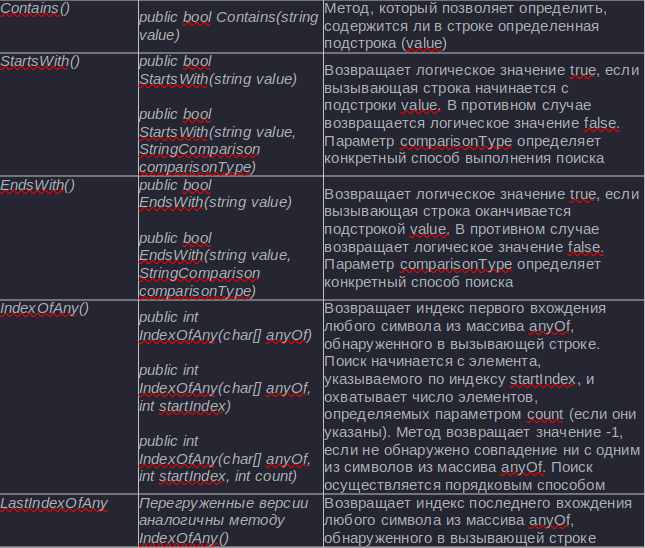
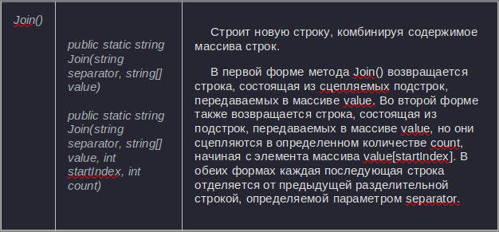

[Вернуться к списку вопросов](../questions.md)

<div id="begin"></div>
-----------------

# Вопрос № 13

* Строки.
* Работа со строками:
    * конкатенация,
    * нахождение подстроки,
    * поиск в строке,
    * форматирование строк,
    * разбиение строк по разделителям.

Довольно большое количество задач, которые могут встретиться при разработке приложений, так или иначе связано с
обработкой строк - парсинг веб-страниц, поиск в тексте, какие-то аналитические задачи, связанные с извлечением нужной
информации из текста и т.д.

В языке C# строковые значения представляет тип string, а вся функциональность работы с данным типом сосредоточена в
классе System.String. Собственно string является псевдонимом для класса System.String. Объекты этого класса представляют
текст как последовательность символов Unicode. Максимальный размер объекта String может составлять в памяти 2 ГБ, или
около 1 миллиарда символов.

### Создание строк

Создавать строки можно, как используя переменную типа string и присваивая ей значение, так и применяя один из
конструкторов класса String:

```cs
string s1 = "hello";
string s2 = null;
 
string s3 = new String('a', 6); // результатом будет строка "aaaaaa"
string s4 = new String(new char[]{'w', 'o', 'r', 'l', 'd'});
```

Конструктор String имеет различное число версий. Так, вызов конструктора new String('a', 6) создаст строку "aaaaaa". И
так как строка представляет ссылочный тип, то может хранить значение null.

#### Строка как набор символов

Так как строка хранит коллекцию символов, в ней определен индексатор для доступа к этим символам:

```cs
public char this[int index] {get;}
```

Применяя индексатор, мы можем обратиться к строке как к массиву символов и получить по индексу любой из ее символов:

```cs
string s1 = "hello";
char ch1 = s1[1]; // символ 'e'
Console.WriteLine(ch1);
Console.WriteLine(s1.Length);
```

Используя свойство Length, как и в обычном массиве, можно получить длину строки.

#### Конкатенация

Конкатенация строк или объединение может производиться как с помощью операции +, так и с помощью метода Concat:

```cs
string s1 = "hello";
string s2 = "world";
string s3 = s1 + " " + s2; // результат: строка "hello world"
string s4 = String.Concat(s3, "!!!"); // результат: строка "hello world!!!"
 
Console.WriteLine(s4);
```

Метод Concat является статическим методом класса String, принимающим в качестве параметров две строки. Также имеются
другие версии метода, принимающие другое количество параметров.

Для объединения строк также может использоваться метод Join:

```cs
string s5 = "apple";
string s6 = "a day";
string s7 = "keeps";
string s8 = "a doctor";
string s9 = "away";
string[] values = new string[] { s5, s6, s7, s8, s9 };
 
String s10 = String.Join(" ", values);
// результат: строка "apple a day keeps a doctor away"
```

Метод Join также является статическим. Использованная выше версия метода получает два параметра: строку-разделитель (в
данном случае пробел) и массив строк, которые будут соединяться и разделяться разделителем.

#### Поиск в строке

**Поиск подстроки в строке** – это отыскивание наличия одной строки в другой. Результат данной операции – это индекс
начала вхождения подстроки в строку.

С помощью метода IndexOf мы можем определить индекс первого вхождения отдельного символа или подстроки в строке:

```cs
string s1 = "hello world";
char ch = 'o';
int indexOfChar = s1.IndexOf(ch); // равно 4
Console.WriteLine(indexOfChar);
 
string subString = "wor";
int indexOfSubstring = s1.IndexOf(subString); // равно 6
Console.WriteLine(indexOfSubstring);
```

Подобным образом действует метод LastIndexOf, только находит индекс последнего вхождения символа или подстроки в строку.

Еще одна группа методов позволяет узнать начинается или заканчивается ли строка на определенную подстроку. Для этого
предназначены методы StartsWith и EndsWith. Например, у нас есть задача удалить из папки все файлы с расширением exe:

```cs
string path = @"C:\SomeDir";
 
string[] files = Directory.GetFiles(path);
 
for (int i = 0; i < files.Length; i++)
{
    if(files[i].EndsWith(".exe"))
        File.Delete(files[i]);
}
```



#### Разделение строк

С помощью функции Split мы можем разделить строку на массив подстрок. В качестве параметра функция Split принимает
массив символов или строк, которые и будут служить разделителями. Например, подсчитаем количество слов в сроке, разделив
ее по пробельным символам:

```cs
string text = "И поэтому все так произошло";
 
string[] words = text.Split(new char[] { ' ' });
 
foreach (string s in words)
{
    Console.WriteLine(s);
}
```

Это не лучший способ разделения по пробелам, так как во входной строке у нас могло бы быть несколько подряд идущих
пробелов и в итоговый массив также бы попадали пробелы, поэтому лучше использовать другую версию метода:

```cs
string[] words = text.Split(new char[] { ' ' }, StringSplitOptions.RemoveEmptyEntries);
```

Второй параметр StringSplitOptions.RemoveEmptyEntries говорит, что надо удалить все пустые подстроки.



[Вернуться в начало](#begin)