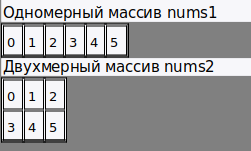
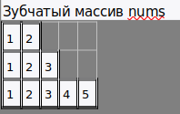

[Вернуться к списку вопросов](../questions.md)

<div id="begin"></div>
-----------------

# Вопрос № 14

* Массивы.
* Синтаксис объявления.
* Многомерные массивы.
* Использование массивов.

Массив представляет набор однотипных данных. Объявление массива похоже на объявление переменной за тем исключением, что
после указания типа ставятся квадратные скобки:

    ип_переменной[] название_массива;

Например, определим массив целых чисел:

```cs
int[] numbers;
```

После определения переменной массива мы можем присвоить ей определенное значение:

```cs
int[] nums = new int[4];
```

Здесь вначале мы объявили массив nums, который будет хранить данные типа int. Далее используя операцию new, мы выделили
память для 4 элементов массива: new int[4]. Число 4 еще называется длиной массива. При таком определении все элементы
получают значение по умолчанию, которое предусмотренно для их типа. Для типа int значение по умолчанию - 0.

Также мы сразу можем указать значения для этих элементов:

```cs
int[] nums2 = new int[4] { 1, 2, 3, 5 };
 
int[] nums3 = new int[] { 1, 2, 3, 5 };
 
int[] nums4 = new[] { 1, 2, 3, 5 };
 
int[] nums5 = { 1, 2, 3, 5 };
```

Все перечисленные выше способы будут равноценны.

Для обращения к элементам массива используются индексы. Индекс представляет номер элемента в массиве, при этом нумерация
начинается с нуля, поэтому индекс первого элемента будет равен 0. А чтобы обратиться к четвертому элементу в массиве,
нам надо использовать индекс 3, к примеру: nums[3]. Используем индексы для получения и установки значений элементов
массива:

```cs
int[] nums = new int[4];
nums[0] = 1;
nums[1] = 2;
nums[2] = 3;
nums[3] = 5;
Console.WriteLine(nums[3]);  // 5
```

И так как у нас массив определен только для 4 элементов, то мы не можем обратиться, например, к шестому элементу:
nums[5] = 5;. Если мы так попытаемся сделать, то мы получим исключение IndexOutOfRangeException.

### Перебор массивов. Цикл foreach

Цикл foreach предназначен для перебора элементов в контейнерах, в том числе в массивах. Формальное объявление цикла
foreach:

    foreach (тип_данных название_переменной in контейнер)
    {
        // действия
    }

Например:

```cs
int[] numbers = new int[] { 1, 2, 3, 4, 5 };
foreach (int i in numbers)
{
    Console.WriteLine(i);
}
```

Здесь в качестве контейнера выступает массив данных типа int. Поэтому мы объявляем переменную с типом int

Подобные действия мы можем сделать и с помощью цикл for:

```cs
int[] numbers = new int[] { 1, 2, 3, 4, 5 };
for (int i = 0; i < numbers.Length; i++)
{
    Console.WriteLine(numbers[i]);
}
```

В то же время цикл for более гибкий по сравнению с foreach. Если foreach последовательно извлекает элементы контейнера и
только для чтения, то в цикле for мы можем перескакивать на несколько элементов вперед в зависимости от приращения
счетчика, а также можем изменять элементы:

```cs
int[] numbers = new int[] { 1, 2, 3, 4, 5 };
for (int i = 0; i < numbers.Length; i++)
{
    numbers[i] = numbers[i] * 2;
    Console.WriteLine(numbers[i]);
}
```

### Многомерные массивы

Массивы характеризуются таким понятием как ранг или количество измерений. Выше мы рассматривали массивы, которые имеют
одно измерение (то есть их ранг равен 1) - такие массивы можно представлять в виде горзонтального ряда элемента. Но
массивы также бывают многомерными. У таких массивов количество измерений (то есть ранг) больше 1.

Массивы которые имеют два измерения (ранг равен 2) называют двухмерными. Например, создадим одномерный и двухмерный
массивы, которые имеют одинаковые элементы:

```cs
int[] nums1 = new int[] { 0, 1, 2, 3, 4, 5 };
 
int[,] nums2 = { { 0, 1, 2 }, { 3, 4, 5 } };
```

Визуально оба массива можно представить следующим образом:



Поскольку массив nums2 двухмерный, он представляет собой простую таблицу. Все возможные способы определения двухмерных
массивов:

```cs
int[,] nums1;
int[,] nums2 = new int[2, 3];
int[,] nums3 = new int[2, 3] { { 0, 1, 2 }, { 3, 4, 5 } };
int[,] nums4 = new int[,] { { 0, 1, 2 }, { 3, 4, 5 } };
int[,] nums5 = new [,]{ { 0, 1, 2 }, { 3, 4, 5 } };
int[,] nums6 = { { 0, 1, 2 }, { 3, 4, 5 } };
```

Массивы могут иметь и большее количество измерений. Объявление трехмерного массива могло бы выглядеть так:

```cs
int[,,] nums3 = new int[2, 3, 4];
```

Соответственно могут быть и четырехмерные массивы и массивы с большим количеством измерений. Но на практике обычно
используются одномерные и двухмерные массивы.

у каждого массива есть метод GetUpperBound(dimension), который возвращает индекс последнего элемента в определенной
размерности. И если мы говорим непосредственно о двухмерном массиве, то первая размерность (с индексом 0) по сути это и
есть таблица. И с помощью выражения mas.GetUpperBound(0) + 1 можно получить количество строк таблицы, представленной
двухмерным массивом. А через mas.Length / rows можно получить количество элементов в каждой строке:

```cs
int[,] mas = { { 1, 2, 3 }, { 4, 5, 6 }, { 7, 8, 9 }, { 10, 11, 12 } };
 
int rows = mas.GetUpperBound(0) + 1;
int columns = mas.Length / rows;
// или так
// int columns = mas.GetUpperBound(1) + 1;
 
for (int i = 0; i < rows; i++)
{
    for (int j = 0; j < columns; j++)
    {
        Console.Write($"{mas[i, j]} \t");
    }
    Console.WriteLine();
```

### Массив массивов

От многомерных массивов надо отличать массив массивов или так называемый "зубчатый массив":

```cs
int[][] nums = new int[3][];
nums[0] = new int[2] { 1, 2 };          // выделяем память для первого подмассива
nums[1] = new int[3] { 1, 2, 3 };       // выделяем память для второго подмассива
nums[2] = new int[5] { 1, 2, 3, 4, 5 }; // выделяем память для третьего подмассива
```

Здесь две группы квадратных скобок указывают, что это массив массивов, то есть такой массив, который в свою очередь
содержит в себе другие массивы. Причем длина массива указывается только в первых квадратных скобках, все последующие
квадратные скобки должны быть пусты: new int[3][]. В данном случае у нас массив nums содержит три массива. Причем
размерность каждого из этих массивов может не совпадать.



Примеры массивов:

Причем мы можем использовать в качестве массивов и многомерные:

```cs
int[][,] nums = new int[3][,] 
{
    new int[,] { {1,2}, {3,4} },
    new int[,] { {1,2}, {3,6} },
    new int[,] { {1,2}, {3,5}, {8, 13} } 
};
```

Так здесь у нас массив из трех массивов, причем каждый из этих массивов представляет двухмерный массив.

Используя вложенные циклы, можно перебирать зубчатые массивы. Например:

```cs
int[][] numbers = new int[3][];
numbers[0] = new int[] { 1, 2 };
numbers[1] = new int[] { 1, 2, 3 };
numbers[2] = new int[] { 1, 2, 3, 4, 5 };
foreach(int[] row in numbers)
{
    foreach(int number in row)
    {
        Console.Write($"{number} \t");
    }
    Console.WriteLine();
}
 
// перебор с помощью цикла for
for (int i = 0; i<numbers.Length;i++)
{
    for (int j =0; j<numbers[i].Length; j++)
    {
        Console.Write($"{numbers[i][j]} \t");
    }
    Console.WriteLine();
}
```

### Основные понятия массивов

Суммирую основные понятия массивов:

* Ранг (rank): количество измерений массива
* Длина измерения (dimension length): длина отдельного измерения массива
* Длина массива (array length): количество всех элементов массива
* Например, возьмем массив

```cs
int[,] numbers = new int[3, 4];
```

* Массив numbers двухмерный, то есть он имеет два измерения, поэому его ранг равен 2. Длина первого измерения - 3, длина
  второго измерения - 4. Длина массива (то есть общее количество элементов) - 12.

[Вернуться в начало](#begin)