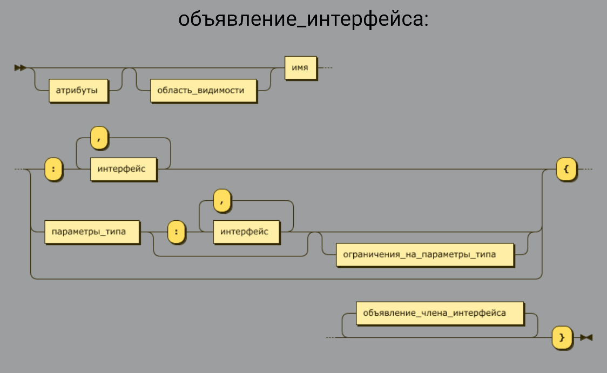

[Вернуться к списку вопросов](../questions.md)

<div id="begin"></div>
-----------------

# Вопрос № 16

* Интерфейсы.
* Наследование интерфейсов.
* Синтаксис объявления интерфейсов.
* Реализация интерфейсов.
* Члены интерфейсов.

### Интерфейсы.

- задают контракт для типов, их реализующих (те типы данных которые реализуют интерфейс обязаны исполнять этот контракт,
  контракт на доступные публичные типы)
- возможна реализация множества интерфейсов одновременно
- приводимость типов работает как с наследованием (когда наш тип реализует интерфейс то он становиться приводим к типу
  этого интерфейса)
- интерфейс это ссылочные типы (если структура реализует интерфейс то при приведении ее к типу этого интерфейса будет
  упаковка)
- экземпляры – это всегда экземпляры тех типов которые их реализуют - классов или структур.

### Объявление_интерфейса

> ::= атрибуты? Область_видимости? Имя
((‘ : ’ интерфейс ( ‘ , ‘ интерфейс ) * ) ? | параметры _типа (  ‘ : ‘ интерфейс ‘ { ‘ объявление_члена_интерфейса * ’ } ‘



**Interface IShape**

```cs
{ 
    double GetArea ();
    double GetPerimeter();
}
```

Интерфейс IShape показывает что должно быть два метода метод GetArea и GetPerimeter которые возвращают double. Когда
объявляются члены интерфейса то прежде всего задаются какие там должны быть методы какие должны быть свойства, какой
должен быть индексатор и события. Но не можем указывать требования к наличию конструктора, деструктора, поля.

### Объявления члена интерфейса

- нельзя указать объявлять конструкторы, деструктор, поля
- нельзя указать область видимости (всегда public)
- нельзя указать реализацию (можно в С# 8)
- статические члены — обязаны иметь реализацию

**interface ISomeInterface**

```cs
{
   double SomeProperty { get; }
   void this [ int index]
  {
     get;
     set;
  }
}
```

### Явная реализация интерфейса

- что делать если тип реализует интерфейсы с пересекающимися по синтаксису, но отличающиеся по смыслу члены?
- в этом случае используют явную реализацию интерфейса
- синтаксис: перед именем члена указывают имя интерфейса с точкой, а область видимости не указывают

```cs
public class ScanerAndRecognizer : IScaner, IRecognizer 
{
  void IScaner.Run ()
  {
    System.Console.WriteLine (“ IScaner.Run”);
  }
  void IRecognizer.Run()
  { 
    System.Console.WriteLine(“IRecognizer.Run”();
  }
}

var obj = new ScanerAndRecognizer();
// obj.Run(); // Ошибка компиляции

IScaner  c = obj;
c.Run();  // Вызов IScaner.Run

IRecognizer s = obj;
s.Run(); // Вызов IRecognizer.Run
```

Класс `ScanerAndRecognizer` реализует два интерфейса - `IScaner`, `IRecognizer`.

При этом оба интерфейса требуют наличия метода `Run` но в интерфейсе `IScaner` - `Run` должен выполнять сканирование, а
в интерфейсе `IRecognizer` Run должен выполнять распознавание поэтому здесь выход из ситуации сделать явную реализацию
интерфейса - в классе `ScanerAndRecognizer` перед именем метода Run пишем имя интерфейса точка `IScaner` как бы
подсказываем компилятору, что предоставляем определения для метода Run для интерфейса `IScaner` и точно также
пишем `void`
`IRecognizer.Run()`. И теперь это разные методы и компилятор понимает что реализация `void IScaner.Run()` относиться к
методу `IScaner`, а реализация void `IRecognizer.Run()` к методу `IRecognizer`. При этом тонкий момент нет области
видимости и не указано, что метод public и нельзя указать метод public. Если создаем экземпляр `ScanerAndRecognizer` то
переменная `obj`
имеет тип данных `ScanerAndRecognizer`.

```cs
var obj = new ScanerAndRecognizwr();
// obj.Run(); // Ошибка компиляции
```

Если обращаемся к методу `Run` то компилятор не понимает какому из двух методов мы обращаемся. Возникает двусмысленность
и тогда компилятор выдает ошибку – там нет такого метода в этом классе. Потому что явная реализация интерфейса так
устроена что предоставляется реализация метода Run для - методов `IScaner`, `IRecognizer`, но не для метода класса
`ScanerAndRecognizer` хотя это метод этого класса. Если приведем тип к конкретному интерфейсу

```cs
IScaner  c = obj;
c.Run();  // Вызов IScaner.Run
```

то конечно же там появиться метод `Run` потому что он объявлен в этом интерфейсе и его можно вызвать то есть когда
приводим тип obj к интерфейсу `IScaner` c вызываем метод Run то работает реализация `IScaner.Run`

```cs
void IScaner.Run ()
{
  System.Console.WriteLine (“ IScaner.Run”);
}
```

Когда приводим объект к IRecognizer s = obj; вызываем метод Run s.Run(); // Вызов IRecognizer.Run то вызывается
реализация

```cs
void IRecognizer.Run()
{ 
  System.Console.WriteLine(“IRecognizer.Run”();
}
```

таким способом коллизия разрешается, как у разработчиков возникает возможность путем добавления перед именем метода
нужного интерфейса, а как у пользователя появляется возможность вызывать нужный метод при приведении типа объекта к
нужному интерфейсу.

### Известные интерфейсы

Интерфейс клонирования

```cs
Public interface ICloneble
{
  object Clone();
}
```

Интерфейс сравнение типов

```cs
Public interface IEquatable<T>
{
  Bool Equals(T? other);
]
```

Интерфейс сравнения (для сортировки)

```cs
Public interface IComparable
{
  Int CompareTo(object? obj);
}
```

Интерфейс для конвертации между разными типами 

```cs
Interface IConvertible 
{
  TypeCode GetTypeCode();
  bool ToBoolean(IFormatProvider? provider);
  byte ToBoolean(IFormatProvider? provider);
  char ToChar(IFormatProvider? provider);
  DateTime ToDaTime(IFormatProvider? provider);
  decimal ToDecimal(IFormatProvier? Provider);
  double ToDouble(IFormatProvider? provider);
  short ToInt16(IFormatProvider? provider);
  int ToInt32(IFormatProvider? provider);
  long ToInt64(IFormatProvider? provider);
  sbyte ToSbyte(IFormatProvider? provider);
  float ToSingle(IFormatProvider? provider);
  string ToString(IFormatProvider? provider);
  object ToType(Type conversionType, IFormatProvider? provider);
  ushort ToUInt16(IFormatProvider? provider);
  uint ToUInt32(IFormatProvider? provider);
  ulong ToUInt64(IFormatProvider? provider);
```

#### Интерфейс IDisposable
Интерфейс IDisposable объявляет один единственный метод Dispose, в котором при реализации интерфейса в классе должно происходить освобождение неуправляемых ресурсов

```cs
Interface IDisposable
{
  Void Dispose();
}
```

Using - используется для повышения удобства использования объектов, реализующих интерфейс System.IDisposable

Синтаксис using
>Using (<тип_переменной> <имя_переменной> = <выражение>
{
}

где выражение должно возвращать тип, приводимый в IDisposable

#### Интерфейс IEnumerable.
Интерфейс IEnumerable предоставляет перечислитель, который поддерживает простой перебор элементов неуниверсальной коллекции.
Определяет базовый низкоуровневый протокол, посредством которого производится проход по элементам (перечисление) последовательности в одонаправленной манере. Объявление этого интерфейса:

```cs
Public interface IEnumerator
{
  bool MoveNext();
  object Current {get;}
  void Reset();
}
```

Перед тем как использовать нумератор с помощью инструкции foreach его нужно создать и сделать это можно с помощью итератора. Итератор — это метод, свойство или индексатор, содержащий одну или более инструкции yield. 
Итератор по сути представляет блок кода, который использует оператор yield для перебора набора значений. Данный блок кода может представлять тело метода, оператора или блок get в свойствах.Итератор использует две специальных инструкции:
yield return: определяет возвращаемый элемент
yield break: указывает, что последовательность больше не имеет элементов

Также итератор должен обязательно возвращать (иметь тип) один из четырех интерфейсов (иначе компилятор выдаст ошибку):
* System.Collections.IEnumerable
* System.Collections.IEnumerator
* System.Collections.Generic.IEnumerable<T>
* System.Collections.Generic.IEnumerator<T>


[Вернуться в начало](#begin)