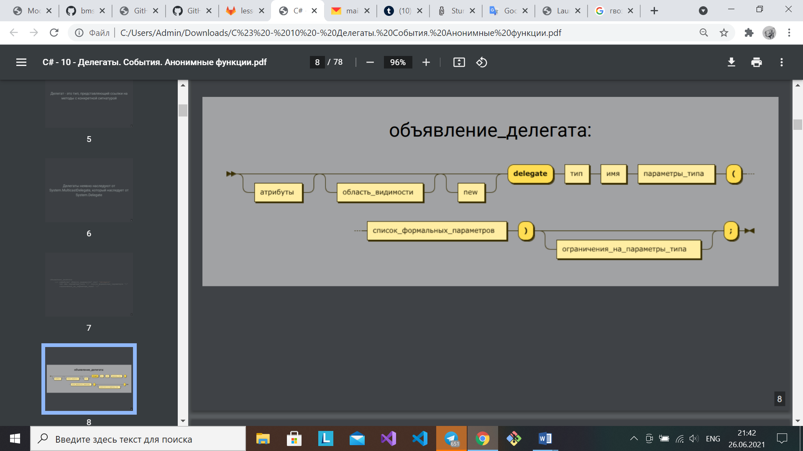
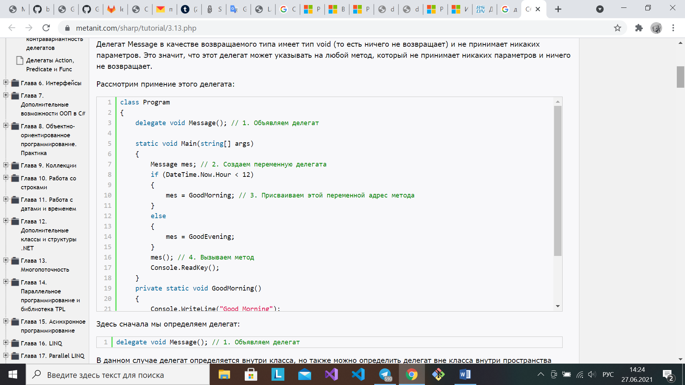
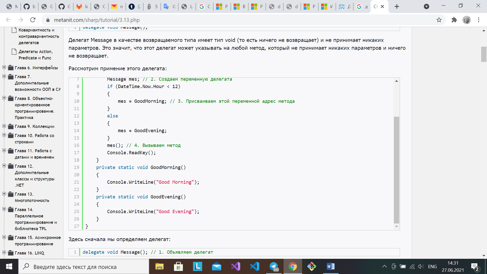
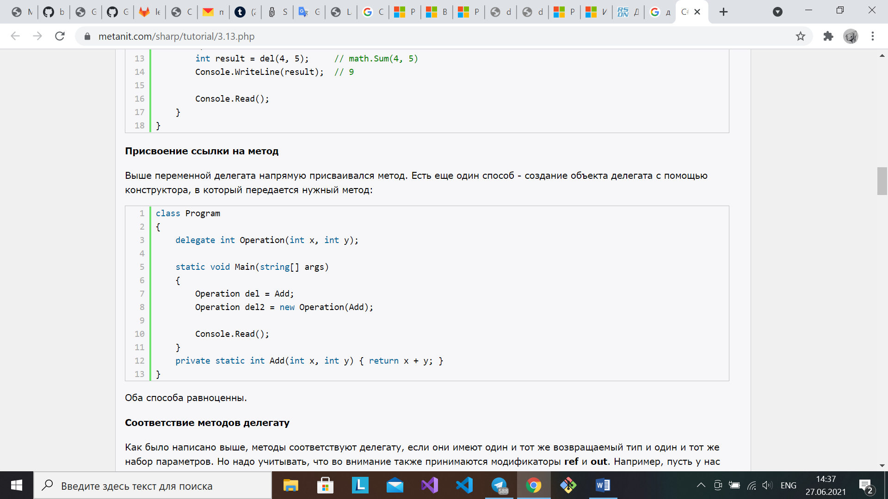
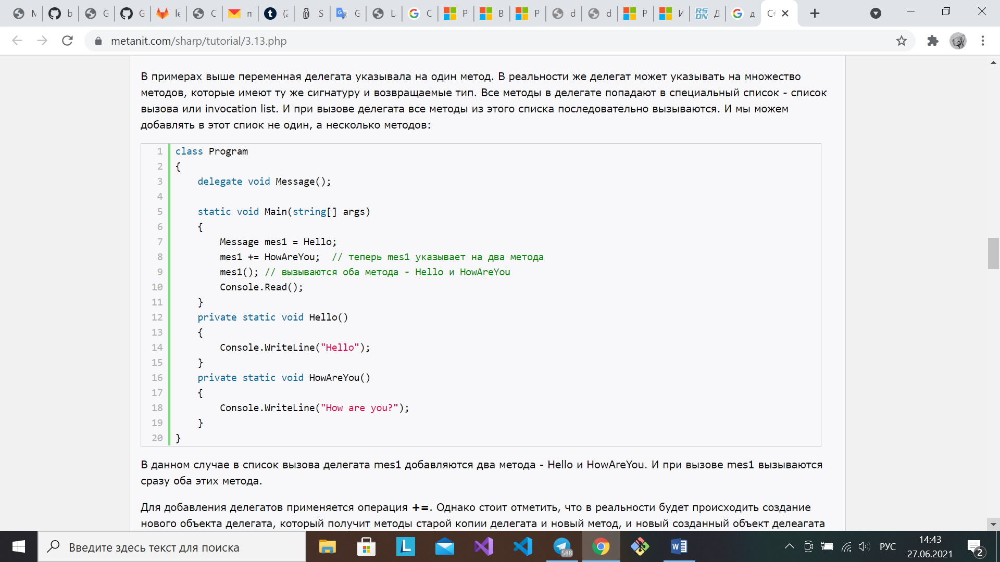

[Вернуться к списку вопросов](../questions.md)

-----------------

# Вопрос № 17

* Делегаты.
* Синтаксис объявления делегатов.
* Использование делегатов.
* Список вызовов делегатов.
* Порядок вызовов в списке.
* Добавление и изъятие вызовов из списка у делегатов.

**Делегат** – это тип, представляющий ссылки на методы с конкретной сигнатурой (имя метода плюс параметры). Делегаты
неявно наследуют от System.MulticastDelegate, который наследует от System.Delegate.

Делегаты имеют следующие свойства.

* Делегаты подобны указателям на функции в C++, но являются полностью объектно-ориентированными и, в отличие от
  указателей C++ на функции-члены, инкапсулируют экземпляр объекта вместе с методом.
* Делегаты допускают передачу методов в качестве параметров.
* Делегаты можно использовать для определения методов обратного вызова.
* Делегаты можно связывать друг с другом; например, при появлении одного события можно вызывать несколько методов.
* Точное соответствие методов типу делегата не требуется (типобезопасны).
* Для краткой записи встроенных блоков кода введены лямбда-выражения. В результате компиляции лямбда-выражений (в
  определенном контексте) получаются типы делегатов.

Делегаты, по сути, ничем не отличаются от обычных пользовательских объектов. Главная их особенность состоит лишь в том,
что они имеют поддержку со стороны среды исполнения. Об их свойствах, в отличие от обычных объектов, знают даже
компиляторы, предоставляющие удобные специальные сервисы для работы с ними.

Делегаты могут также указывать на методы из других классов и структур.

Второй способ создать объект делегата – с помощью конструктора, в который передается нужный метод. Оба способа
равноценны.

#### Операции над делегатами:

**БИНАРНЫЙ "+"**

* Объединение двух делегатов
* Результат - новый делегат
* При его вызове происходит последовательный вызов всех методов, на которые ссылаются исходные делегаты

**БИНАРНЫЙ "-"**

* Удаление делегата из объединения
* Результат - новый делегат или null (при удалении последнего метода)
* При его вызове происходит последовательный вызов всех методов, на которые ссылается левый исходный делегат, но не
  ссылается правый

**СРАВНЕНИЕ: "==" И "!="**

* Делегаты равны, если они ссылаются на одни и те же методы... в том же порядке и количестве

**ВЫЗОВ: "()"**

* Последовательно вызывает все методы, на который ссылается делегат
* Результат — один из результатов (последний)

Делегат может указывать на множество методов, которые имеют ту же сигнатуру и возвращаемые тип. Все методы в делегате
попадают в специальный список – список вызова (invocation list). При вызове делегата все методы из этого списка
последовательно вызываются. В этот список можно добавлять не один, а несколько методов.

В данном случае в список вызова делегата mes1 добавляются два метода - Hello и HowAreYou. И при вызове mes1 вызываются
сразу оба этих метода.

Для добавления делегатов применяется операция +=. В реальности будет происходить создание нового объекта делегата,
который получит методы старой копии делегата и новый метод, и новый созданный объект делегата будет присвоен переменной
mes1.

При добавлении делегатов следует учитывать, что можно добавить ссылку на один и тот же метод несколько раз, и в списке
вызова делегата тогда будет несколько ссылок на один и то же метод. Соответственно при вызове делегата добавленный метод
будет вызываться столько раз, сколько он был добавлен.

Схожим образом можно удалять методы из делегата с помощью операции -=.

При удалении методов из делегата фактически будет создаваться новый делегат, который в списке вызова методов будет
содержать на один метод меньше. Если делегат содержит несколько ссылок на один и тот же метод, то операция -= начинает
поиск с конца списка вызова делегата и удаляет только первое найденное вхождение. Если подобного метода в списке вызова
делегата нет, то операция -= не имеет никакого эффекта.

Также делегаты могут быть параметрами методов. Или обобщёнными
– https://docs.microsoft.com/ru-ru/dotnet/csharp/programming-guide/generics/generic-delegates

[Вернуться в начало](#begin)