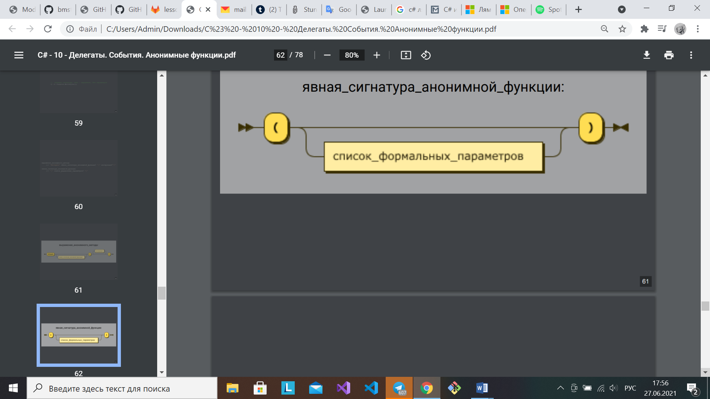

[Вернуться к списку вопросов](../questions.md)

<div id="begin"></div>
-----------------

# Вопрос № 18

* Выражения анонимных функций.
* Лямбда-выражения и выражения анонимных методов.

В C# 1.0 экземпляр делегата (тип, представляющий ссылки на методы с конкретной сигнатурой) создавался путем его явной
инициализации с помощью метода, который был определен в другом месте кода. В C# 2.0 введена концепция анонимных методов
как способа написания неименованных встроенных блоков операторов, которые могут быть выполнены в вызове делегата. В C#
3.0 введены лямбда-выражения, по сути аналогичные анонимным методам, но более выразительные и четкие. Эти две функции
собирательно называют анонимными функциями.

**Анонимная функция** – это выражение, представляющее собой подставляемое определение метода. Анонимная функция не имеет
значение или тип сама по себе, но может быть преобразована в совместимый тип делегата или дерева выражений.

Преобразование зависит от целевого типа:

* Если это тип делегата, то результат – делегат, ссылающийся на метод, определяемый анонимной функцией
* Если это тип, приводимый к System.Linq.Expressions.Expression, то результат – дерево выражения (деревья выражений
  представляют код в виде древовидной структуры, где каждый узел является выражением, например, вызовом метода или
  двоичной операцией, такой как x < y)

Разновидности анонимных функций:

* Лямбда-выражения
* Выражения анонимных методов


Примеры:

```cs
x => x + 1	// неявная сигнатура, тело - выражение 

x => { return x + 1; }	// неявная сигнатура, тело - инструкция 

(int x) => x + 1	// явная сигнатура, тело – выражение

(x, y) => x * y		// неявная сигнатура, тело - выражение, несколько параметров

() => Console.WriteLine();	// неявная сигнатура, тело - выражение, без параметров
```

Начиная с C# 9.0, можно использовать пустые переменные, чтобы указать два или более входных параметра лямбда-выражения,
которые не используются в выражении (полезны, если лямбда-выражение используются для указания обработчика событий).
Аналогично для анонимных методов.

```cs
Func<int, int, int> constant = (_, _) => 42;
```

**Примечание:** Если только один входной параметр имеет имя _, для обеспечения обратной совместимости _ рассматривается
как имя этого параметра в лямбда-выражении.

**Лямбда-выражения могут ссылаться на внешние переменные.** Это переменные в области метода, в котором определено
лямбда-выражение, или области типа, который содержит лямбда-выражение. Переменные, полученные таким способом,
сохраняются для использования в лямбда-выражениях, даже если бы в ином случае они оказались за границами области
действия и уничтожились сборщиком мусора. Внешняя переменная должна быть определенным образом присвоена, прежде чем она
сможет использоваться в лямбда-выражениях.

Следующие правила применимы к области действия переменной в лямбда-выражениях:

* Захваченная переменная не будет уничтожена сборщиком мусора до тех пор, пока делегат, который на нее ссылается, не
  перейдет в статус подлежащего уничтожению при сборке мусора.
* Переменные, представленные в лямбда-выражении, невидимы в заключающем методе.
* Лямбда-выражение не может непосредственно захватывать параметры in, ref или out из заключающего метода.
* Оператор return в лямбда-выражении не вызывает возврат значения заключающим методом.
* Лямбда-выражение не может содержать операторы goto, break или continue, если целевой объект этого оператора перехода
  находится за пределами блока лямбда-выражения. Если целевой объект находится внутри блока, использование оператора
  перехода за пределами лямбда-выражения также будет ошибкой.

Начиная с C# 9.0, можно применять модификатор static к лямбда-выражению для предотвращения непреднамеренного сохранения
локальных переменных или состояния экземпляров лямбда-выражением. Аналогично для анонимных методов.

```cs
Func<double, double> square = static x => x * x;
```

Статическое лямбда-выражение не может сохранять локальные переменные или состояние экземпляров из охватывающих областей,
но может ссылаться на статические элементы и определения констант.

Оператор delegate создает анонимный метод, который можно преобразовать в тип делегата.




Примеры:

```cs
delegate (int x) { return x + 1; }	// нельзя опустить указание типа параметра
// нельзя использовать выражение вместо тела

delegate { return x + 1; }	// можно опустить указание сигнатуры
```

Различия

* Только лямбда-выражения могут быть преобразованы в деревья выражений
* Лямбда выражения рекомендуемы к использованию как более лаконичный способ написания встроенного кода, а выражения
  анонимных методов - устарели

Подробно про лямбда-выражения
– https://docs.microsoft.com/ru-ru/dotnet/csharp/language-reference/operators/lambda-expressions

[Вернуться в начало](#begin)