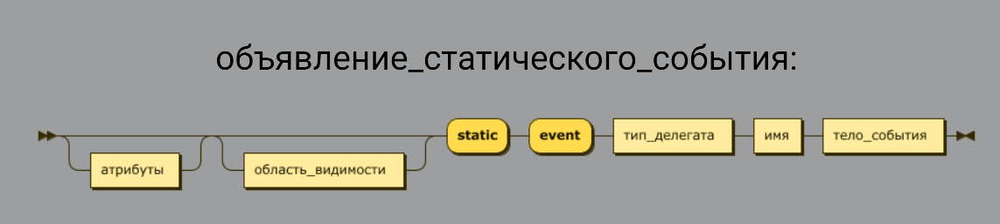
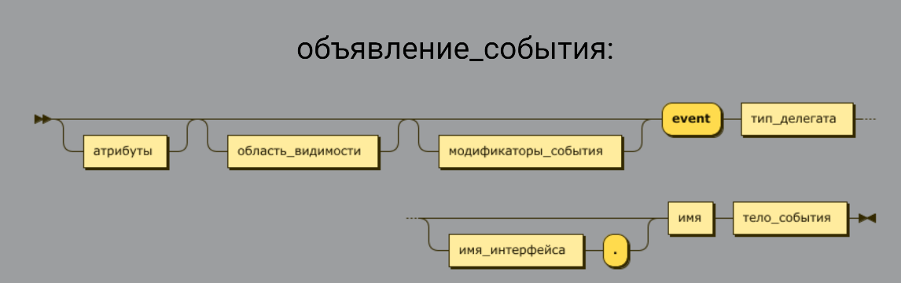
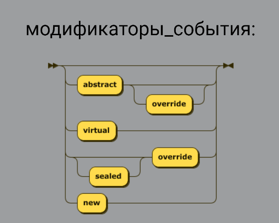
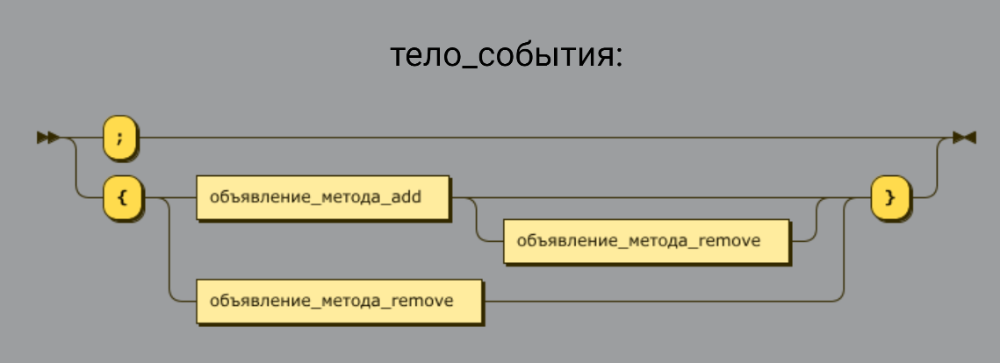
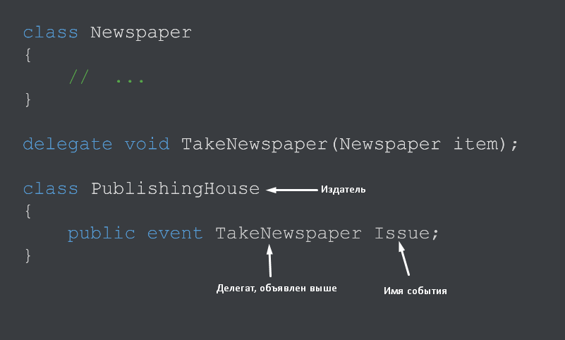
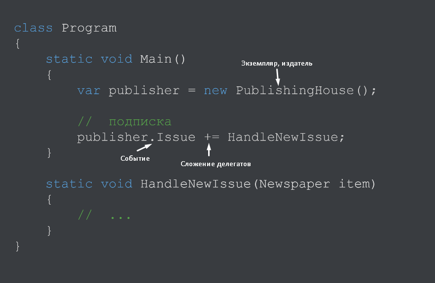
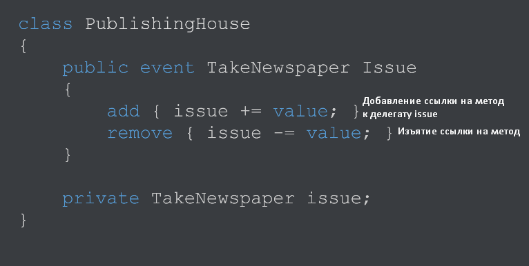
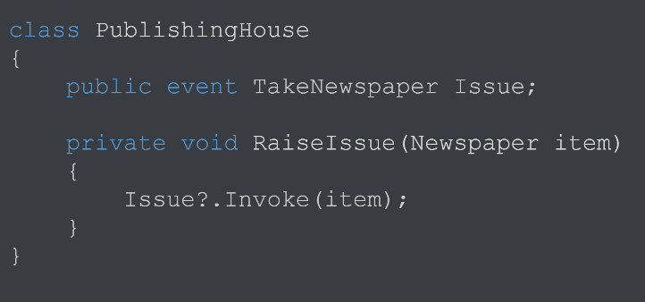
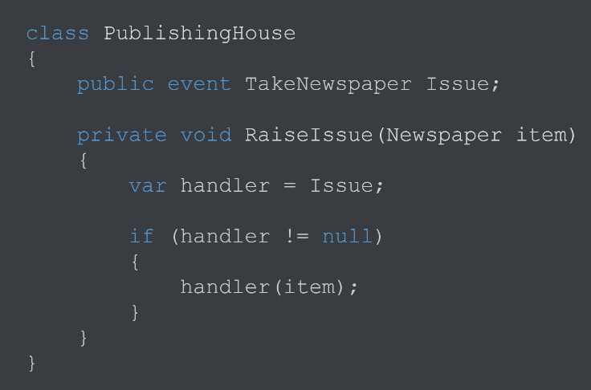

[Вернуться к списку вопросов](../questions.md)

-----------------

# Вопрос № 19

* События.
* Синтаксис объявления событий.
* Генерация событий.
* Подписка и отписка.

Лекция 10 - https://youtu.be/6wJ4ZHeFgbY?list=PLl2sJ30rgYIq3MdZ9fWjIKICBDFssG_sT&t=2418
До 1:15:39

События реализуют шаблон «Издатель-подписчик» (ситуация, при возникновении которой, произойдут некоторые действия).

Издатель:

* Предоставляет возможность подписаться и отписаться от события
* Генерирует события, уведомляя об этом всех подписчиков

Подписчик:

* Подписывается и отписывается от событий издателя
* Получает и обрабатывает события от издателя
* Ничего не знает о других подписчиках
* Не может влиять на издателя

Объявляется как член типа (класса, структуры, интерфейса). Делегат – способ описать то, как должен выглядеть подписчик.
Содержит абстракцию по действию (ссылка на метод, который вызывается) во время вызова события.

Модификаторы такие же, как и у других членов:

Тело события зачастую оставляют просто «;», но иногда расписывают полностью для описания дополнительных действий при
подписке и отписке. Тело похоже на свойство, только в отличие от «get, set» используется «add, remove» или же что-то
одно из последних.

Пример:

Подписка на событие:

С событием может быть связан один или несколько обработчиков. Обработчики событий - это именно то, что выполняется при
вызове событий. Нередко в качестве обработчиков событий применяются методы. Каждый обработчик событий по списку
параметров и возвращаемому типу должен соответствовать делегату, который представляет событие. Для добавления
обработчика события применяется операция +=. Когда событие будет сгенерировано (вызов делегата), будет вызван метод
HandleNewIssue.

Пример с add remove:

Add – при подписке на событие, remove – при отписке.

Проверка события на null:

Проверку производят с помощью элвис оператора. Если Issue == null, событие не будет вызвано. В противном случае – будет
вызвано. Эта запись аналогична старому способу проверки до появления элвис оператора:

При отсутствии подписчиков, когда вызывается событие, программа упадет с ошибкой. Для этого проводится проверка.
Приватный – только для издателя (может быть protected при наследовании). Сохраняет делегат в переменную handler для
проверки на null и вызывает для проверки. Делается это таким образом для исключения проблем при многопоточности, когда
за время выполнения проверки от события могут отписаться или подписаться и при выполнения последующего кода произойдет
ошибка. Однако также это может сработать обратным образом, когда за время выполнения, подписчики отписываются и есть
шанс отправить событие уже отписавшимся. Этим пренебрегают, так как операции выполняются за милисекунды.

Отличие от свойства типа делегат:

Сгенерировать событие может только издатель.

[Вернуться в начало](#begin)