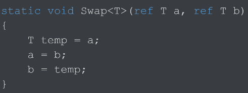
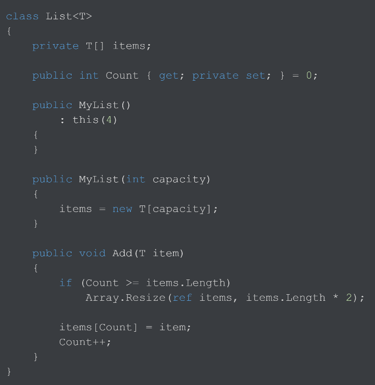
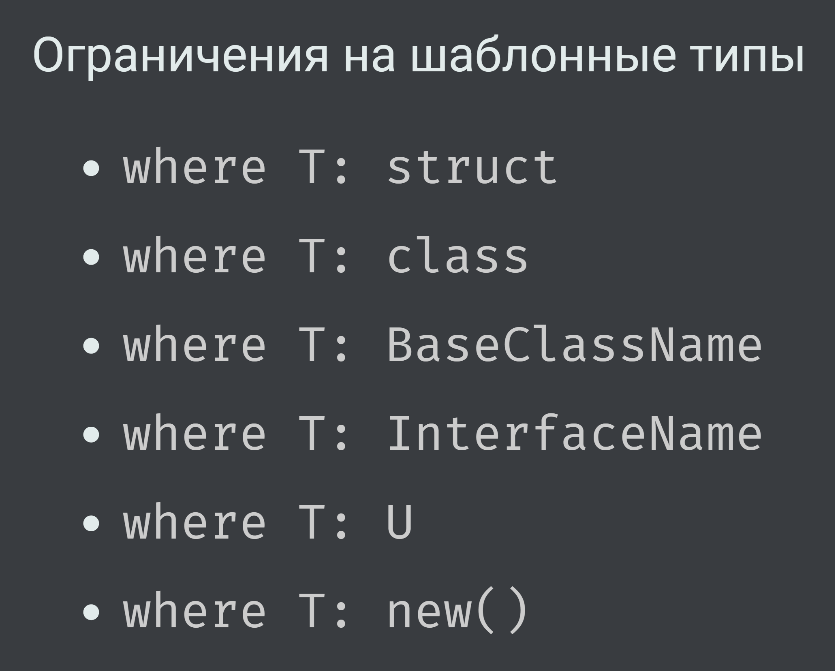

[Вернуться к списку вопросов](../questions.md)

-----------------

# Вопрос № 20

* Универсальные шаблоны (generics).
* Обобщённые методы.
* Обобщённые типы.
* Ограничения на обобщаемый тип.

Лекция 11 - https://youtu.be/do12ooHZka8?list=PLl2sJ30rgYIq3MdZ9fWjIKICBDFssG_sT&t=39
До 58:55

Generics – универсальные шаблоны:

* Позволяют писать шаблонный код (обобщенный относительно чего-либо)
* Шаблонизация происходит относительно типов данных

Позволяет более качественно выполнить унификацию по типам. В отличие от object, где в качестве параметра передается
любой тип, а при передаче структуры происходит упаковка-распаковка и возможно потребуется приведение типов данных, не
унифицирует типы как object, а предоставляет шаблонный тип данных, который способен быть разными типами в зависимости от
ситуации.

Шаблонными могут быть:

* Метод
* Класс
* Структура
* Интерфейс
* Делегат

Объявление шаблонного метода:

Т – шаблонный тип данных. Тип параметра метода, тип возвращаемого результата, тип переменной в теле метода. При вызове
метода в качестве типа Т может быть использован абсолютно любой тип данных, и он должен быть подставлен во все места где
использовалась данная буква в качестве указания типа данных. Поэтому не нужно прописывать данный метод несколько раз для
покрытия всех типов данных. Если шаблонных типов несколько, то они указываются в скобках `<>` через запятую. Обобщенный
метод объявляет параметры типа в сигнатуре метода.

Обобщенный тип объявляет параметры типа (type parameters) — плейсхолдеры типов, которые будут заполнены в дальнейшем при
использовании обобщенного типа, путем передачи в него аргументов типа (type arguments).

Ограничения на шаблонные типы:

* Позволяют предоставить информацию о шаблонизируемом типе
  
* Компилятор не даст нарушить ограничения пользователем
* Но разрешит пользоваться информацией разработчику

Также есть дополнительные ограничения на параметры шаблонов. Они используются только в интерфейсах и делегатах:

* Covariance - ковариантность
* Contravariance - контрвариантность
* Invariance – инвариантность

Ковариантность:

* Позволяет использовать «более наследованный» тип, чем указано
* Например, можно присвоить экземпляр `IEnumerable<Derived>` переменной типа `IEnumerable<Base>` без приведения типа (
  интерфейсы)
* `<out T>` - ковариантный параметр (тип Т может использоваться только в качестве возвращаемого значения, потому что в качестве данного типа может быть наследник, а входным – нет – возникнет проблема совместимости)

Контрвариантность:

* Позволяет использовать "более базовый" тип, чем указано
* Например, можно присвоить экземпляр `Action<Base>` переменной типа `Action<Derived>` (делегаты)
* `<in T>` — контрвариантный параметр

Инвариантность:

* Не позволяет использовать иной тип, нежели указано
* Например, нельзя присвоить экземпляр `List<Base>` переменной типа `List<Derived>` и наоборот (списки)

[Вернуться в начало](#begin)