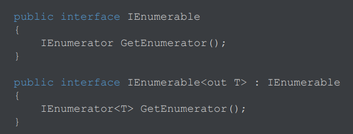
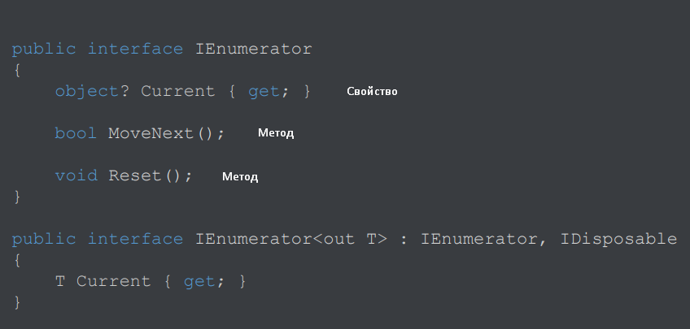
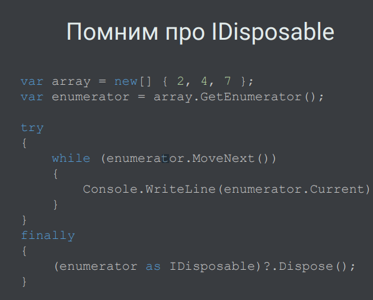
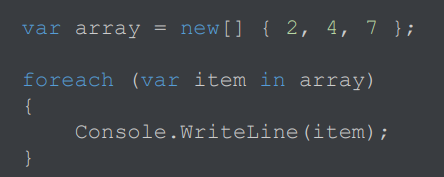
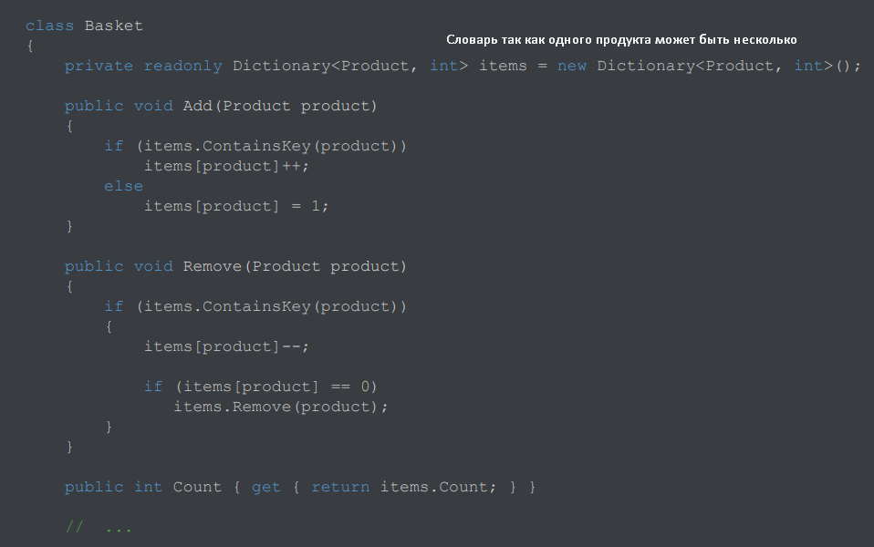
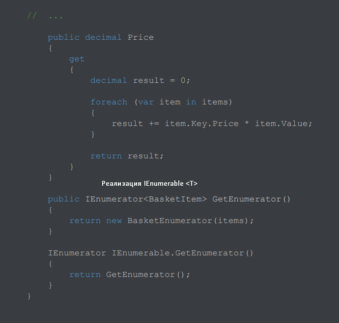
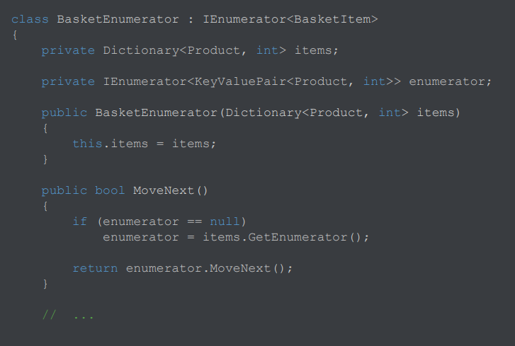
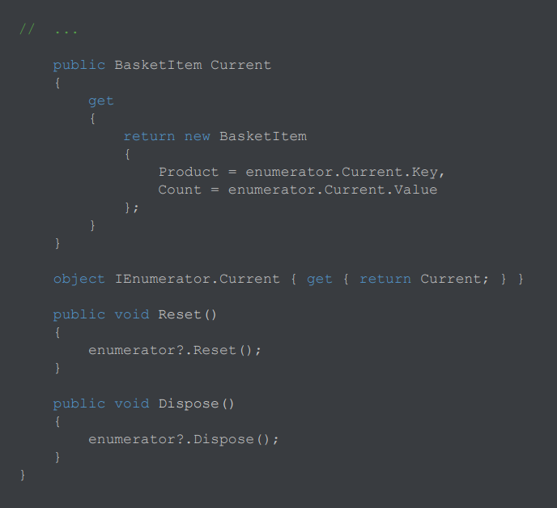
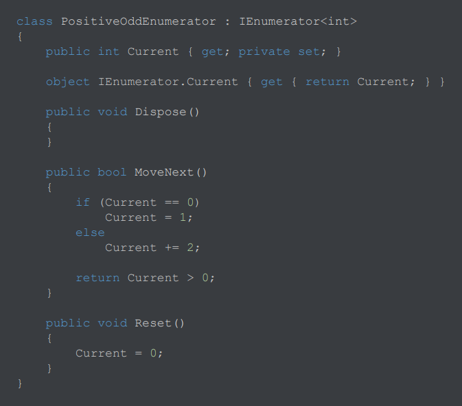

[Вернуться к списку вопросов](../questions.md)

-----------------

# Вопрос № 21

* Интерфейсы IEnumerable, IEnumerator.
* Цикл foreach.

Лекия 9 - https://youtu.be/4YOC1n843fg?list=PLl2sJ30rgYIq3MdZ9fWjIKICBDFssG_sT&t=3309
До 1:24:08

**Итератор** – абстракция, позволяющая перебирать элементы в составе чего-либо.

2 вида интерфейса `IEnumerable`:

Содержит один метод `GetEnumerator`, который возвращает экземпляр интерфейса `IEnumerator`.

`Enumerator` – итератор для хождения по какой-либо коллекции, перечисления элементов.
`Current` – свойство с методом get – способ получить текущий элемент (на начале не имеем право обращаться к нему на
случай если там нет ни одного элемента. Только после того как `MoveNext` вернет `true`)
`MoveNext` – двигаемся к следующему элементу (`bool` значение. Если `true` – получилось перейти к след элементу, `false`
– дошли до конца, обращаться к current больше не можем)
`Reset` – возвращение к началу

`IEnumerator<T>` - расширяет `IEnumerator`. Возвращает конкретный тип `Т` а не `object` + расширяет IDisposable.

Пример:

Цикл `foreach`

Делает то же самое. Синтаксический сахар к тому, что выше.

Цикл работает с помощью `IEnumerable`. Если необходимо, чтобы класс работал с `foreach`, то нужно реализовать интерфейс
IEnumerable. Во всех коллекциях и списках это уже реализовано.

Пример реализации вручную для корзины с товарами.

[Вернуться в начало](#begin)