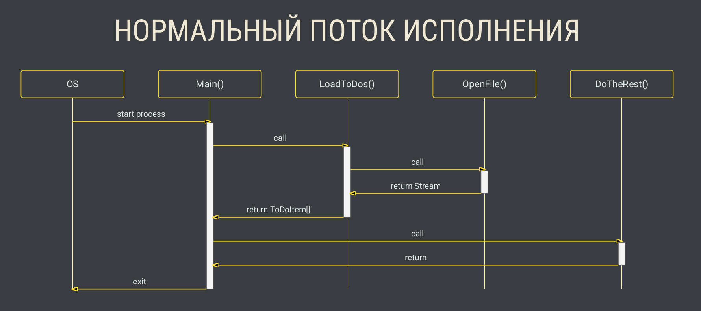
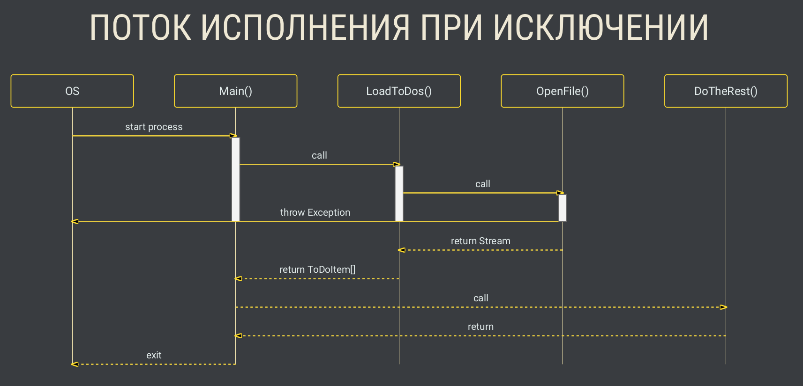
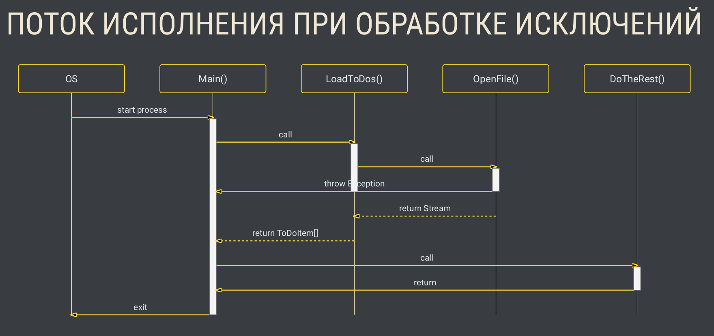

[Вернуться к списку вопросов](../questions.md)

<div id="begin"></div>
-----------------

# Вопрос № 23

## Обработка ошибок.

* [Ключевые отличия от обработки ошибок, основанной на возврате кодов ошибок.](#differents)
* [Генерация исключений.](#exceptions)
* [Типы исключений.](#types)
* [Обработка исключений.](#handling)
* [Конструкция try-catch-finally.](#try-catch-finally)
* [Конструкция using.](#using)

<div id="differents"></div>
-----------------

### Исключения

Исключением является проблема, которая возникает во время выполнения программы. Исключения вызывают ненормальное
завершение программы.  
Исключение может возникнуть по множеству различных причин. Несколько примеров:

- Пользователь ввел неподходящие данные.
- Файл, который должен быть открыт, не найден.
- Сетевое соединение потеряно в середине коммуникации.
- Недостаток памяти, и другие причины, связанные с физическими ресурсами.

Например, следующий код выполнит исключение при работе, потому что мы запросили несуществующий индекс:

```cs
static void Main(string[] args)
{
    int[] arr = new int[] { 4, 5, 8 };
    Console.Write(arr[8]);
}
```

Исключения вызываются при ошибке пользователя, ошибке программиста, или по причине физических ресурсов. Однако, хорошо
написанная программа должна обрабатывать все возможные исключения.

### Ключевые отличия от обработки ошибок, основанной на возврате кодов ошибок

#### КОДЫ ВОЗРАТА (ЯЗЫК С)

```c
void fn(T1 arg1, T2 arg2)
{
    // ...
}

int fn(T1 arg1, T2 arg2)
{
    int errorCode = 0;
    // ...
    return errorCode;  // 0 - Ok, != 0 - Error
}
```

```c
TResult fn(T1 arg1, T2 arg2)
{
    // ...
}

int fn(T1 arg1, T2 arg2, TResult* result)
{
    int errorCode = 0;
    // ...
    return errorCode;  // 0 - Ok, != 0 - Error
}
```

```c
int readToDos(ToDoItem * items, const char * filePath, size_t& limit, size_
{
    int result;
    FILE * stream = fopen(filePath, "rb");
    
    if (stream != null)
    {
        if (offset > 0)
            result = fseek(stream, sizeof(ToDoItem) * offset, SEEK_SET);
        if (result == 0)
            limit = fread(items, sizeof(ToDoItem), limit, stream);
        fclose(stream);
    }
    else
    {
        result = 1;
        limit = 0;
    }
    
    return result;
}
```

#### КОДЫ ВОЗРАТА — ПРОБЛЕМЫ

- Возвращаемое значение функции перестаёт быть результатом
- Ничто не обязывает обрабатывать ошибки
- Коды ошибок требуют документации

#### ИСКЛЮЧЕНИЯ

```cs
void fn(T1 arg1, T2 arg2)
{
    // ... если ошибка, то генерируем исключение
}
TResult fn(T1 arg1, T2 arg2)
{
    // ... если ошибка, то генерируем исключение
}
```





<div id="exceptions"></div>
-----------------

### Генерация исключений

#### Синтаксис

`throw [<выражение>];`

- опционально только в блоке catch
- выражение должно иметь тип, приводимый к `System.Exception`

#### ТИП SYSTEM.EXCEPTION - Свойства

```cs
public class Exception // ...
{
    public virtual string Message { get; }
    public virtual string StackTrace { get; }
    public Exception InnerException { get; }
    public int HResult { get; protected set; }
    public MethodBase TargetSite { get; }
    public virtual IDictionary Data { get; }
    public virtual string HelpLink { get; set; }
}
```

#### ТИП SYSTEM.EXCEPTION - Конструкторы

```cs
public class Exception // ...
{
    public Exception();
    public Exception(string message);
    public Exception(string message, Exception innerException);
}
```

#### Пример генерации исключения

```cs
throw new Exception("Some error message");
```

<div id="types"></div>
-----------------

### Типы исключений

#### Часто встречающиеся типы исключений

Следующие типы исключений являются наиболее часто используемыми:

* `FileNotFoundException`
* `FormatException`
* `IndexOutOfRangeException`
* `InvalidOperationException`
* `OutOfMemoryException`

Другие часто встречающиеся типы исключений:

* `Exception`
* `NullReferenceException`
* `RankException`
* `ArgumentNullException`
* `ArgumentOutOfRangeException`
* `ArgumentException`
* `NotImplementedException`
* `NotSupportedException`
* `OverflowException`
* `TimeoutException`
* `DirectoryNotFoundException`
* `DriveNotFoundException`
* `PathTooLongException`
* `...`

<div id="handling"></div>
-----------------

### Обработка исключений

#### Синтаксис

```cs
try
    <инструкция>
[ catch [ (<тип_исключения1> [ <имя_1> ]) ] [ when (<логическое_выражение1>
    <инструкция1> ]
[ ... ]
[ finally
    <инструкцияN> ]
```

`C#` предоставляет гибкий механизм для обработки исключений, называющийся выражением `try-catch`, чтобы программа не
сломалась при возникновении ошибок. Блоки `try` и `catch` используются следующим образом:

```cs
try {
    int[] arr = new int[] { 4, 5, 8 };
    Console.Write(arr[8]);
}
catch(Exception e) {
    Console.WriteLine("An error occurred");
}
```

Код, который может сгенерировать исключение, размещается в блоке `try`. Если возникает исключение, то выполняется блок
`catch` без остановки программы. Тип исключения, который вы хотите обработать указывается в скобках после ключевого слова
`catch`.  
Мы используем общий тип `Exception` для обработки всех видов исключений. Мы также можем использовать объект исключений `e`
для доступа к деталям исключений, типа оригинального сообщения об ошибке (`e.Message`):

```cs
try {
    int[] arr = new int[] { 4, 5, 8 };
    Console.Write(arr[8]);
}
catch(Exception e) {
    Console.WriteLine(e.Message);
}
```

#### Пример обработки исключения

```cs
Console.WriteLine("Enter an integer");
try
{
    int value = int.Parse(Console.ReadLine());
}
catch (FormatException ex)
{
    Console.WriteLine("Failed to parse input");
    Console.WriteLine(ex);
}
```

Результат к примеру выше при вводе значения отличающегося от `int`:

```shell
Enter an integer
a
Failed to parse input
System.FormatException: Input string was not in a correct format.
at System.Number.StringToNumber(ReadOnlySpan`1 str,
NumberStyles options, NumberBuffer& number,
NumberFormatInfo info, Boolean parseDecimal)
at System.Number.ParseInt32(ReadOnlySpan`1 s, NumberStyles style,
NumberFormatInfo info)
at System.Int32.Parse(String s)
at ConsoleApp1.Program.Main(String[] args) in
C:\Users\a.pavlyuk\temp\ConsoleApp1\ConsoleApp1\Program.cs:line 12
```

#### Пример обработки исключения (число Фибоначчи)

```cs
class MathUtils
{
    public static long GetFibonacci(int index)
    {
        if (index < 0)
            throw new ArgumentException(
                "Expected a non-negative value", nameof(index));
        
        return index > 1
            ? GetFibonacci(index - 1) + GetFibonacci(index - 2)
            : 1;
    }
}
```

#### Пример обработки исключения (подключение к БД)

```cs
SqlConnection conn = EstablishDbConnection();
try
{
    IEnumerable<Order> orders = QueryPlacedUnprocessedOrders(conn);
    // do something else
}
finally
{
    Disconnect(conn);
}
```

#### Обработка множества исключений

Один блок `try` может содержать множество блоков `catch`, которые отдельно обрабатывают различные исключения.  
Обработка исключений частично полезна при работе с пользовательским вводом. Например, для программы, которая запрашивает
пользователя ввести два числа, а затем выводит их частное, убедитесь, что вы обработали деление на ноль, в случае, если
пользователь введет `0` в качестве второго числа.

```cs
int x, y; 
try { 
  x = Convert.ToInt32(Console.Read()); 
  y = Convert.ToInt32(Console.Read()); 
  Console.WriteLine(x / y); 
} 
catch (DivideByZeroException e) { 
  Console.WriteLine("Cannot divide by 0"); 
} 
catch(Exception e) { 
  Console.WriteLine("An error occurred"); 
}
```

Вышеуказанный код обрабатывает исключение `DivideByZeroException` отдельно. Последнее выражение `catch` обрабатывает все
другие исключения, которые могут возникнуть. Если обрабатывается несколько исключений, то тип `Exception` должен быть
определен последним. Теперь, если пользователь введет `0` в качестве второго числа, будет выведено `Cannot divide by 0`.  
Если, к примеру, пользователь введет не целочисленное значение, то будет выведено `An error occurred`.


<div id="try-catch-finally"></div>
-----------------

### Конструкция `try-catch-finally`

Опциональный блок `finally` может быть использован после блоков `catch`. Блок `finally` используется для выполнения заданного
набора выражений, независимо от того, было ли вызвано исключение.

```cs
int result=0;
int num1 = 8;
int num2 = 4;
try {
    result = num1 / num2;
}
catch (DivideByZeroException e) {
    Console.WriteLine("Error");
}
finally {
    Console.WriteLine(result);
}
```

Блок `finally` может использоваться, например, при работе с файлами, или другими ресурсами. Они должны быть закрыты, или
освобождены, в блоке `finally`, независимо от того, было вызвано исключение, или нет.

#### Пример обработки исключения (подключение к БД)

```cs
SqlConnection conn = EstablishDbConnection();
try
{
    IEnumerable<Order> orders = QueryPlacedUnprocessedOrders(conn);
    // do something else
}
catch (Exception ex) when (ex.HResult == 42)
{
    // log exception
    throw new DbInteractionException(ex);
}
finally
{
    Disconnect(conn);
}
```

#### Пример обработки исключения (подключение к БД)

```cs
SqlConnection conn = EstablishDbConnection();
try
{
    IEnumerable<Order> orders = QueryPlacedUnprocessedOrders(conn);
    // do something else
}
catch
{
    // log exception
    throw new DbInteractionException(/* ?? */);
}
finally
{
    Disconnect(conn);
}
```

#### Пример обработки исключения (подключение к БД)

```cs
SqlConnection conn = EstablishDbConnection();
try
{
    IEnumerable<Order> orders = QueryPlacedUnprocessedOrders(conn);
    // do something else
}
catch (Exception ex)
{
    // log exception
    throw; // не throw ex;
}
finally
{
    Disconnect(conn);
}
```

<div id="using"></div>
-----------------

### Конструкция `using`

#### USING

Используется для повышения удобства использования объектов, реализующих интерфейс `System.IDisposable`

#### IDisposable

```cs
Stream stream = File.OpenRead("todos.csv");
try
{
    // работа с потоком
}
finally
{
    if (stream != null)
        stream.Dispose();
}
```

#### СИНТАКСИС `using`

```shell
using (<тип_переменной> <имя_переменной> = <выражение>)
{
}
```

где выражение должно возвращать тип, приводимый к `IDisposable`

#### Пример

```cs
using (Stream stream = File.OpenRead("todos.csv"))
{
    // работа с потоком
}
```

#### НЕСКОЛЬКО `USING` ПОДРЯД

```cs
using (Stream stream = File.OpenRead("todos.csv"))
using (StreamReader reader = new StreamReader(stream))
{
    // работа с потоком и читателем
}
```

[Вернуться в начало](#begin)
