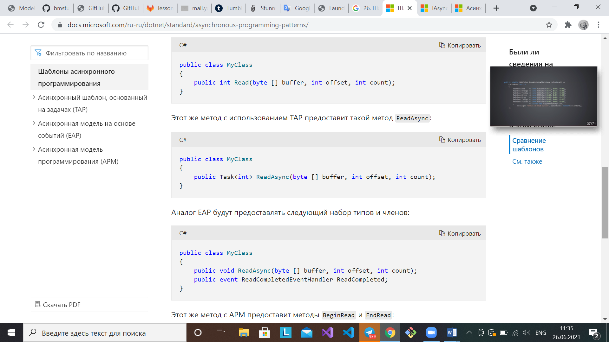
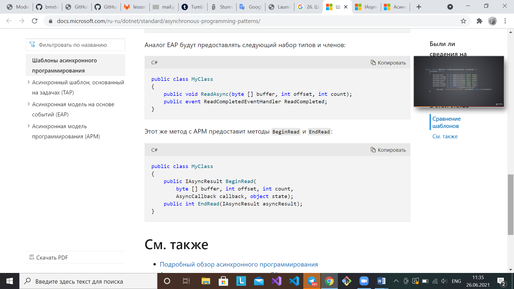
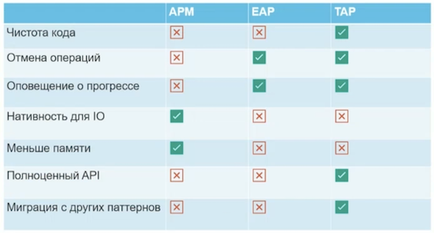
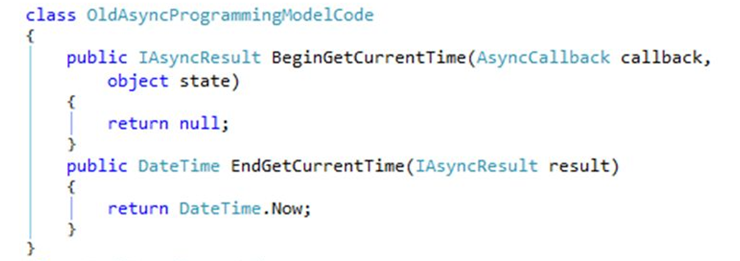
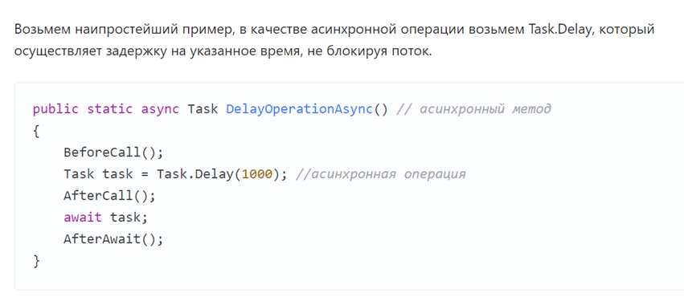

[Вернуться к списку вопросов](../questions.md)

<div id="begin"></div>
-----------------

# Вопрос № 26

* Шаблоны проектирования асинхронных операций в C#.
* Модель асинхронного программирования – Asynchronous programming model (APM).

Как правило, асинхронность подразумевает выполнение операции в стиле, не подразумевающем блокирование вызвавшего потока,
то есть запуск операции без ожидания ее завершения. Для решения задач, связанных с вводом-выводом (например, запрос
данных из сети, доступ к базе данных или чтение и запись в файловой системе, код, ограниченный ресурсами процессора,
например, выполняющий сложные вычисления), желательно использовать асинхронное программирование. В C# есть модель
асинхронного программирования, реализованная на уровне языка, которая позволяет легко писать асинхронный код, не
прибегая к обратным вызовам или библиотекам, которые поддерживают асинхронность.

Шаблоны асинхронного программирования – это систематизация и унификация подходов к организации асинхронного кода.

В .NET есть три шаблона для выполнения асинхронных операций:

* Модель асинхронного программирования (APM – Asynchronous Programming Model), также называется шаблоном IAsyncResult —
  основан на 2 методах. Метод Begin (например, BeginWrite) возвращает интерфейс IAsyncResult. Метод End (например,
  EndWrite – после использования этих двух методов была бы реализована асинхронная операция записи) принимает
  IAsyncResult (если к моменту вызова End операция не завершена, поток блокируется). В данный момент считается
  устаревшей.
* Асинхронная модель на основе событий (EAP – Event-based Asynchronous Pattern) — как следует из названия, поход основан
  на событиях, которые срабатывают по завершении операции и обычного метода, вызывающего эту операцию. Для нее требуется
  метод с суффиксом Async, одно или несколько событий, типы делегатов обработчика событий и производные типы EventArg.
  Модель EAP была реализована в .NET Framework 2.0. В данный момент считается устаревшей.
* Асинхронный шаблон на основе задач (TAP – Task-based Asynchronous Pattern) — использует один метод для запуска и
  завершения асинхронной операции. Шаблон TAP был реализован в .NET Framework 4. Именно его рекомендуется использовать
  для асинхронного программирования в .NET. Ключевые слова async/await. Асинхронная модель на основе задач (TAP)
  основана на типах System.Threading.Tasks.Task и System.Threading.Tasks.Task<TResult> пространства имен
  System.Threading.Tasks, которые используются для представления произвольных асинхронных операций.

### Сравнение шаблонов

Для быстрого сравнения, как с помощью трех шаблонов моделировать асинхронные операции, рассмотрим метод Read, который
считывает указанный объем данных в предоставленный буфер, начиная с заданного смещения:







**Асинхронная операция, использующая шаблон разработки IAsyncResult**, реализуется в виде двух методов с именами
BeginOperationName и EndOperationName, которые соответственно начинают и завершают асинхронную операцию OperationName.
Например, класс FileStream предоставляет методы BeginRead и EndRead для асинхронного считывания байтов из файла. Эти
методы реализуют асинхронную версию метода Read.

После вызова метода `BeginOperationName` приложение может продолжить выполнение инструкций в вызывающем потоке, пока
асинхронная операция выполняется в другом потоке. Для каждого вызова метода BeginOperationName приложение должно
вызывать метод EndOperationName, получающий результаты операции.



**APM**
– https://docs.microsoft.com/ru-ru/dotnet/standard/asynchronous-programming-patterns/asynchronous-programming-model-apm

> Из лекции Павлюка

Метод `BeginDoWork`

* Запускает асинхронную операцию
* Асинхронная операция выполняется в другом потоке
* Для получения результата нужно вызвать метод EndDoWork

* Выполняет подготовительные проверки
* Бросает исключение если запуск асинхронной операции недопустим
* Если он бросил исключение, значит асинхронная операция не была запущена
* Если асинхронная операция была запущена, то уже не может бросать исключение

* object state – это параметр позволяющий передать произвольный объект
* Этот объект можно использовать для восстановления контекста операции после её завершения в AsynchCallback callback

* AsynchCallback callback – это делегат ссылающийся на метод, который вызван после завершения асинхронной операции
* AsynchCallback callback – можно не задавать - передавать null

* Возвращает объект реализующий IAsynchResult
* IAsynchResult - хранит информацию об асинхронной операции

Пример:

```cs
Public interface IAsynchResult
{
  object AsynchState{ get;}
  WaitHandle AsyncjWaitHandle { get;}
  bool CompletedSynchronously { get;}
  bool IsCompleted   { get;}
}
```

Метод EndDoWork

* Возвращает результат асинхронной операции
* Требует на вход объект IAsynchResult, который был получен в результате BeginDoWork

* Если вызван до завершения операции, то заблокирует поток до её окончания (нечто вроде JOIN)
* Если в процессе асинхронной операции были исключения, то они будут получены здесь

> Павлюк из недостатков акцентировал внимание на оповещении о прогрессе и отмене операции (не учитывается в шаблоне, есть специальный класс Cancellation чего-то там. Но нужно добавлять поддержку, заморачиваться и т.д.)

В лекции нет информации про шаблоны EAP и TAP в лёгкой форме, но я изначально добавила в ответ также немного про TAP по
ошибке. Пусть будет.

Чтобы написать стандартный асинхронный метод в стиле TAP нужно:

1. Чтобы возвращаемое значение было Task, Task<T> или void (не рекомендуется). В C# 7 пришли Task-like типы, C# 8 к
   этому списку добавляется еще IAsyncEnumerable<T> и IAsyncEnumerator<T>
2. Чтобы метод был помечен ключевым словом async, а внутри содержал await. Это ключевые слова идут в паре.
3. Для приличия соблюдать конвенцию о суффиксе Async (компилятор за ошибку считать это не будет).

Объект задачи, также имеет определенные условия, чтобы к нему можно было применить await:

1. Ожидаемый тип должен иметь публичный (или internal) метод GetAwaiter(), это может быть и метод расширения. Этот метод
   возвращает объект ожидания
2. Объект ожидания должен реализовать интерфейс INotifyCompletion, который обязывает реализовать метод void OnCompleted(
   Action continuation). Также он должен иметь экземплярные свойство bool IsCompleted, метод void GetResult(). Может
   быть как структурой, так и классом.



Async/await в C#: концепция, внутреннее устройство, полезные приемы – 
https://habr.com/ru/post/470830/

[Вернуться в начало](#begin)