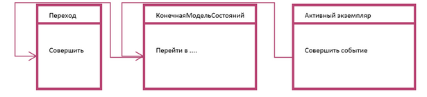

[К списку вопросов](exam_oop.md)

# 11. Архитектурный домен. Паттерн КМС. Шаблоны для создания прикладных классов.

## Архитектурный домен.
Домен - отдельный реальный, абстрактный или гипотетический мир, населенный отчетливым набором оъектов, которые ведут себя соотвественно определнным доменом правилам или линиям поведения. Архитектурный домен дает общие механизмы и структуры для управления данными и для управления всей нашей системой как единым целым.

## Архитектурный паттерн MVC (Model-View-Controller)
Схема разделения данных приложения, пользовательского интерфейса и управляющей логики на три отдельных компонента: модель, представление и контроллер — таким образом, что модификация каждого компонента может осуществляться независимо.

* Модель(Model) предоставляет данные и реагирует на команды контроллера, изменяя своё состояние.
* Представление(View) отвечает за отображение данных модели пользователю, реагируя на изменения модели.
* Контроллер(Controller) интерпретирует действия пользователя, оповещая модель о необходимости изменений. Основная цель применения этой концепции состоит в отделении бизнес-логики(модели) от её визуализации(представления, вида). Засчёт такого разделения повышается возможность повторного использования кода. Наиболее полезно применение данной концепции в тех случаях, когда пользователь должен видеть те же самые данные одновременно в различных контекстах и/или с различных точек зрения. В частности, выполняются следующие задачи:
    1. К одной модели можно присоединить несколько видов, при этом не затрагивая реализацию модели. Например, некоторые данные могут быть одновременно представлены в виде электронной таблицы, гистограммы и круговой диаграммы;
    2. Не затрагивая реализацию видов, можно изменить реакции на действия пользователя(нажатие мышью на кнопке, ввод данных) — для этого достаточно использовать другой контроллер;
    3. Ряд разработчиков специализируется только в одной из областей: либо разрабатывают графический интерфейс, либо разрабатывают бизнес-логику. Поэтому возможно добиться того, что программисты, занимающиеся разработкой бизнес-логики(модели), вообще не будут осведомлены о том, какое представление будет использоваться.

## Паттерн КМС (конечная модель состояний).
Для архитектурного домена создаются три класса, задающих правило перехода из одного состояния в другое при возникновении события.

## Шаблоны для создания прикладных классов.
КМС делается шаблонным классом – позволяет сделать систему гибкой. Все активные классы будут производными от «акт экз». Соответственно у АЭ должен быть конструктор, в который мы передаём начальное состояние и КМС. В схему можно добавить параметр игнорирования перехода; возвращается флаг. Либо проверка происходит на уровне формирования активного класса. Выделены пассивные и активные объекты. Для активных выделяются жизненные циклы.

* Диаграмма пассивного класса должна включать в себя: атрибуты (компоненты экземпляра), аксессоры (сет и гет) (как объекта так и класса).
* Диаграмма активного: атрибуты, аксессоры (как правило), методы объекта (тейкеры событий) – действия, которые соответствуют состояниям в модели состояний объекта. «Затребовать событие» - реакция на событие. Кроме этого, активный класс включает инициализатор КМС.

Выделяются объекты, осуществляющие только связь между другими. Если для таких объектов не выделять атрибутов, то их можно рассматривать как объекты определители связи. Такие объекты не имеют аксессоров, только тейкеры и инициализаторы.
