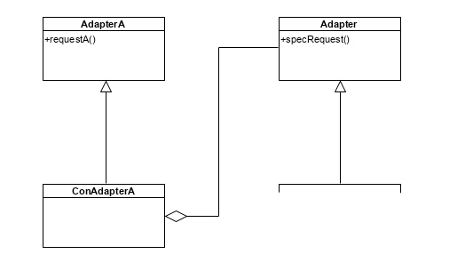
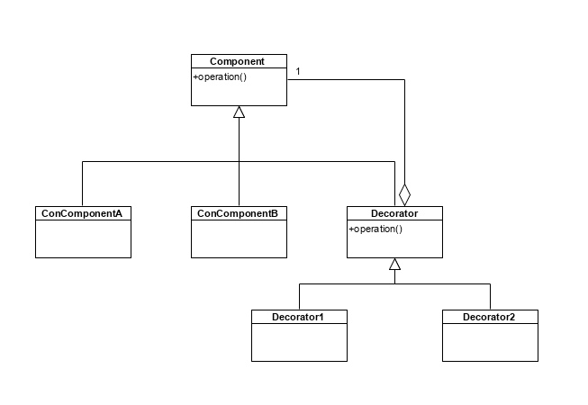
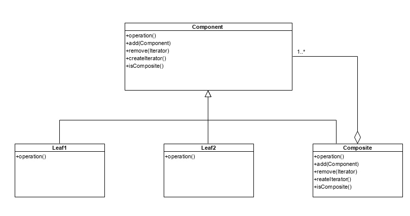
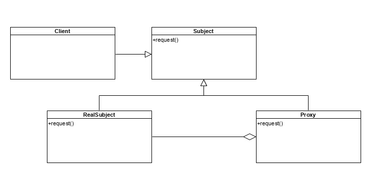
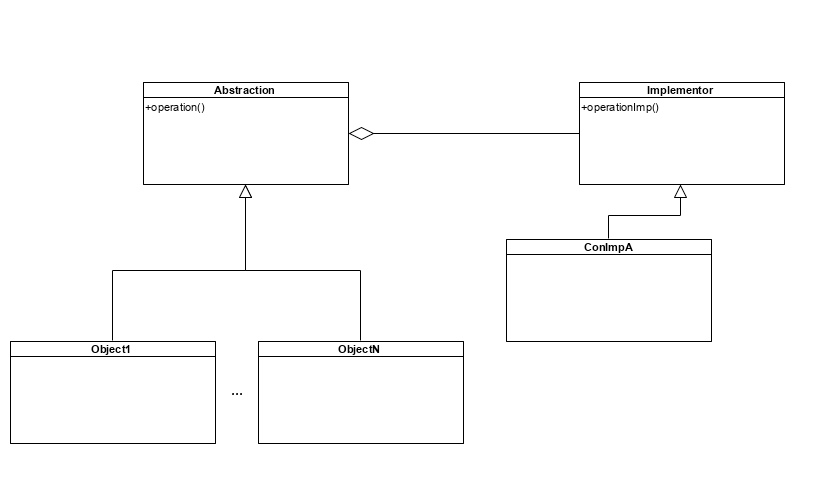

[К списку вопросов](exam_oop.md)

# 12. Структурные паттерны: адаптер (Adapter), декоратор (Decorator), компоновщик (Composite), заместитель (Proxy), мост (Bridge), фасад (Facade).

Отличие шаблонов от паттернов: шаблон - конкретная реализация чего-либо, а паттерн - шаблон для решения какой-то задачи (как может решаться данная задача). Паттерн мы всегда адаптируем к своей задаче.

**Преимущества использования паттернов:**
* Мы имеем готовое решение
* За счет готового решения - нюансы все выявлены => надежный код
* Повышаетя скорость разработки
* Повышается читаемость кода
* Улучшается взаимодействие с коллегами (?)

Структурные паттерны предлагают структурные решения: определенную декомпозицию классов использованием схем наследования, включения и пр.

## Адаптер

**Проблема:** 

объект в разных местах программы играет разные роли.
Это плохо, потому что:
* Для каждой роли разрабатывается свой интерфейс. Несколько ролей для одного объекта - значит, избыточный интерфейс.
* Роль объекта - это возложение на него определенной ответственности. Несколько ролей - это несколько ответственностей. Недопустимо с точки зрения принципов ООП.

**Идея решения:** 

У объекта был один интерфейс. Подменяем этот интерфейс другим - соответственно той роли, в которой мы хотим использовать объект. Таким образом, в зависимости от ситуации мы можем использовать этот объект в разных ролях. С этим объектом работаем через объект другого класса. Объект, через класс которого мы работаем, имеет интерфейс необходимой нам роли.

**Использование паттерна:**

Один объект может выступать в нескольких ролях.
Нам нужно встроить в систему сторонние классы, имеющие другой интерфейс. Класс с любым интерфейсом можем встроить в нашу программу.
Мы, используя полиморфизм, сформировали интерфейс для базового. Определенные сущности, наследуемые от базового класса, должны поддерживать еще какой-то функционал. Мы не можем расширить этот функционал и изменять написанный код. Решаем эту проблему за счет адаптера, который предоставляет расширенный интерфейс.

**Диаграмма:**



**Пример:**

```cpp
# include <iostream>
# include <memory>

using namespace std;

class Adapter
{
public:
	virtual ~Adapter() = 0;

	virtual void request() = 0;
};

Adapter::~Adapter() = default;

class BaseAdaptee
{
public:
	virtual ~BaseAdaptee() = 0;

	virtual void specificRequest() = 0;
};

BaseAdaptee::~BaseAdaptee() = default;

class ConAdapter : public Adapter // подменяет интерфейс
{
private:
	shared_ptr<BaseAdaptee> adaptee;

public:
	ConAdapter(shared_ptr<BaseAdaptee> ad) : adaptee(ad) {}

	virtual void request() override;
};

class ConAdaptee : public BaseAdaptee
{
public:
	virtual void specificRequest() override { cout << "Method ConAdaptee;" << endl; }
};

#pragma region Methods
void ConAdapter::request() 
{
	cout << "Adapter: ";

	if (adaptee)
	{
		adaptee->specificRequest();
	}
	else
	{
		cout << "Empty!" << endl;
	}
}

#pragma endregion


int main()
{
	shared_ptr<BaseAdaptee> adaptee(new ConAdaptee());
	shared_ptr<Adapter> adapter(new ConAdapter(adaptee));

	adapter->request();
}
```

## Декоратор

**Проблема:** 

нам надо добавить/подменить классам функционал. Причем одинаковый для нескольких классов. Если мы подменим функционал в производных для каждого из классов, которые мы хотим изменить - разрастается иерархия, приходится дублировать код.

**Идея решения:** 

вынести это добавление в отдельный класс - декоратор.

**Использование паттерна:**

добавление/подмена небольшой части функционала, одинаковой для разных классов.

**Преимущества:**

* Гибкая система. Уменьшается иерархия.
* Декорировать можем во время выполнения работы программы.
* Избавляемся от дублирования кода. Этот код уходит в конкретный декоратор, не дублируясь.

**Недостатки:**

Не можем убрать обертку из иерархии оберток. Придется заново создавать компонент с обёртками.

**Диаграмма:**



**Пример:**

```cpp
# include <iostream>
# include <memory>

using namespace std;

class Component
{
public:
	virtual ~Component() = 0;

	virtual void operation() = 0;
};

Component::~Component() {}

class ConComponent : public Component
{
public:
	virtual void operation() override { cout << "ConComponent; "; }
};

class Decorator : public Component
{
protected:
	shared_ptr<Component> component;

public:
	Decorator(shared_ptr<Component> comp) : component(comp) {}
};

class ConDecorator : public Decorator
{
public:
	using Decorator::Decorator;

	virtual void operation() override;
};

#pragma region Method
void ConDecorator::operation()
{
	if (component)
	{
		component->operation();

		cout << "ConDecorator ";
	}

}

#pragma endregion

int main()
{
	shared_ptr<Component> component(new ConComponent());
	shared_ptr<Component> decorator1(new ConDecorator(component));

	decorator1->operation();
	cout << ";" << endl;

	shared_ptr<Component> decorator2(new ConDecorator(decorator1));

	decorator2->operation();
	cout << ";" << endl;
}
```

## Компоновщик

**Проблема:** 

часто работаем со многими объектами однотипно, то есть выполняем над ними одни и те же операции. Более того, возникают ситуации, когда нужно выполнять над группой объектов эти действия совместно.

**Идея решения:** 

вынести интерфейс, который предлагает контейнер (объект, включающий в себя другие объекты), на уровень базового класса. Компоновщик компонует объекты в древовидную структуру, в которой над всей иерархией объектов (или ее частью) можно выполнять такие же действия, как над простым элементом. Задача методов интерфейса для компонентов - пройтись по списку компонент и вызвать соответствующий метод для содержимого. Клиенту неважно, работает он с простым объектом или с составным.

**Использование паттерна:** 

когда необходимо выполнять над одним элементом и над множеством общие действия. Над множеством элементов необходимо выполнять действия совместно (с составным объектом работаем, как с простым).

**Диаграмма:**



**Пример:**

```cpp
# include <iostream>
# include <memory>
# include <vector>
# include <iterator>

using namespace std;

class Component;

using VectorComponent = vector<shared_ptr<Component>>;
using IteratorComponent = VectorComponent::const_iterator;

class Component
{
public:
	virtual ~Component() = 0;

	virtual void operation() = 0;

	virtual bool isComposite() const { return false; }
	virtual bool add(shared_ptr<Component> comp) { return false; }
	virtual bool remove(const IteratorComponent& it) { return false; }
	virtual IteratorComponent begin() const { return IteratorComponent(); }
	virtual IteratorComponent end() const { return IteratorComponent(); }
};

Component::~Component() {}

class Figure : public Component
{
public:
	virtual void operation() override { cout << "Figure method;" << endl; }
};

class Camera : public Component
{
public:
	virtual void operation() override { cout << "Camera method;" << endl; }
};

class Composite : public Component
{
private:
	VectorComponent vec;

public:
	Composite() = default;
	Composite(shared_ptr<Component> first, ...);

	virtual void operation() override;

	virtual bool isComposite() const override { return true; }
	virtual bool add(shared_ptr<Component> comp) { vec.push_back(comp); return false; }
	virtual bool remove(const IteratorComponent& it) { vec.erase(it); return false; }
	virtual IteratorComponent begin() const override { return vec.begin(); }
	virtual IteratorComponent end() const override { return vec.end(); }
};

#pragma region Methods
Composite::Composite(shared_ptr<Component> first, ...)
{
	for (shared_ptr<Component>* ptr = &first; *ptr; ++ptr)
		vec.push_back(*ptr);
}

void Composite::operation()
{
	cout << "Composite method:" << endl;
	for (auto elem : vec)
		elem->operation();
}

#pragma endregion

int main()
{
	using Default = shared_ptr<Component>;
	shared_ptr<Component> fig1(new Figure()), fig2(new Figure), cam1(new Camera()), cam2(new Camera());
	shared_ptr<Component> composite1(new Composite(fig1, cam1, fig2, cam2, Default()));

	composite1->operation();
	cout << endl;

	IteratorComponent it = composite1->begin();

	composite1->remove(++it);
	composite1->operation();
	cout << endl;

	shared_ptr<Component> composite2(new Composite(shared_ptr<Component>(new Figure()), composite1, Default()));

	composite2->operation();
}
```

## Заместитель

Позволяет работать не с реальным объектом, а с другим объектом, который подменяет реальный.

**В каких целях это можно делать:**

* Подменяющий объект может контролировать другой объект, задавать правила доступа к этому объекту.
* Поскольку запросы к объекту проходят через прокси, прокси может заниматься статистической обработкой.
* Реальные объекты какие-то операции могут выполнять долго. Прокси может сохранять предыдущий ответ и смотреть – был ответ на этот запрос или нет. Если был – возвращать его, а если нет – обращается к хозяину. Например, запрос в базу данных.

**Диаграмма:**



**Пример:**

```cpp
# include <iostream>
# include <memory>
# include <map>
# include <random>

using namespace std;

class Subject
{
public:
	virtual ~Subject() = 0;

	virtual pair<bool, double> request(size_t index) = 0;
	virtual bool changed() { return true; }
};

Subject::~Subject() = default;

class RealSubject : public Subject
{
private:
	bool flag{ false };
	size_t counter{ 0 };

public:
	virtual pair<bool, double> request(size_t index) override;
	virtual bool changed() override;
};

class Proxy : public Subject
{
protected:
	shared_ptr<RealSubject> realsubject;

public:
	Proxy(shared_ptr<RealSubject> real) : realsubject(real) {}
};

class ConProxy : public Proxy
{
private:
	map<size_t, double> cache;

public:
	using Proxy::Proxy;

	virtual pair<bool, double> request(size_t index) override;
};

#pragma region Methods
bool RealSubject::changed()
{
	if (counter == 0)
	{
		flag = true;
	}
	if (++counter == 7)
	{
		counter = 0;
		flag = false;
	}
	return flag;
}

pair<bool, double> RealSubject::request(size_t index)
{
	random_device rd;
	mt19937 gen(rd());

	return pair<bool, double>(true, generate_canonical<double, 10>(gen));
}

pair<bool, double> ConProxy::request(size_t index)
{
	pair<bool, double> result;

	if (!realsubject)
	{
		cache.clear();

		result = pair<bool, double>(false, 0.);
	}
	if (!realsubject->changed())
	{
		cache.clear();

		result = realsubject->request(index);

		cache.insert(map<size_t, double>::value_type(index, result.second));
	}
	else
	{
		map<size_t, double>::const_iterator it = cache.find(index);

		if (it != cache.end())
		{
			result = pair<bool, double>(true, it->second);
		}
		else
		{
			result = realsubject->request(index);

			cache.insert(map<size_t, double>::value_type(index, result.second));
		}
	}

	return result;
}

#pragma endregion

int main()
{
	shared_ptr<RealSubject> subject(new RealSubject());
	shared_ptr<Subject> proxy(new ConProxy(subject));

	for (size_t i = 0; i < 21; ++i)
	{
		cout << "( " << i + 1 << ", " << proxy->request(i % 3).second << " )" << endl;

		if ((i + 1) % 3 == 0)
			cout << endl;
	}
	
}
```

## Мост

**Проблема:** 

В иерархии возможно несколько внутренних реализаций для объекта, это разные классы (разные ветви иерархии). У нас один объект, во время работы надо поменять реализацию - мигрировать от одного класса к другому.

**Идея решения:** 

разделить абстракцию объекта и его реализации в отдельные иерархии. Это сократит иерархию, во время работы программы мы сможем менять реализацию объекта. Можем независимо менять логику (абстракции) и наращивать реализацию (добавлять новые классы реализации).

**Использование решения:**

1. Когда нам нужно во время выполнения менять реализацию
2. Когда у нас большая иерархия, и по разным ветвям этой иерархии идут одинаковые реализации. Дублирование кода мы выносим в дерево реализаций. Такой подход дает возможность независимо изменять управляющую логику и реализацию.

**Диаграмма:**



**Пример**

```cpp
# include <iostream>
# include <memory>

using namespace std;

class Implementor
{
public:
	virtual ~Implementor() = 0;

	virtual void operationImp() = 0;
};

Implementor::~Implementor() = default;

class Abstraction
{
protected:
	shared_ptr<Implementor> implementor;

public:
	Abstraction(shared_ptr<Implementor> imp) : implementor(imp) {}
	virtual ~Abstraction() = 0;

	virtual void operation() = 0;
};

Abstraction::~Abstraction() = default;

class ConImplementor : public Implementor
{
public:
	virtual void operationImp() override { cout << "Implementor;" << endl; }
};

class Entity : public Abstraction
{
public:
	using Abstraction::Abstraction;

	virtual void operation() override { cout << "Entity: "; implementor->operationImp(); }
};

int main()
{
	shared_ptr<Implementor> implementor(new ConImplementor());
	shared_ptr<Abstraction> abstraction(new Entity(implementor));

	abstraction->operation();
}
```

## Фасад

Есть группа объектов, жестко связанных между собой. Чтобы извне не работать с каждым объектом в отдельности, мы можем эти объекты объединить в один класс - фасад, который будет представлять интерфейс для работы со всем объединением. Мы работаем с фасадом не как с контейнером, а как с простым объектом. Клиенту не нужно знать внутреннего устройства системы.

Фасад также может следить за целостностью системы.
