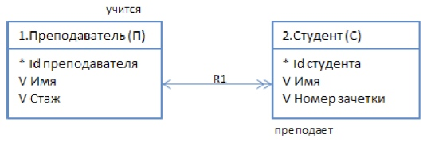
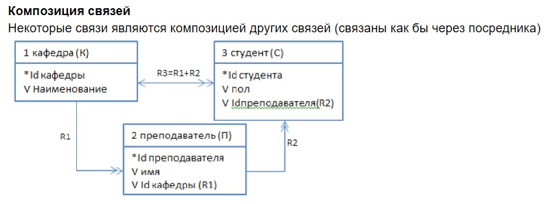
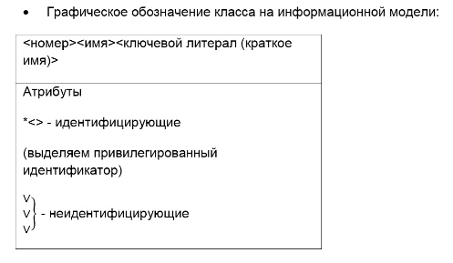

[К списку вопросов](exam_oop.md)

# 5. Концепции информационного моделирования. Понятие атрибута. Типы атрибутов. Правила атрибутов. Понятие связи. Типы связей. Формализация связей. Композиция связей. Подтипы и супертипы. Диаграмма сущность-связь.

С чего начинать разработку проекта: разбили задачу на домены, рассматриваем прикладной домен (наш). Разработка прикладного домена начинается с информационного моделирования. Мы начинаем всегда с физических объектов. Смотрим, какие объекты существуют. Пытаемся эти объекты сгруппировать по принципу одних и тех же характеристик. Выделяем, чем характеризуется объект - выделяем атрибуты объектов.

## Концепции информационного моделирования.

Разработка прикладного домена начинается с информационного моделирования.

Информационное моделирование включает в себя: \
• Выделение сущностей, с которыми мы работаем. \
• Описание и анализ сущностей. Выделение их характеристик. \
• Графическое представление сущностей.

## Понятие атрибута. Типы атрибутов. Правила атрибутов.

**Атрибуты** - характеристики сущностей, переменные-члены объектов (данные). Каждая характеристика, которая является общей для всех экземпляров класса, выделяется как отдельный атрибут.

**Типы атрибутов:**

• Описательные атрибуты. Какая-то характеристика, внутренне присущая каждому объекту. \
• Указывающие атрибуты. Которые используются как идентификатор, или как часть идентификатора. \
• Вспомогательные атрибуты. Для формализации связи одного объекта с другими объектами. Для активных объектов будем выделять время жизни. Атрибут состояния.

**Правила атрибутов:**

1. Один объект класса имеет одно единственное значение для каждого атрибута в любой момент времени. Не может быть атрибутов, значения которых не определены в какой-то момент жизни объекта.
2. Атрибут не должен содержать никакой внутренней структуры.
3. Когда объект имеет составной идентификатор, каждый атрибут являющийся частью идентификатора, представляет характеристику всего объекта, а не его части.
4. Каждый атрибут не являющийся частью идентификатора, представляет собой характеристику объекта указанного идентификатором, а не характеристику другого атрибута.

Для каждого атрибута выделяем, какие значения может принимать атрибут. (Чтобы в дальнейшем определить тип для атрибута).

Каждый атрибут необходимо описать. Из описания атрибута должно стать понятно, зачем мы выделили этот атрибут: \
• Для описательного: показываем, какую характеристику хранит атрибут, как определяется и кто задает этот атрибут. \
• Для идентифицирующего: показываем форму указания, кто назначает указание и степень, в которой идентифицирующий атрибут используется как идентификатор. \
Из группы идентифицирующих атрибутов выделяется привилегированный. (Если имя и фамилия - идентифицирующие атрибуты, из них фамилия - привилегированный).
• Для вспомогательного: показываем, какую связь формализует атрибут и почему мы так ее формализуем.

**(!)** - Изменение атрибута не приводит к изменению объекта - это тот же объект с другим атрибутом. Даже идентифицирующего.

## Понятие связи. Типы связей. Формализация связей. Композиция связей.

**Связь** – это абстракция отношений, которые возникают между объектами.

Задаём связь из перспективы каждого участвующего объекта.

Каждой связи присваивается уникальный идентификатор, который состоит из буквы и номера.

**Типы связей по множественности:**

• Один к одному <---------> \
• Один ко многим <--------->> \
• Многие ко многим <<--------->>

**Типы связей по условности:**

• Условные (один может не участвовать) \
• Безусловные (оба участвуют) \
• Биусловные (оба могут не участвовать) Если со стороны объекта связь условная, то у стрелочки с его стороны ставится У.

**Формализация связей:**

• Один к одному (атрибут связи добавляется в главный из объектов, но если у связи динамическое поведение - с помощью ассоциативного объекта). Главный - наиболее осведомленный о всей системе. \
• Один ко многим (атрибут связи добавляется со стороны многих, но если у связи динамическое поведение или объекты со стороны многих стоят рангом ниже, чем со стороны одного - с помощью ассоциативного объекта) \
• Многие ко многим - с помощью ассоциативного объекта

**(!)** - Условная, биусловная или связь имеющая динамическое поведение, формализуется с помощью ассоциативного объекта!

На информационной модели некоторые связи могут быть следствием другой связи. Такие связи мы обозначаем как композицию связей и не формализуем на диаграмме.

 
## Подтипы и супертипы.

Если для объектов разных классов существует некий общий атрибут - объединяем их суперклассом. Общие атрибуты для разных классов выносим в их суперкласс.

В объектно-ориентированном анализе суперкласс - всегда абстрактное понятие, мы не рассматриваем возможность создания объектов суперкласса.

Связь суперкласса с подклассами обозначается номером, начинающемся со 100 (101, 102, 103...).

## Диаграмма сущность-связь.

На диаграмме сущность-связь сущности располагаются в прямоугольнике. Каждой сущности присваиваем и уникальный для домена номер. Выделяем имя сущности (желательно существительное). Для имени указываем ключевой литерал (29:20 часть 2 лекция 10). Указываем атрибуты: Привилегированный указывающий атрибут обозначаем '*' Все остальные атрибуты - просто перечисляем.

Между сущностями графически указываем связи.

Остальные правила и термины приведены выше.

