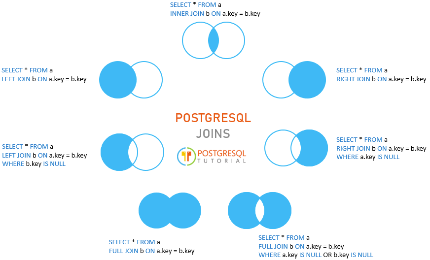

[К списку вопросов](db_exam.md)

# 11. Язык SQL. DML. Оператор SELECT. Логические условия выборки. Группировка и агрегирующие функции. Сортировка. Соединения. Виды соединений.

## SELECT
SELECT, TABLE, WITH — получить строки из таблицы или представления

Синтаксис
```postgresql
[ WITH [ RECURSIVE ] запрос_WITH [, ...] ]
SELECT [ ALL | DISTINCT [ ON ( выражение [, ...] ) ] ]
    [ * | выражение [ [ AS ] имя_результата ] [, ...] ]
    [ FROM элемент_FROM [, ...] ]
    [ WHERE условие ]
    [ GROUP BY [ ALL | DISTINCT ] элемент_группирования [, ...] ]
    [ HAVING условие ]
    [ WINDOW имя_окна AS ( определение_окна ) [, ...] ]
    [ { UNION | INTERSECT | EXCEPT } [ ALL | DISTINCT ] выборка ]
    [ ORDER BY выражение [ ASC | DESC | USING оператор ] [ NULLS { FIRST | LAST } ] [, ...] ]
    [ LIMIT { число | ALL } ]
    [ OFFSET начало [ ROW | ROWS ] ]
    [ FETCH { FIRST | NEXT } [ число ] { ROW | ROWS } { ONLY | WITH TIES } ]
    [ FOR { UPDATE | NO KEY UPDATE | SHARE | KEY SHARE } [ OF имя_таблицы [, ...] ] [ NOWAIT | SKIP LOCKED ] [...] ]

-- Здесь допускается элемент_FROM:

    [ ONLY ] имя_таблицы [ * ] [ [ AS ] псевдоним [ ( псевдоним_столбца [, ...] ) ] ]
                [ TABLESAMPLE метод_выборки ( аргумент [, ...] ) [ REPEATABLE ( затравка ) ] ]
    [ LATERAL ] ( выборка ) [ AS ] псевдоним [ ( псевдоним_столбца [, ...] ) ]
    имя_запроса_WITH [ [ AS ] псевдоним [ ( псевдоним_столбца [, ...] ) ] ]
    [ LATERAL ] имя_функции ( [ аргумент [, ...] ] )
                [ WITH ORDINALITY ] [ [ AS ] псевдоним [ ( псевдоним_столбца [, ...] ) ] ]
    [ LATERAL ] имя_функции ( [ аргумент [, ...] ] ) [ AS ] псевдоним ( определение_столбца [, ...] )
    [ LATERAL ] имя_функции ( [ аргумент [, ...] ] ) AS ( определение_столбца [, ...] )
    [ LATERAL ] ROWS FROM( имя_функции ( [ аргумент [, ...] ] ) [ AS ( определение_столбца [, ...] ) ] [, ...] )
                [ WITH ORDINALITY ] [ [ AS ] псевдоним [ ( псевдоним_столбца [, ...] ) ] ]
    элемент_FROM [ NATURAL ] тип_соединения элемент_FROM [ ON условие_соединения | USING ( столбец_соединения [, ...] ) [ AS псевдоним_использования_соединения ] ]

-- и элемент_группирования может быть следующим:

    ( )
    выражение
    ( выражение [, ...] )
    ROLLUP ( { выражение | ( выражение [, ...] ) } [, ...] )
    CUBE ( { выражение | ( выражение [, ...] ) } [, ...] )
    GROUPING SETS ( элемент_группирования [, ...] )

-- и запрос_WITH:

    имя_запроса_WITH [ ( имя_столбца [, ...] ) ] AS [ [ NOT ] MATERIALIZED ] ( выборка | values | insert | update | delete )
        [ SEARCH { BREADTH | DEPTH } FIRST BY имя_столбца [, ...] SET имя_столбца_послед_поиска ]
        [ CYCLE имя_столбца [, ...] SET имя_столбца_пометки_цикла [ TO значение_пометки_цикла DEFAULT пометка_цикла_по_умолчанию ] USING имя_столбца_пути_цикла ]

TABLE [ ONLY ] имя_таблицы [ * ]
```
**Описание**

SELECT получает строки из множества таблиц (возможно, пустого). Общая процедура выполнения SELECT следующая:

Выполняются все запросы в списке WITH. По сути они формируют временные таблицы, к которым затем можно обращаться в списке FROM. Запрос в WITH без указания NOT MATERIALIZED выполняется только один раз, даже когда он фигурирует в списке FROM неоднократно. (См. WITH Clause ниже.)

Вычисляются все элементы в списке FROM. (Каждый элемент в списке FROM представляет собой реальную или виртуальную таблицу.) Если список FROM содержит несколько элементов, они объединяются перекрёстным соединением. (См. FROM Clause ниже.)

Если указано предложение WHERE, все строки, не удовлетворяющие условию, исключаются из результата. (См. WHERE Clause ниже.)

Если присутствует указание GROUP BY, либо в запросе вызываются агрегатные функции, вывод разделяется по группам строк, соответствующим одному или нескольким значениям, а затем вычисляются результаты агрегатных функций. Если добавлено предложение HAVING, оно исключает группы, не удовлетворяющие заданному условию. (См. GROUP BY Clause и HAVING Clause ниже.)

Вычисляются фактические выходные строки по заданным в SELECT выражениям для каждой выбранной строки или группы строк. (См. SELECT List ниже.)

SELECT DISTINCT исключает из результата повторяющиеся строки. SELECT DISTINCT ON исключает строки, совпадающие по всем указанным выражениям. SELECT ALL (по умолчанию) возвращает все строки результата, включая дубликаты. (См. DISTINCT Clause ниже.)

Операторы UNION, INTERSECT и EXCEPT объединяют вывод нескольких команд SELECT в один результирующий набор. Оператор UNION возвращает все строки, представленные в одном, либо обоих наборах результатов. Оператор INTERSECT возвращает все строки, представленные строго в обоих наборах. Оператор EXCEPT возвращает все строки, представленные в первом наборе, но не во втором. Во всех трёх случаях повторяющиеся строки исключаются из результата, если явно не указано ALL. Чтобы явно обозначить, что выдаваться должны только неповторяющиеся строки, можно добавить избыточное слово DISTINCT. Заметьте, что в данном контексте по умолчанию подразумевается DISTINCT, хотя в самом SELECT по умолчанию подразумевается ALL. (См. UNION Clause, INTERSECT Clause и EXCEPT Clause ниже.)

Если присутствует предложение ORDER BY, возвращаемые строки сортируются в указанном порядке. В отсутствие ORDER BY строки возвращаются в том порядке, в каком системе будет проще их выдать. (См. ORDER BY Clause> ниже.)

Если указано предложение LIMIT (или FETCH FIRST) либо OFFSET, оператор SELECT возвращает только подмножество строк результата. (См. LIMIT Clause ниже.)

Если указано FOR UPDATE, FOR NO KEY UPDATE, FOR SHARE или FOR KEY SHARE, оператор SELECT блокирует выбранные строки, защищая их от одновременных изменений. (См. The Locking Clause ниже.)

Для всех столбцов, задействованных в команде SELECT, необходимо иметь право SELECT. Применение блокировок FOR NO KEY UPDATE, FOR UPDATE, FOR SHARE или FOR KEY SHARE требует также права UPDATE (как минимум для одного столбца в каждой выбранной для блокировки таблице).

Подробнее [тут](https://postgrespro.ru/docs/postgresql/14/sql-select)

## Логические условия выборки

**Предложение WHERE**

Необязательное предложение WHERE имеет общую форму
```postgresql
WHERE условие
```
, где условие — любое выражение, выдающее результат типа boolean. Любая строка, не удовлетворяющая этому условию, исключается из результата. Строка удовлетворяет условию, если оно возвращает true при подстановке вместо ссылок на переменные фактических значений из этой строки.

**Предложение HAVING**

Необязательное предложение HAVING имеет общую форму
```postgresql
HAVING условие
```
Здесь условие задаётся так же, как и для предложения WHERE.

HAVING исключает из результата строки групп, не удовлетворяющих условию. HAVING отличается от WHERE: WHERE фильтрует отдельные строки до применения GROUP BY, а HAVING фильтрует строки групп, созданных предложением GROUP BY. Каждый столбец, фигурирующий в условии, должен однозначно ссылаться на группируемый столбец, за исключением случаев, когда эта ссылка находится внутри агрегатной функции или негруппируемый столбец функционально зависит от группируемых.

Подробнее [тут](https://postgrespro.ru/docs/postgresql/14/sql-select)

## Группировка и агрегирующие функции

**Предложение GROUP BY**

Необязательное предложение GROUP BY имеет общую форму
```postgresql
GROUP BY [ ALL | DISTINCT ] элемент_группирования [, ...]
```
GROUP BY собирает в одну строку все выбранные строки, выдающие одинаковые значения для выражений группировки. В качестве выражения внутри элемента_группирования может выступать имя входного столбца, либо имя или порядковый номер выходного столбца (из списка элементов SELECT), либо произвольное значение, вычисляемое по значениям входных столбцов. В случае неоднозначности имя в GROUP BY будет восприниматься как имя входного, а не выходного столбца.

Подробнее [тут](https://postgrespro.ru/docs/postgresql/14/sql-select)

## Сортировка

**Предложение ORDER BY**

Необязательное предложение ORDER BY имеет следующую общую форму:
```postgresql
ORDER BY выражение [ ASC | DESC | USING оператор ] [ NULLS { FIRST | LAST } ] [, ...]
```
Предложение ORDER BY указывает, что строки результата должны сортироваться согласно заданным выражениям. Если две строки дают равные значения для самого левого выражения, проверяется следующее выражение и т. д. Если их значения оказываются равными для всех заданных выражений, строки возвращаются в порядке, определяемом реализацией.

Подробнее [тут](https://postgrespro.ru/docs/postgresql/14/sql-select)

## Соединения

Запросы могут также обращаться сразу к нескольким таблицам или обращаться к той же таблице так, что одновременно будут обрабатываться разные наборы её строк. Запросы, обращающиеся к разным таблицам (или нескольким экземплярам одной таблицы), называются соединениями (JOIN). Такие запросы содержат выражение, указывающее, какие строки одной таблицы нужно объединить со строками другой таблицы. Например, чтобы вернуть все погодные события вместе с координатами соответствующих городов, база данных должна сравнить столбец city каждой строки таблицы weather со столбцом name всех строк таблицы cities и выбрать пары строк, для которых эти значения совпадают. [4] Это можно сделать с помощью следующего запроса:
```postgresql
SELECT * FROM weather JOIN cities ON city = name;
```
Подробнее [тут](https://postgrespro.ru/docs/postgresql/14/tutorial-join)

## Виды соединений

Один из следующих вариантов:

> [ INNER ] JOIN

> LEFT [ OUTER ] JOIN

> RIGHT [ OUTER ] JOIN

> FULL [ OUTER ] JOIN

> CROSS JOIN

Для типов соединений INNER и OUTER необходимо указать условие соединения, а именно одно из предложений NATURAL, ON условие_соединения или USING (столбец_соединения [, ...]). Эти предложения описываются ниже. Для CROSS JOIN ни одно из этих предложений не допускается.

Предложение JOIN объединяет два элемента списка FROM, которые мы для простоты дальше будем называть «таблицами», хотя на самом деле это может быть любой объект, допустимый в качестве элемента FROM. Для определения порядка вложенности при необходимости следует использовать скобки. В отсутствие скобок предложения JOIN обрабатывается слева направо. В любом случае JOIN связывает элементы сильнее, чем запятые, разделяющие элементы в списке FROM.

CROSS JOIN и INNER JOIN формируют простое декартово произведение, то же, что можно получить, указав две таблицы на верхнем уровне FROM, но ограниченное возможным условием соединения. Предложение CROSS JOIN равнозначно INNER JOIN ON (TRUE), то есть, никакие строки по условию не удаляются. Эти типы соединений введены исключительно для удобства записи, они не дают ничего такого, что нельзя было бы получить, используя просто FROM и WHERE.

LEFT OUTER JOIN возвращает все строки ограниченного декартова произведения (т. е. все объединённые строки, удовлетворяющие условию соединения) плюс все строки в таблице слева, для которых не находится строк в таблице справа, удовлетворяющих условию. Строка, взятая из таблицы слева, дополняется до полной ширины объединённой таблицы значениями NULL в столбцах таблицы справа. Заметьте, что для определения, какие строки двух таблиц соответствуют друг другу, проверяется только условие самого предложения JOIN. Внешние условия проверяются позже.

RIGHT OUTER JOIN, напротив, возвращает все соединённые строки плюс одну строку для каждой строки справа, не имеющей соответствия слева (эта строка дополняется значениями NULL влево). Это предложение введено исключительно для удобства записи, так как его можно легко свести к LEFT OUTER JOIN, поменяв левую и правую таблицы местами.

FULL OUTER JOIN возвращает все соединённые строки плюс все строки слева, не имеющие соответствия справа, (дополненные значениями NULL вправо) плюс все строки справа, не имеющие соответствия слева (дополненные значениями NULL влево).



Подробнее [тут](https://www.postgresqltutorial.com/postgresql-joins/)
