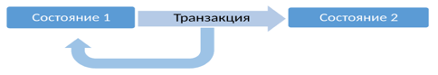

[К списку вопросов](db_exam.md)

# 14. Транзакции в СУРБД. Свойства транзакций (ACID). Изоляция транзакций. Классификация проблем одновременного доступа к данным при отсутствии блокировок. Уровни изоляции транзакций. Способы определения границ транзакций на примере T-SQL.

**Транзакция** – это объект, группирующий последовательность операций, которые должны быть выполнены как единое целое. Обеспечивает переход БД из одного целостного состояния в другое.

Обеспечивают целостность БД в условиях:
 * Параллельной обработки данных
 * Физических отказов диска
 * Аварийного сбоя электропитания
 * И других

Обладают 4 характеристиками, удовлетворяющими парадигме ACID:
 1. Atomic – атомарные;
 2. Consistent – согласованные;
 3. Isolated – изолированные;
 4. Durable – долговечные, устойчивые.

## 1. ACID – Атомарность транзакций
 * Транзакция должна представлять собой атомарную (неделимую) единицу работы;
 * Должны быть выполнены либо все операции, входящие в транзакцию, либо ни одна из них;
 * Следовательно, в случае невозможности выполнить все операции, все внесённые изменения должны быть отменены:
   - Commit – совершение транзакции
   - Rollback – отмена транзакции

## 2.ACID – Согласованность транзакций
 * По завершению транзакции все данные должны остаться в согласованном состоянии
 * При выполнении транзакции необходимо выполнить все правила реляционной СУБД:
   - Проверки выполнения ограничений (домены, индексы уникальности, внешние ключи, проверки, правила и т.д.)
   - Обновление индексов;
   - Выполнение триггеров
   - И другие

## 3. ACID – Изоляция транзакций
 * Изменения в данных, выполняемые в пределах транзакции, должны быть изолированы от всех изменений, выполняемых в других транзакциях, до тех пор, пока транзакция не совершена;
 * Выделяют различные уровни изоляции – для достижения компромисса между степенью распараллеливания работы с БД и строгостью выполнения принципа непротиворечивости:
   - Чем выше уровень изоляции, тем выше степень непротиворечивости данных;
   - Чем выше уровень изоляции, тем ниже степень распараллеливания и тем ниже степень доступности данных.

### Стандартная классификация проблем с уровнями изоляции:
 * P1: dirty read – «грязное» чтение 
 * P2: non-repeatable read – невоспроизводимое чтение 
 * P3: phantom read – фантомное чтение

### P1 (dirty read, «грязное» чтение)
1. Транзакция Т1 вносит изменения в ряд таблицы.
2. Т2 читает этот ряд после внесения изменений Т1, но до
совершения Т1.
3. Если Т1 будет отменена, то данные, считанные Т2, будут
некорректными.

### P2 (non-repeatable read, невоспроизводимое чтение)
1. Транзакция Т1 читает ряд.
2. Транзакция Т2 после этого вносит изменения в этот ряд или
удаляет его.
3. Если Т1 после этого считает этот же ряд снова, то получит новый
результат по сравнению с первым считыванием.

### P3 (phantom, фантомное чтение)
1. Транзакция Т1 читает набор рядов N, удовлетворяющих некоторому условию.
2. После этого Т2 выполняет SQL запросы, создающие новые ряды, удовлетворяющие этому условию.
3. Если Т1 повторит запрос с тем же условием, то получит другой
набор рядов.

### Уровни изоляции транзакций ANSI SQL
|   Уровень изоляции    |   Грязное чтение  |   Невоспроизводимое   чтение  |   Фантомное чтение  |
|-----------------------|-------------------|-------------------------------|---------------------|
|   0 Read Uncommitted  |   возможно        |   возможно                    |   возможно          |
|   1 Read Committed    |   -               |   возможно                    |   возможно          |
|   2 Repeatable Read   |   -               |                               |   возможно          |
|   3 Serializable      |   -               |   -                           |   -                 |

## 4. ACID – Долговечность, устойчивость транзакций
 * Если транзакия была совершена, её результат должен сохраниться в системе, несмотря на сбой системы;
 * Если транзакиция не была совершена, её результат может быть полностью отменён вслед за сбоем системы.

Границы транзакций:
 * BEGIN;
 * INSERT ...
 * UPDATE ...
 * DELETE ...
 * COMMIT;

 * BEGIN;
 * INSERT ...
 * UPDATE ...
 * DELETE ...
 * ROLLBACK;
