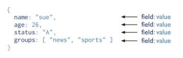

[К списку вопросов](db_exam.md)

# 17. Нереляционные модели данных: документная модель. Достоинства и недостатки хранения частично структурированных данных в документоориентированных СУБД по сравнению с реляционными.

Базы данных NoSQL специально созданы для определенных моделей данных и обладают гибкими схемами, что позволяет разрабатывать современные приложения. Базы данных NoSQL получили широкое распространение в связи с простотой разработки, функциональностью и производительностью при любых масштабах. Ресурсы, представленные на этой странице, помогут разобраться с базами данных NoSQL и начать работу с ними[^1].

Нереляционная база данных — это база данных, в которой в отличие от большинства традиционных систем баз данных не используется табличная схема строк и столбцов. В этих базах данных применяется модель хранения, оптимизированная под конкретные требования типа хранимых данных. Например, данные могут храниться как простые пары "ключ — значение", документы JSON или граф, состоящий из ребер и вершин[^2].

### Нереляционные СУБД (NoSQL)
 * Документоориентированные
 * Хранилище «Ключ-значение»
 * На основе графов
 * Объектно-ориентированные
 * И другие

### Документоориентированные СУБД
Предназначены для хранения документоориентированной информации – **слабоструктурированной модели данных**:
 * Не соответствует строгой структуре отношений в РМД
 * Содержит теги и другие маркеры для отделения семантических элементов и для обеспечения иерархической структуры записей и полей
 * Бессхемная и самоописываемая
 * Записи, соответствующие одной сущности предметной области, могут сильно отличаться: иметь разный набор полей, разные типы данных в совпадающих полях.

**Документ:**
 * Единица хранения информации (аналог записи таблицы в СУРБД)
 * Логически хранится вместе с другими документами в коллекции
 * Может включать поля «ключ-значение», где значение может быть:
   * Примитивным типом: строка, число, дата и т.д.;
   * Документом;
   * Массивом, элементами которого могут быть:
     * Примитивные типы
     * Документы
     * Массивы...
     * Комбинация вышеперечисленного

### Документ в формате JSON

```json
{
    ...
    "name": { "first": "Alan", "last": "Turing" },
    "contact": { "phone": { "type": "cell", "number": "111-222-3333" } },
    ...
}
```

### Документ в формате XML
```xml
<contact>
    <firstname>Bob</firstname>
    <lastname>Smith</lastname>
    <phone type="Cell">(123) 555-0178</phone>
    <phone type="Work">(890) 555-0133</phone>
    <address>
        <type>Home</type>
        <street1>123 Back St.</street1>
        <city>Boys</city>
        <state>AR</state>
        <zip>32225</zip>
        <country>US</country>
    </address>
</contact>
```

### Документ в формате YAML
```yaml
---
receipt: Oz-Ware Purchase Invoice
date: 2012-08-06
customer:
    first_name: Dorothy
    family_name: Gale
items:
    - part_no: A4786
      descrip: Water Bucket (Filled)
      price: 1.47
      quantity: 4
    - part_no: E1628
      descrip: High Heeled "Ruby" Slippers
      size: 8
      price: 133.7
      quantity: 1
```

### Слабоструктурированные данные

```json
[
    {
        "fullName": "Jon Doe",
        "age": 26,
        "relatives": 3
    },
    {
        "lastName": "Stevenson",
        "firstName": "Peter",
        "birthDate": 549752400000,
        "relatives": [
            {
                "type": "father",
                "lastName": " Stevenson ",
                "firstName": "Jack"
            },
            {
                "type": "sister",
                "lastName": "Donowell",
                "firstName": "Beatrice"
            }
        ]
    }
]
```

 * **Хранение данных неисследованной предметной области**
   * Частый случай в гибкой методологии разработки (Agile)
   * Информация о предметной области появляется на поздних этапах ЖЦ
программного продукта: этапах разработки и поддержки
   * Отсутствие необходимости создавать миграции схемы РМД снижает
издержки и риски при разработке
 * **Хранение данных из разных источников**
   * Каждый источник имеет свою схему данных, даже если предметная
   область одна
   * Появление новых источников данных может дать новую информацию о
   предметной области, что повлечёт за собой необходимость миграции
   существующей схемы
   * Появление новых источников требует дополнительных затрат на
   разработку
 * **Хранение данных из меняющейся предметной области**
   * Невозможно спроектировать заранее так, чтобы предугадать изменения
   * Повышенные издержки во время разработки и поддержки
   * Риск возникновения настолько больших изменений, что разработанная система станет непригодной к использованию, а экономическая эффективность её повторной реализации окажется выше
 * **Хранение данных из внешнего источника**
   * Схема получаемых данных меняется непредсказуемо
   * Невозможно гарантировать корректное получение и сохранение данных при РМД
   * Издержки на этапах разработки и поддержки
 * **Недопустимы потери при приведении ко схеме**
   * Сценарии использования сохраняемых данных неизвестны заранее
   * В РМД для такой ситуации используют хранение всех данных, не
учтённых в схеме, в виде записей таблицы «ключ-значение». Однако
создание запросов по таким данным сложно или невозможно
 * **Повышенные требования к производительности записи данных**
   * Ограничения в СУРБД
   * Триггеры
   * Индексы
   * Нормализация
   * Внешние ключи
   * <u>Сложность масштабирования РМД</u>
   
### Недостатки NoSQL
 * Не заставляют проектировать схему предметной области
 * Поощряют накопление несогласованной информации в БД
 * Для сложных предметных областей: схема данных стремится к
реляционной. При этом преимущества реляционной модели
остаются недоступными
 * Согласованность в конечном счёте и BASE-принцип вносят риски
ошибок

[^1]: Много полезной фигни по теме NoSQL [на сайте AWS Amazon](https://aws.amazon.com/ru/nosql/)
[^2]: Немного полезной фигни по теме NoSQL [на сайте Microsoft](https://docs.microsoft.com/ru-ru/azure/architecture/data-guide/big-data/non-relational-data)