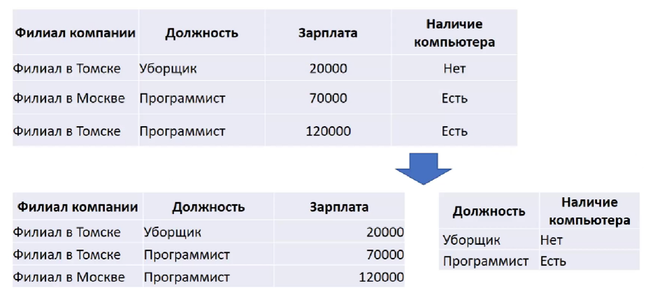
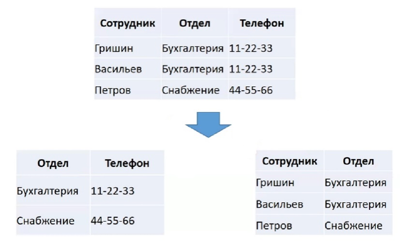

[К списку вопросов](db_exam.md)

# 3. Нормализация отношений. Концепция нормальных форм. Декомпозиция без потерь и функциональные зависимости. Первая, вторая и третья нормальные формы. Нормальная форма Бойса-Кодда.

**Нормализация отношений БД** – это процесс их преобразования к виду, отвечающему нормальным формам.
Классический подход к проектированию реляционных баз данных заключается в том, что сначала предметная область представляется в виде одного или нескольких отношений, а далее осуществляется процесс нормализации схем отношений, причем каждая следующая нормальная форма обладает свойствами лучшими, чем предыдущая.
 
**Нормальные формы:**
* первая нормальная форма (1НФ или 1NF) *все атрибуты простые*
* вторая нормальная форма (2НФ или 2NF) *не ключевые атрибуты зависят от ПК*
* третья нормальная форма (3НФ или 3NF) *не ключевые атрибуты не транзитивно зависят от ПК*
* нормальная форма Бойса-Кодда (НФБК или BCNF) *каждый детерминант является потенциальным ключом*
* четвёртая нормальная форма (4НФ или 4NF) *все нетривиальные многозначные зависимости фактически являются функциональными зависимостями от ее потенциальных ключей*
* пятая нормальная форма или нормальная форма проекции-соединения (5НФ или 5NF или PJ/NF) *отсутствуют сложные зависимые соединения между атрибутами*
 
**Свойства** нормальных форм:
* каждая следующая НФ «лучше» предыдущей
* при переходе к следующей НФ свойства предыдущих нормальных свойств сохраняются
* переход к следующей НФ обратим
* переход к следующей НФ происходит без потери, появления и искажения данных
* переход к следующей НФ происходит за счёт декомпозиции отношений на два или более отношений
 
**Цели** нормальных форм:
* исключение некоторых типов избыточности
* устранение некоторых аномалий обновления
Цели актуальны для OLTP (обработка транзакций в реальном времени), но не актуальны для OLAP (интерактивная аналитическая обработка).
 
## 1 нормальная форма
 
**Определение:**
Переменная отношения находится в 1НФ тогда и только тогда, когда в любом допустимом значении отношения каждый его кортеж содержит только одно значение для каждого из атрибутов (то есть атомарно).
Первая нормальная форма - это условие, согласно которому каждый компонент каждого кортежа является атомарным значением. В реляционной модели отношение всегда находится в первой нормальной форме по определению понятия отношение.
 

 
## 2 нормальная форма
 
**Определение 1** (В этом определении предполагается, что единственным ключом отношения является первичный ключ):
Отношение R находится во 2НФ в том и только в том случае, когда оно находится в 1НФ , и каждый неключевой атрибут полностью зависит от первичного ключа.
 
**Определение 2:**
Отношение R находится во 2НФ в том и только в том случае, когда он находится в 1НФ, и каждый неключевой атрибут полностью зависит от каждого ключа R.
 

 
## 3 нормальная форма
 
**Определение** (Снова определение дается в предположении существования единственного ключа.):
Отношение R находится в 3НФ тогда и только тогда, когда оно находится в 2НФ и ни один неключевой атрибут отношения не находится в транзитивной функциональной зависимости (когда X функционально зависит от Y, а Y от Z, то есть Х транзитивно зависит от Z) от потенциального ключа отношения.
 

 
## Нормальная форма Бойса-Кодда
 
**Детерминант** – любой атрибут (или группа атрибутов), от которого полностью функционально зависит некоторый другой атрибут.
 
**Определение:**
Отношение R находится в НФБК в том и только в том случае, если каждый детерминант является потенциальным ключом.
 
* позволяет устранить все аномалии обновления, связанные с ФЗ (если какие-то атрибуты функционально зависят от каких-то других атрибутов, и при их редактировании-удалении возникают какие-то аномалии)
* не избавляет от аномалий обновления, связанных с наличием многозначных зависимостей.
 

 
## Пример преобразования R к BCNF
 
Дано отношение R(A, B, (C, D, (E, F, G, H, I))) и множество ФЗ.
 
A -> B, \
E -> FG, \
G -> H, \
ACE -> I, \
AC -> D, \
D -> C \
}
 
1NF – Удаляем повторяющиеся группы. Жирным выделены **PK**.
 
R1(**A**, B, **C**, D, **E**, F, G, H, I)
 
2NF – Удаляем частичные ключевые зависимости.
 
R1(**A**, B), // A -> B \
R2(**A**, **C**, D), // AC->D \
R3(**A**, **C**, **E**, I) // ACE -> I \
R4(**E**, F, G, H) // E ->* FGH
 
3NF – Удаляем транзитивные зависимости.
 
R1(**A**, B), \
R2(**A**, **C**, D), \
R3(**A**, **C**, **E**, I) \
R4(**E**, F, G) // E->G, G->H \
R5(**G**, H)
 
BCNF – Каждый детерминант должен является потенциальным ключом. Для отношений, имеющих один потенциальный ключ, BCNF является 3NF. Рассмотрим отношение R2, т.к. оно имеет более одного ПК - AC или AD. Для отношения R2 справедливы следующие ФЗ:
 
S' = { \
AC -> D, \
D -> C \
}
 
Детерминант в ФЗ D -> C не является ПК отношения R2.
 
R1(**A**, B), \
R3(**A**, **C**, **E**, I) \
R4(**E**, F, G) \
R5(**G**, H), \
R6(**A**, **D**), \
R7(**D**, C)
