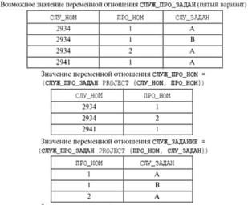

[К списку вопросов](db_exam.md)

# 4. Нормализация отношений. Многозначные зависимости и четвертая нормальная форма. 2-декомпозируемые и n-декомпозируемые отношения. Зависимости соединения и пятая нормальная форма[^1].

## Нормализация отношений.[^2]

**Нормализация** — это процесс организации данных в базе данных, включающий создание таблиц и установление отношений
между ними в соответствии с правилами, которые обеспечивают защиту данных и делают базу данных более гибкой, устраняя
избыточность и несогласованные зависимости.

**Нормализация и проектирование**
Проектирование баз данных, как правило, играет одну из ключевых ролей в большинстве проектов. Грамотно спроектированная
база позволяет без особых проблем вносить изменения, изменять структуру системы.

**Цели нормализации:**

1. **Исключение некоторых типов избыточности**. Избыточность данных приводит к непродуктивному расходованию свободного
   места на диске и затрудняет обслуживание баз данных.
2. **Устранение некоторых аномалий обновления**. Например, если данные, хранящиеся в нескольких местах, потребуется
   изменить, в них придется внести одни и те же изменения во всех этих местах. Несогласованность информации в базе
   данных — это настоящий кошмар, который почти всегда приводит к возникновению ошибок. Если вы забудете хотя бы об
   одной таблице, которую нужно обновить, то все данные станут не достоверными.
3. **Устранение некоторых аномалий выборки**. Например, если данные, хранящиеся в нескольких местах, потребуется
   выбрать, то выборка одних и тех же данных из разных источников может дать различные результаты.
4. **Упрощение процедуры применения необходимых ограничений целостности**. Отношения, определенные с помощью первичных и
   внешних ключей позволяют организовать СУБД автоматический контроль согласованности данных, в том числе позволяют
   реализовать каскадное обновление связанных по внешнему ключу полей в соответствующих таблицах. Разработка проекта
   базы данных, который является достаточно «качественным» представлением реального мира, интуитивно понятен и может
   служить хорошей основой для последующего расширения;

Нормализация как таковая не имеет целью уменьшение или увеличение производительности работы или же уменьшение или
увеличение физического объёма базы данных. Однако качественная модель, разработанная на основе принципов нормализации
ведет к уменьшению физического объема базы данных и обеспечивает приемлемый уровень производительности.

**Зачем нужны принципы нормализации?**

1. Целостная система принципов нормализации позволяет различным разработчикам получать на выходе идентичные схемы баз
   данных, при условии, что на вход они получили идентичные задания. То есть реализуется принцип единообразия.
2. Появляется возможность автоматизировать процесс анализа результата проектирования для выявления рекомендаций,
   замечаний и грубых ошибок.
3. В условиях неопределенности нормализация позволяет создавать системы с широкими потенциальными возможностями для
   последующего развития. В ходе эволюционных модернизаций любая система рискует оказаться в тупике, преодолеть, который
   можно только революционным путем. Приверженность принципам нормализация позволяет развивать систему без серьезных
   потрясений и накладных затрат на радикальные изменения структуры.
4. Нормализованная структура базы данных поддерживает целостность данных на уровне структуры.
5. Оптимальная структура базы данных обеспечивает максимальную производительность системы, сочетая простоту и
   функциональность.
6. Принципы нормализации создают основу для общения между архитекторами системы и разработчиками, разработчиками и
   заказчиками приложений.
7. Осознание принципов позволяет выявить скрытые проблемы в уже работающих системах и помогает принять взвешенные
   решения для устранения недостатков.

Существует несколько правил нормализации баз данных. Каждое правило называется «нормальной формой». Если выполняется
первое правило, говорят, что база данных представлена в «первой нормальной форме». Если выполняются два первых правила,
считается, что база данных представлена во «второй нормальной форме» Если выполняются три первых правила, считается, что
база данных представлена в «третьей нормальной форме».

Есть и другие уровни нормализации, однако для большинства приложений достаточно нормализовать базы данных до третьей
нормальной формы.

Как таковые первая и вторая нормальные формы не являются целью оптимизации – это промежуточные этапы для приведения
схемы базы данных к третьей нормальной форме. В то время как первая и вторая нормальные формы позволяют реализовать
схему базы данных различным набором связанных таблиц. Строгая третья нормальная форма предполагает только один вариант
решения задачи проектирования схемы базы данных. с заданной функциональностью. Таким образом, различные программисты
одну и туже задачу решают одним и тем же способом, что в значительной мере облегчает коммуникации между разработчиками и
архитекторами. К тому же, единообразие позволяет проверять качество проектирования схемы баз данных с помощью
автоматизированных средств разработки.  
В дальнейшем для решения задач производительности или обеспечения простоты может быть проведена денормализация схемы
базы данных. Опытный разработчик баз данных такую денормализацию выполняет на лету в своей голове, однако для этого
нужен достаточно большой опыт практического применения принципов нормализации в течении нескольких лет. К сожалению,
принципы проектирования 1С не соответствуют принципам проектирования по третьей нормальной форме. Для приобретения
навыков проектирования можно взять базу данных mySQL и реализовать на её базе несколько web-приложений.

## Многозначные зависимости и четвертая нормальная форма (4NF).

Четвертая нормальная форма касается отношений, в которых имеются повторяющиеся наборы данных. Декомпозиция, основанная
на функциональных зависимостях, не приводит к исключению такой избыточности. В этом случае используют декомпозицию,
основанную на многозначных зависимостях.

Многозначная зависимость является обобщением функциональной зависимости и рассматривает соответствия между множествами
значений атрибутов.

В качестве примера рассмотрим отношение ПРЕПОДАВАТЕЛЬ (ИМЯ, КУРС, УЧЕБНОЕ_ПОСОБИЕ), хранящее сведения о курсах, читаемых
преодавателем, и написанных им учебниках. Пусть профессор N читает курсы "Теория упругости" и "Теория колебаний" и имеет
соответствующие учебные пособия, а профессор K читает курс "Теория удара" и является автором учебников "Теория удара"
и "Теоретическая механика". Тогда наше отношение будет иметь вид:

| ИМЯ |       КУРС       |     УЧЕБНОЕ_ПОСОБИЕ    |
|:---:|:----------------:|:----------------------:|
| N   | Теория упругости | Теория упругости       |
| N   | Теория колебаний | Теория упругости       |
| N   | Теория упругости | Теория колебаний       |
| N   | Теория колебаний | Теория колебаний       |
| K   | Теория удара     | Теория удара           |
| K   | Теория удара     | Теоретическая механика |

добавляем:

     | K | Теория упругости |      Теория удара      |
     | K | Теория упругости | Теоретическая механика |

Это отношение имеет значительную избыточность и его использование приводит к возникновению аномалии обновления.
Например, добавление информации о том, что профессор K будет также читать лекции по курсу "Теория упругости" приводит к
необходимости добавить два кортежа (по одному для каждого написанного им учебника) вместо одного. Тем не менее,
отношение ПРЕПОДАВАТЕЛЬ находится в NFBC (ключевой атрибут - ИМЯ). Заметим, что указанные аномалии исчезают при замене
отношения ПРЕПОДАВАТЕЛЬ его проекциями:

     | ИМЯ |       КУРС       |   | ИМЯ |     УЧЕБНОЕ_ПОСОБИЕ    |
     |:---:|:----------------:|:-:|:---:|:----------------------:|
     | N   | Теория упругости |   | N   | Теория упругости       |
     | N   | Теория колебаний |   | N   | Теория колебаний       |
     | K   | Теория удара     |   | K   | Теоретическая механика |
     | K   | Теория упругости |   | K   | Теория удара           |

Аномалия обновления возникает в данном случае потому, что в отношении ПРЕПОДАВАТЕЛЬ имеются:

1. зависимость множества значений атрибута КУРС от множества значений атрибута ИМЯ
2. зависимость множества значений атрибута УЧЕБНОЕ_ПОСОБИЕ от множества значений атрибута ИМЯ.

Такие зависимости и называются многозначными и обозначаются как
> ИМЯ ->> КУРС ИМЯ ->> УЧЕБНОЕ_ПОСОБИЕ

Нетрудно показать, что многозначные зависимости всегда образуют связанные пары, поэтому их часто обозначают
> ИМЯ ->> КУРС | УЧЕБНОЕ_ПОСОБИЕ

Очевидно, что каждая функциональная зависимость является многозначной, но не каждая многозначная зависимость является
функциональной.

### Определение четвертой нормальной формы:

Отношение находится в 4NF если оно находится в BCNF и в нем отстутсвуют многозначные зависимости, не являющиеся
функциональными зависимостями.

## N-декомпозируемые отношения. Пример декомпозиции. Зависимость проекции/соединения.

В переменной отношения R с атрибутами (возможно, составными) A и B MVD AB называется **тривиальной**, если либо AB, либо
A UNION B совпадает с заголовком отношения R.

**Нетривиальная** многозначная зависимость: существует многозначная зависимость A->>B|C, но нет функциональных
зависимостей A->B и A->C.

**Тривиальная** MVD всегда удовлетворяется. При AB она вырождается в тривиальную FD. В случае A UNION B = HR требования
многозначной зависимости соблюдаются очевидным образом.

Отношение называется **n-декомпозируемым**, есть его можно декомпозировать на n частей.

Для примера n-декомпозируемого отношения при n > 2 рассмотрим пятый вариант переменной отношения СЛУЖ_ПРО_ЗАДАН, в
которой имеется единственно возможный ключ {СЛУ_НОМ, ПРО_НОМ, СЛУ_ЗАДАН} и отсутствуют нетривиальные MVD. Пример
значения переменной отношения приведен на рис. 9.3.

Рис. 9.3 Возможное значение переменной отношения СЛУЖ_ПРО_ЗАДАН (пятый вариант), результаты проекций и результат
частичного естественного соединения

Как показано на рис. 9.3, результат естественного соединения проекций СЛУЖ_ПРО_НОМ и ПРО_НОМ_ЗАДАН почти совпадает с
телом исходного отношения СЛУЖ_ПРО_ЗАДАН, но в нем присутствует один лишний кортеж, который исчезнет после выполнения
заключительного естественного соединения с проекцией СЛУЖ_ЗАДАНИЕ. Читателям предлагается убедиться, что исходное
отношение будет восстановлено при любом порядке естественного соединения трех проекций.

## Зависимость проекции/соединения

Если служащий с номером сн участвует в проекте пн, и в проекте пн выполняется задание сз, и служащий с номером сн
выполняет задание сз, то служащий с номером сн выполняет задание сз в проекте пн.

В общем виде такое ограничение называется зависимостью проекции/соединения.

### Формальное определение:

Пусть задана переменная отношения R, и A, B, …, Z являются произвольными подмножествами заголовка R (составными,
перекрывающимися атрибутами). В переменной отношения R  **удовлетворяется зависимость проекции/соединения** (
Project-Join Dependency – PJD) *( A, B, …, Z) тогда и только тогда, когда любое допустимое значение r переменной
отношения R можно получить путем естественного соединения проекций этого значения на атрибуты A, B, …, Z.
 
## Пятая нормальная форма

**Пятая нормальная форма** - это последняя нормальная форма, которую можно получить путем декомпозиции. Ее условия
достаточно нетривиальны, и на практике 5NF не используется. Заметим, что зависимость соединения является обобщением как
многозначной зависимости, так и функциональной зависимости.

[^1]: [Ответ на вопрос по версии Игоря](https://github.com/igorshvch/MGTU-sem_v/blob/master/DB/exam/QA/04.md)
[^2]: [Ответ на вопрос по версии слайдов Павлюка](4_.md)