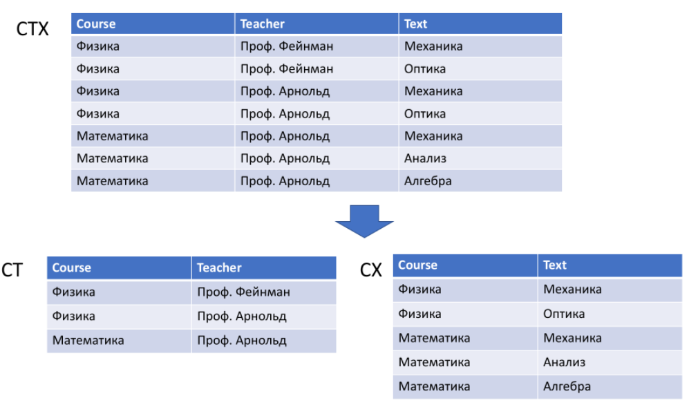
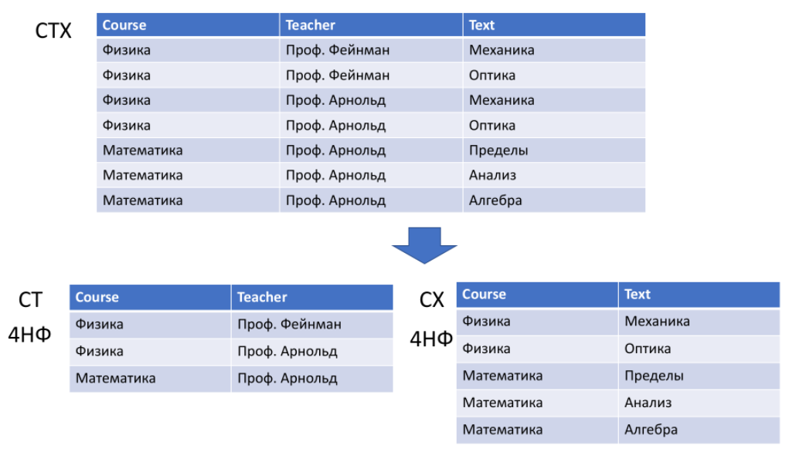
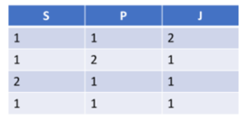
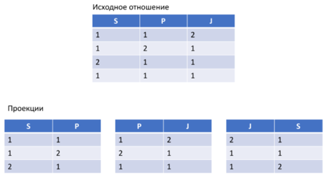
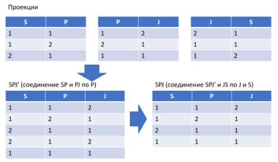

[К списку вопросов](db_exam.md)

# 4. Нормализация отношений. Многозначные зависимости и четвертая нормальная форма. 2-декомпозируемые и n-декомпозируемые отношения. Зависимости соединения и пятая нормальная форма[^1].

## Нормализация отношений
**Нормализация отношений БД** – это процесс их преобразования к виду, отвечающему нормальным формам.

**Нормальные формы:**
 * первая нормальная форма (1НФ или 1NF) *все атрибуты простые*
 * вторая нормальная форма (2НФ или 2NF) *не ключевые атрибуты зависят от ПК*
 * третья нормальная форма (3НФ или 3NF) *не ключевые атрибуты не транзитивно зависят от ПК*
 * нормальная форма Бойса-Кодда (НФБК или BCNF) *каждый детерминант является потенциальным ключом*
 * четвёртая нормальная форма (4НФ или 4NF) *все нетривиальные многозначные зависимости фактически являются функциональными зависимостями от ее потенциальных ключей*
 * пятая нормальная форма или нормальная форма проекции-соединения (5НФ или 5NF или PJ/NF) *отсутствуют сложные зависимые соединения между атрибутами*

## Многозначные зависимости (МЗ)

<u>Два определения функциональные зависимости:</u>
 * Пусть R – это отношение, а X и Y – произвольные подмножества множества атрибутов отношения R. Тогда Y функционально зависимо от X ↔ Ɐ значение множества X связано в точности с одним значением множества Y.
 * Пусть R является переменной-отношением, а X и Y – произвольными подмножествами множества атрибутов переменной-отношения R. Тогда X -> Y ↔ для Ɐ допустимого значения отношения R Ɐ значение X связано в точности с одним значением Y.

Пример: переменная-отношение СТХ, содержащая информацию о курсах обучения, преподавателях и учебниках.

* в СТХ возможны аномалии обновления[^2]
* в СТХ нет функциональных зависимостей

<u>Определение:</u> \
Пусть А, В и С являются произвольными подмножествами множества атрибутов переменной-отношений R. \
Тогда подмножество В многозначно зависит от подмножества А тогда и только тогда, когда множество значений В, соответствующее заданной паре (значение А, значение С) переменной-отношения R, зависит от А, но не зависит от С.

А ->> В

<u>Лемма Фейгина</u>

Для данной переменной-отношения R { A, D, C } МЗ \
А ->> В \
выполняется тогда и только тогда, когда также выполняется МЗ \
А ->> С

МЗ всегда образуют связанные пары, поэтому обычно их представляют вместе в символьном виде А ->> В | С

<u>Теорема Фейгина</u>

Пусть А, В и С являются множеством атрибутов переменной-отношения R { А, В, С }. \
Переменная-отношение R будет равна соединению её проекций  \
А, В и А, С \
тогда и только тогда, когда для переменной-отношения R выполняется МЗ \
А ->> В | С

## 4 нормальная форма

<u>Определение 1:</u> \
Переменная-отношение R находится в 4НФ тогда и только тогда, когда в случае существования таких подмножеств А и В атрибутов этой переменной-отношения К, для которых выполняется нетривиальная МЗ А ->> В, все атрибуты переменной-отношения R также функционально зависят от атрибута А.

<u>Определение 2:</u> \
Переменная-отношение R находится в 4НФ, если она находится НФБК и все МЗ в переменной-отношении R фактически представляют собой ФЗ от её ключей.

## 2-декомпозируемые и n-декомпозируемые отношения
_Не из лекции Павлюка_

При приведении отношения ко всем видам нормальных форм (кроме пятой) использовалась единственная операция, необходимая для устранения избыточности в отношении, которая заключалась в декомпозиции данного отношения на две проекции. Но существуют отношения, для которых невозможно выполнить декомпозицию на две проекции без потерь.

В то же время над такими отношениями можно выполнить декомпозицию на большее количество проекций без потерь, каждая из которых обладает лучшими свойствами. Данный факт принято называть **зависимостью по соединению**, а подобные отношения называются **3-декомпозируемыми отношениями** (любое отношение называется n-декомпозируемым при n≥2). 

Обратим внимание, что зависимость по соединению является обобщением многозначной зависимости. Отношения, которые содержат зависимости по соединению, которые не являются одновременно ни функциональными, ни многозначными, также могут содержать аномалии обновления. В таких случаях вводят понятие пятой нормальной формы (5НФ).

## 5 нормальная форма

<u>Зависимости соединения и 5НФ</u>

Рассмотрим переменную-отношение SPJ из базы данных "Поставщики, детали и проекты". 

Исходное отношение

<u>Определение (зависимость соединения):</u>

Пусть R является переменной-отношением, а A, B, ..., Z – произвольными подмножествами множества её атрибутов. \
Переменная-отношение R удовлетворяет зависимости соединения \
*{ A, B, ..., Z } \
тогда и только тогда, когда любое допустимое значение переменной-отношения R эквивалентно соединению её проекций по подмножествам атрибутов A, B, ..., Z.

SPJ удовлетворяет зависимости соединения * { SP, PJ, JS }

<u>Определение (тривиальная ЗС):</u> \
ЗС  *{ А, В,..., Z } называется тривиальной тогда и только тогда, когда одна из проекций A, B, ..., Z является проекцией, идентичной R (т.е. проекцией по всем атрибутам переменной-отношения R).

<u>Определение:</u> \
ЗС *{ А, В, ..., Z } подразумевается потенциальными ключами тогда и только тогда, когда каждое подмножество атрибутов A, B, ..., Z фактически является суперключом для данной переменной-отношения.

<u>Определение (5НФ):</u> \
Переменная-отношение R находится в 5НФ, которую иногда иначе называют проекционно-соединительной нормальной формой (ПСНФ), тогда и только тогда, когда каждая нетривиальная ЗС в переменной-отношении R подразумевается ее потенциальными ключами.

## Процедура нормализации

1. Переменную-отношение в 1НФ следует разбить на такие проекции, которые позволят исключить все функциональные зависимости, не являющиеся неприводимыми. В результате будет получен набор переменных-отношений в 2НФ.
2. Полученные переменные-отношения в 2НФ следует разбить на такие проекции, которые позволят исключить все существующие транзитивные функциональные зависимости. В результате будет получен набор переменных-отношений в 3НФ.
3. Полученные переменные-отношения в 3НФ следует разбить на проекции, позволяющие исключить любые оставшиеся функциональные зависимости, в которых детерминанты не являются потенциальными ключами. В результате такого приведения будет получен набор переменных-отношений в НФБК.
Замечание. Правила 1-3 могут быть объединены в одно: "Исходную переменную-отношение следует разбить на проекции, позволяющие исключить все функциональные зависимости, в которых детерминанты не являются потенциальными ключами".
4. Полученные переменные-отношения в НФБК следует разбить на проекции, позволяющие исключить любые многозначные зависимости, которые не являются функциональными. В результате будет получен набор переменных-отношений в 4НФ.
5. Полученные переменные-отношения в 4НФ следует разбить на проекции, позволяющие исключить любые зависимости соединения, которые не подразумеваются потенциальными ключами. В результате будет получен набор переменных-отношений в 5НФ.

[^1]: [Ответ на вопрос по версии Игоря](https://github.com/igorshvch/MGTU-sem_v/blob/master/DB/exam/QA/04.md)
[^2]: [ – 03 – БД – РМД, нормализация, слайды 33-36](https://disk.yandex.ru/d/7ZGI6YEodZPh7w?w=1)
