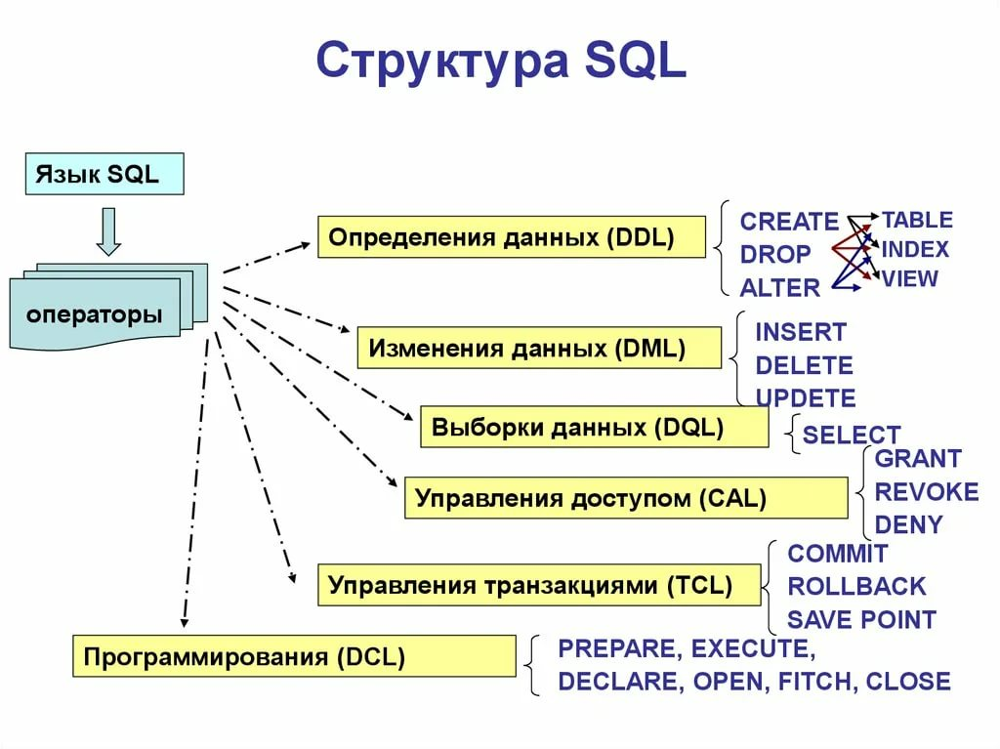
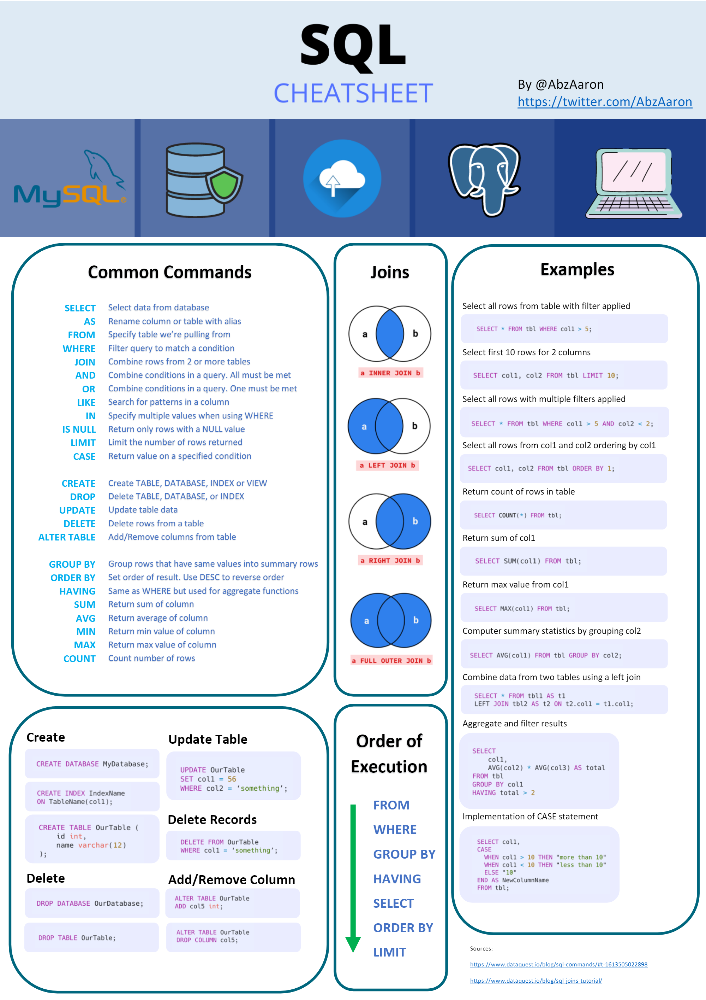

[1. Реляционная модель. Реляционные объекты данных: домены и отношения.](1.md)

[2. Целостность реляционных данных: потенциальные, первичные, альтернативные и внешние ключи. Ссылочная целостность.](2.md)

[3. Нормализация отношений. Концепция нормальных форм. Декомпозиция без потерь и функциональные зависимости. Первая, вторая и третья нормальные формы. Нормальная форма Бойса-Кодда.](3.md)

[4. Нормализация отношений. Многозначные зависимости и четвертая нормальная форма. 2-декомпозируемые и n-декомпозируемые отношения. Зависимости соединения и пятая нормальная форма.](4.md)

[5. Язык SQL. DDL. Объекты РБД: таблицы. Синтаксис создания таблиц на примере произвольного диалекта SQL. Указание первичных и внешних ключей, обязательности значений, значений по умолчанию, а также других видов ограничений. Создание автоматически генерируемого значения для первичного ключа. Рекомендации при проектировании таблиц в РБД.](5.md)

[6. Язык SQL. DDL. Объекты РБД: представления. Синтаксис создания представлений на примере произвольного диалекта SQL. Материализованные представления.](6.md)

[7. Язык SQL. DDL. Объекты РБД: функции и хранимые процедуры. Синтаксис создания функций и процедур на примере произвольного диалекта SQL. Синтаксис вызова. Различия и сферы применения.](7.md)

[8. Язык SQL. DDL. Объекты РБД: триггеры. Синтаксис создания триггеров на примере произвольного диалекта SQL. Виды триггеров. Работа с изменёнными данными в триггерах.](8.md)

[9. Целостность базы данных. Декларативная и процедурная поддержка ограничений целостности.](9.md)

[10. Язык SQL. DML. Операторы INSERT, UPDATE, DELETE. Синтаксис insert-select и update-from. Получение идентификатора, сгенерированного при вставке.](10.md)

[11. Язык SQL. DML. Оператор SELECT. Логические условия выборки. Группировка и агрегирующие функции. Сортировка. Соединения. Виды соединений.](11.md)

[12. Структура БД  (физическая). Организация хранения данных таблиц на физическом уровне. Пример алгоритма выполнения простого запроса (без учёта индексов).](12.md)

[13. Индексы в СУРБД. Принцип работы. Достоинства и недостатки. Влияние на производительность запросов. Применение индексов на практике. Покрывающий индекс.](13.md)

[14. Транзакции в СУРБД. Свойства транзакций (ACID). Изоляция транзакций. Классификация проблем одновременного доступа к данным при отсутствии блокировок. Уровни изоляции транзакций. Способы определения границ транзакций на примере T-SQL.](14.md)

[15. Транзакции в СУРБД. Блокировки. Свойства блокировок. Виды гранулярности блокировок. Режимы блокировок. Взаимоблокировки. Обнаружение взаимоблокировок и выбор жертвы в СУБД.](15.md)

[16. Безопасность данных в базах данных на примере произвольной СУБД. Поддержка мер обеспечения безопасности в стандарте языка SQL. Директивы GRANT и REVOKE.](16.md)

[17. Нереляционные модели данных: документная модель. Достоинства и недостатки хранения частично структурированных данных в документоориентированных СУБД по сравнению с реляционными.](17.md)

[18. Документоориентированные СУБД: примеры. CAP-теорема (теорема Брюера). ACID и BASE как следствия теоремы Брюера. Модель «согласованность в конечном счёте»: что означает, примеры применения, достоинства и недостатки.](18.md)

[19. Нереляционные модели данных: ассоциативные массивы и их применение в хранилищах «ключ-значение». Примеры СУБД «ключ-значение», область применения, примеры использования.](19.md)

[20. Хранилища “ключ-значение” на примере Redis. Структура базы данных. Основные типы данных и операции.](20.md)

---

[Памятка/шпаргалка по SQL](https://habr.com/ru/post/564390/)

[Памятка/шпаргалка по джойнам](https://learnsql.com/blog/sql-join-cheat-sheet/joins-cheat-sheet-a4.pdf)

[Восемь интересных возможностей PostgreSQL, о которых вы, возможно, не знали](https://habr.com/ru/company/otus/blog/523322/)
